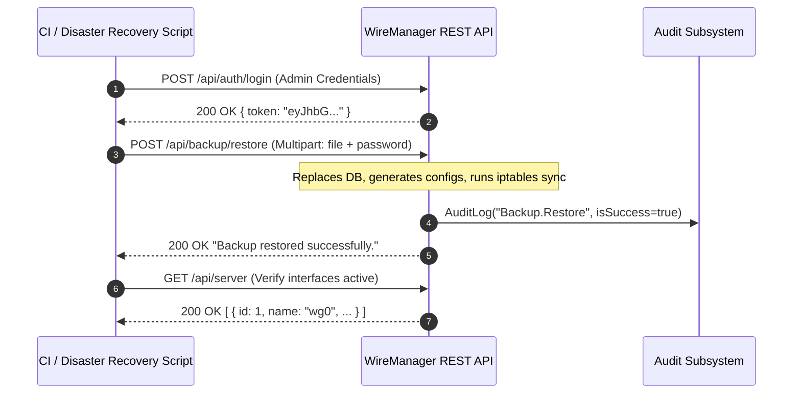

# Backup & Disaster Recovery API

The WireManager REST API provides programmatic endpoints under `/api/backup` for exporting cryptographically secured snapshots, executing full disaster recovery restorations, and automating scheduled backups with custom retention policies.

---

## Architectural Principles & Access Control

1. **Authentication & Authorization**:
   - All state-modifying endpoints (`POST /api/backup`, `POST /api/backup/restore`, `POST /api/backup/automatic`) require an authenticated JWT Bearer token with the **Admin** role (`[Authorize(Roles = AppRoles.Admin)]`).
   - Requests initiated by accounts with the `Operator` role return HTTP `403 Forbidden`.
2. **Setup Gatekeeper**:
   - All endpoints in `BackupController` are protected by the `[RequireSetup]` attribute, blocking execution until the system onboarding wizard has successfully concluded.
3. **Payload Encryption**:
   - Backup files exported via the API are encrypted with `AES-256-GCM` using keys derived via `PBKDF2` (HMAC-SHA-256, 600,000 iterations).

---

## Endpoints Overview

| Method | Endpoint | Authorization | Description |
| :--- | :--- | :--- | :--- |
| `POST` | `/api/backup` | Admin | Generates and streams an encrypted backup file (`wiremanager-backup.json`). |
| `POST` | `/api/backup/restore` | Admin | Uploads and restores an encrypted backup file, updating database, keys, and firewall. |
| `POST` | `/api/backup/automatic` | Admin | Configures or updates the automatic backup schedule, retention, and encryption password. |
| `GET` | `/api/backup/automatic` | Authenticated | Retrieves the current automatic backup configuration (schedule and retention). |

---

## Request & Response Specifications

### 1. Create On-Demand Backup (`POST /api/backup`)

Generates an encrypted snapshot capturing all database records (servers, peers, tags, services, users, MFA secrets, audits) and server/peer private keys.

#### Request Headers

```http
POST /api/backup HTTP/1.1
Host: wiremanager.example.com
Authorization: Bearer <ADMIN_JWT_TOKEN>
Content-Type: application/json
Accept: application/octet-stream
```

#### Request Payload (`CreateBackupRequestDTO`)

| Field | Type | Required | Description |
| :--- | :--- | :--- | :--- |
| `password` | `string` | Yes | The encryption password used to derive the AES-256-GCM key. |

```json
{
  "password": "CorrectHorseBatteryStaple2026!"
}
```

#### Response (`200 OK`)

Returns the raw encrypted binary payload as an attachment.

```http
HTTP/1.1 200 OK
Content-Type: application/octet-stream
Content-Disposition: attachment; filename="wiremanager-backup.json"
Transfer-Encoding: chunked
```

#### cURL Example

```bash
curl -X POST "https://wiremanager.example.com/api/backup" \
  -H "Authorization: Bearer $ADMIN_TOKEN" \
  -H "Content-Type: application/json" \
  -d '{"password": "CorrectHorseBatteryStaple2026!"}' \
  --output "wiremanager-backup-$(date +%Y%m%d).json"
```

#### Response Status Codes

| Code | Meaning | Description |
| :--- | :--- | :--- |
| `200 OK` | Success | Returns the binary encrypted backup file. |
| `400 Bad Request` | Generation Failed | Missing password or internal error during key extraction. |
| `401 Unauthorized` | Missing / Expired Token | Missing or invalid JWT Bearer token. |
| `403 Forbidden` | Insufficient Permissions | User does not have the `Admin` role. |

---

### 2. Restore System from Backup (`POST /api/backup/restore`)

Uploads an encrypted `.json` backup file and restores the entire system state atomically.

:::danger High-Impact Administrative Action
Restoring a backup wipes current database records, re-writes server and client configuration files on the host, and resets firewall rules to match the backup state.
:::

#### Request Headers

```http
POST /api/backup/restore HTTP/1.1
Host: wiremanager.example.com
Authorization: Bearer <ADMIN_JWT_TOKEN>
Content-Type: multipart/form-data; boundary=----WebKitFormBoundaryX
```

#### Form Data Parameters

| Parameter | Type | Required | Description |
| :--- | :--- | :--- | :--- |
| `file` | `file` (`IFormFile`) | Yes | The encrypted `.json` backup file previously exported from WireManager. |
| `password` | `string` | Yes | The decryption password specified when the backup was created. |

#### cURL Example

```bash
curl -X POST "https://wiremanager.example.com/api/backup/restore" \
  -H "Authorization: Bearer $ADMIN_TOKEN" \
  -F "file=@./wiremanager-backup-20260917.json" \
  -F "password=CorrectHorseBatteryStaple2026!"
```

#### Response (`200 OK`)

```http
HTTP/1.1 200 OK
Content-Type: text/plain; charset=utf-8

Backup restored successfully.
```

#### Response Status Codes

| Code | Meaning | Description |
| :--- | :--- | :--- |
| `200 OK` | Success | The backup was decrypted, the database restored, files rewritten, and firewall synced. |
| `400 Bad Request` | Restoration Error | Invalid decryption password, corrupt ciphertext, or missing required keys. |
| `401 Unauthorized` | Missing / Expired Token | Missing or invalid JWT Bearer token. |
| `403 Forbidden` | Insufficient Permissions | User does not have the `Admin` role. |

---

### 3. Configure Automatic Backup (`POST /api/backup/automatic`)

Configures or updates the recurring automatic backup schedule and retention policy. The background worker evaluates this schedule every minute.

#### Request Headers

```http
POST /api/backup/automatic HTTP/1.1
Host: wiremanager.example.com
Authorization: Bearer <ADMIN_JWT_TOKEN>
Content-Type: application/json
```

#### Request Payload (`AutomaticBackup`)

| Field | Type | Required | Description |
| :--- | :--- | :--- | :--- |
| `enabled` | `boolean` | Yes | Whether the automatic backup background worker should execute. |
| `schedule` | `string` | Yes | Time of day to run the backup (24-hour format `HH:mm` or `HH:mm:ss`). |
| `retention` | `integer` | Yes | Number of backup files to retain in the `backup/` directory (minimum: `1`). |
| `password` | `string` | Optional | Encryption password. If omitted during an update, the previously stored password is kept. |

```json
{
  "enabled": true,
  "schedule": "03:00:00",
  "retention": 14,
  "password": "AutomatedBackupSecureKey2026!"
}
```

:::note Secure Password Storage
When supplied, the password is encrypted using ASP.NET Core Data Protection (`IDataProtector` with purpose `"WireManager.Backup.Password"`) before saving to the database.
:::

#### Response (`200 OK`)

```http
HTTP/1.1 200 OK
```

#### cURL Example

```bash
curl -X POST "https://wiremanager.example.com/api/backup/automatic" \
  -H "Authorization: Bearer $ADMIN_TOKEN" \
  -H "Content-Type: application/json" \
  -d '{
    "enabled": true,
    "schedule": "03:00:00",
    "retention": 14,
    "password": "AutomatedBackupSecureKey2026!"
  }'
```

---

### 4. Get Automatic Backup Configuration (`GET /api/backup/automatic`)

Retrieves the currently active automatic backup settings.

:::note Sensitive Data Protection
For security reasons, the encryption password is never returned in this response.
:::

#### Request Headers

```http
GET /api/backup/automatic HTTP/1.1
Host: wiremanager.example.com
Authorization: Bearer <JWT_TOKEN>
Accept: application/json
```

#### Response (`200 OK`)

```json
{
  "enabled": true,
  "retention": 14,
  "schedule": "03:00:00"
}
```

If no automatic backup has been configured yet, the endpoint returns `null` with HTTP `200 OK`.

#### cURL Example

```bash
curl -X GET "https://wiremanager.example.com/api/backup/automatic" \
  -H "Authorization: Bearer $ADMIN_TOKEN" \
  -H "Accept: application/json"
```

---

## Disaster Recovery Automated Workflow

In automated DevOps or CI/CD pipelines, a full system recovery can be orchestrated using the REST API:



---

## Related Documentation

- **[Backup & Disaster Recovery User Guide](../guides/backup-restore.md)** — Architectural details, cryptography, and web console walkthrough.
- **[API Reference Catalog](./reference.md)** — Complete index of all WireManager REST endpoints.
- **[Auditing & Security Events Guide](../guides/audit-logs.md)** — Ingesting and querying backup audit events.
