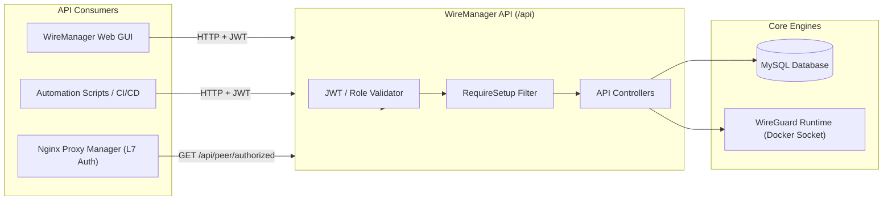
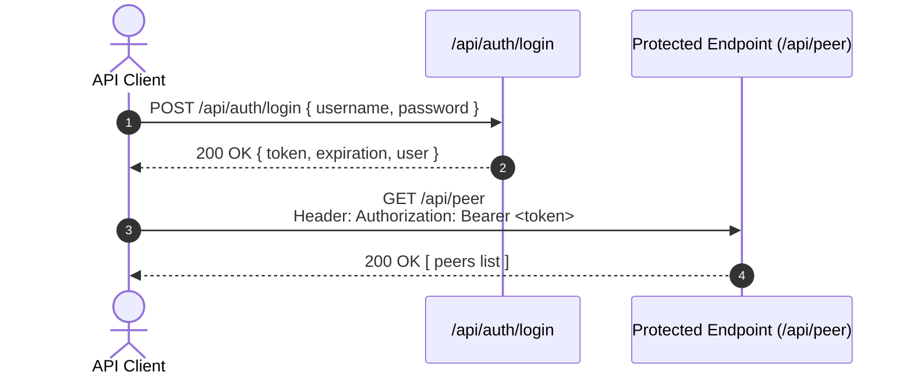
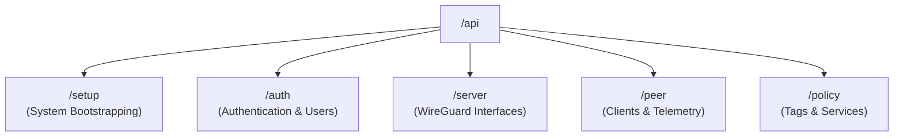

# API Overview

The **WireManager REST API** provides a complete programmatic interface for managing, automating, and auditing your WireGuard VPN infrastructure. Built with ASP.NET Core, the API enables administrators and automated systems (such as CI/CD pipelines, custom onboarding portals, or infrastructure-as-code scripts) to control servers, provision peers, define protected services, and orchestrate zero-trust access policies.

This document provides a high-level overview of the API architecture, base URLs, authentication model, resource domains, request/response conventions, and error handling.

---

## Architectural Model & Base URL

The WireManager API operates as a stateless HTTP REST service running inside the `wiremanager-api` container.



### Base URLs

Depending on where your API consumer is running:

| Context | Protocol | Host / Port | Full Base URL |
| :--- | :--- | :--- | :--- |
| **Host / External Network** | HTTP / HTTPS | `localhost:5070` or `<server-ip>:5070` | `http://<server-ip>:5070/api` |
| **Docker Internal Network** | HTTP | `wiremanager-api:8080` | `http://wiremanager-api:8080/api` |

:::note Default Container Ports
By default, the Docker Compose configuration maps external port `5070` on the host to internal port `8080` inside the `wiremanager-api` container.
:::

---

## Setup Gatekeeper (`[RequireSetup]`)

WireManager features an integrated initialization gatekeeper:
- Upon first deployment, all operational API endpoints (`/api/server`, `/api/peer`, `/api/policy`, `/api/auth/register`, etc.) are blocked by an internal `[RequireSetup]` action filter.
- Any request to operational routes before completing the setup wizard returns a redirect or error state.
- Once the initial administrator account and primary server configuration are established via `POST /api/setup`, the gatekeeper permanently unlocks the rest of the API.
- You can query the current setup readiness status at any time via `GET /api/setup/status`.

---

## Authentication & Authorization

Except for setup initialization and reverse-proxy authorization, the WireManager API is secured using **JSON Web Tokens (JWT)** and **Role-Based Access Control (RBAC)**:



### Access Levels & Roles

1. **Anonymous / Public Endpoints**:
   - `GET /api/setup/status` — Checks if the instance is initialized.
   - `POST /api/setup` — Initial setup wizard (disabled once completed).
   - `POST /api/auth/login` — Authenticates credentials and returns a JWT Bearer token.
   - `GET /api/peer/authorized` — Reverse proxy forward-auth verification (used by Nginx Proxy Manager).
2. **Operator Role**:
   - Authorized to manage peers, toggle peer states, download `.conf` profiles, generate QR codes, inspect telemetry, and read policy tags.
3. **Admin Role**:
   - Full system privileges, including server management, user account creation, service definition, tag creation, and destructive resource deletions.

:::info Detailed Authentication Guide
For a deep dive into JWT token handling, login payloads, and token refresh workflows, consult the dedicated **[Authentication Guide](./authentication.md)**.
:::

---

## Functional Resource Domains

The WireManager API is organized into modular functional areas:



### 1. Setup & System Initialization (`/api/setup`)
Handles the onboarding wizard for new installations, creating the initial administrator user and validating system configuration.

### 2. Authentication & User Management (`/api/auth`)
Manages operator and administrator identities, credential verification, JWT issuance, and user listing.

### 3. WireGuard Servers (`/api/server`)
Manages server interface instances (e.g. `wg0`, `server_1`), defining CIDR subnet pools (e.g., `10.0.0.0/24`), public endpoints, listening UDP ports, and server key pairs.

### 4. Peers & Telemetry (`/api/peer`)
Controls VPN client identities:
- Automatic IPAM address assignment or static allocation.
- Dynamic key generation and profile export (`.conf` and QR code PNG).
- Real-time handshake and bandwidth counters polled from the WireGuard kernel interface.
- Instant peer activation/deactivation toggle.
- Layer-7 external authorization for reverse proxies (`/api/peer/authorized`).

### 5. Access Policies, Tags & Services (`/api/policy`)
Governs the Zero-Trust network access engine:
- **Services**: Define target internal IPs, ports, protocols, and optional domain associations.
- **Tags**: Create role-based policy groups bundling one or more services.
- **Associations**: Dynamically attach policy tags to peers, automatically triggering firewall rule recompilation.

---

## Request & Response Conventions

### Data Formats
- **Standard Payloads**: Request and response bodies are formatted as standard JSON (`application/json; charset=utf-8`).
- **Configuration Profiles**: Client `.conf` files are returned as raw text (`text/plain`).
- **QR Codes**: Client setup QR codes are returned as PNG binary images (`image/png`).

### Pagination & Search Headers
List endpoints (such as `GET /api/peer` or `GET /api/auth/users`) accept zero-based index pagination:

| Query Parameter | Type | Default | Description |
| :--- | :--- | :--- | :--- |
| `start` | Integer | `0` | Zero-based starting index for the slice. |
| `end` | Integer | `10` | Zero-based ending index (maximum 100 items per request). |
| `searchTerm` | String | `null` | Optional search filter (searches by name, IP, etc.). |

#### Total Count Header
Paginated responses deliver the total matching item count in an HTTP response header:
```http
HTTP/1.1 200 OK
Content-Type: application/json
X-Total-Count: 42
```

---

## HTTP Status Codes & Error Handling

WireManager utilizes standard HTTP status codes to indicate the result of API requests:

| Status Code | Meaning | Description |
| :--- | :--- | :--- |
| **`200 OK`** | Success | The request completed successfully. Response body contains the requested data. |
| **`201 Created`** | Created | A new resource (e.g. peer, tag, service) was successfully created. |
| **`400 Bad Request`** | Validation Error | Malformed JSON, missing required fields, invalid IP format, or out-of-range ports. |
| **`401 Unauthorized`** | Authentication Required | Missing, invalid, or expired JWT Bearer token. |
| **`403 Forbidden`** | Permission Denied | Authenticated account lacks the required role for this action (e.g. non-Admin). |
| **`404 Not Found`** | Resource Missing | The target ID (peer, server, tag, service) does not exist in the database. |
| **`500 Server Error`** | Internal Error | An unhandled exception occurred (e.g. database error or Docker socket communication failure). |

---

## API Best Practices

:::tip Integration Recommendations
1. **Reuse Bearer Tokens**: Do not issue a `POST /api/auth/login` call before every single API request. Cache the JWT token until near its expiration window to minimize authentication overhead.
2. **Use the Docker Bridge for Internal Integrations**: When integrating with sibling containers on the same host (such as Nginx Proxy Manager), route traffic over the internal Docker network (`http://wiremanager-api:8080`) rather than looping back through public host ports.
3. **Respect Batch Limits**: Do not request page slices larger than 100 items (`end - start > 100`) to maintain predictable response times and low memory consumption.
4. **Implement Graceful Retries**: For asynchronous automation scripts, handle temporary HTTP `500` or network connection timeouts with exponential backoff.
:::

---

## Next Steps

- **[Authentication & Tokens](./authentication.md)** — Step-by-step guide to generating, validating, and refreshing API tokens.
- **[Full API Reference](./reference.md)** — Comprehensive endpoint specification with parameters, status codes, and schemas.
- **[Concepts: Architecture Overview](../concepts/overview.md)** — Conceptual understanding of servers, peers, tags, and services.
