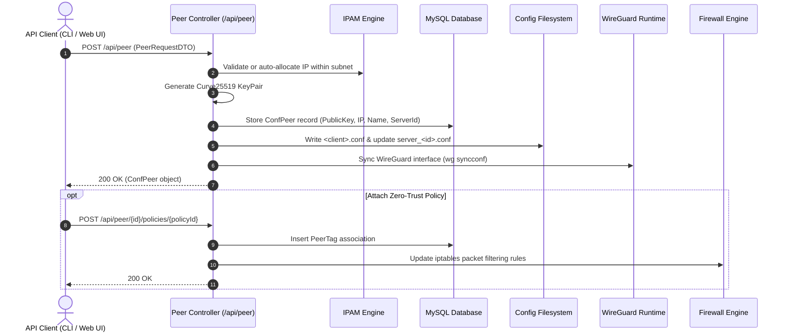
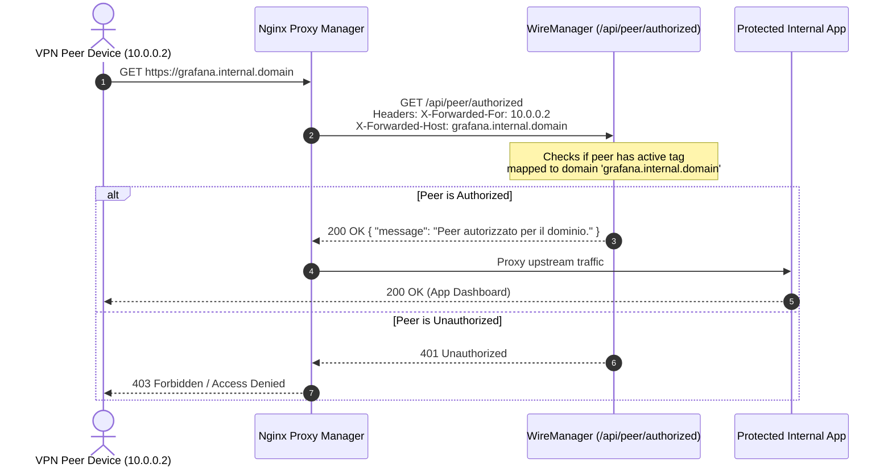

# Peer API

The WireManager REST API provides a comprehensive set of endpoints for managing the full lifecycle of WireGuard client peers. Through the `/api/peer` resource, administrators and automation systems can provision new peers with automatic or static IP allocation, export configuration files (`.conf`) and QR codes, toggle tunnel availability, bind zero-trust policy tags, inspect real-time interface telemetry, and integrate reverse proxies with external forward authentication.

---

## Architectural Lifecycle & Provisioning Flow

Peers in WireManager are dynamically synchronized between the MySQL database, the server configuration files on disk, and the running WireGuard kernel interface inside the container.



---

## Authorization & Access Levels

All peer management endpoints require authentication via a JWT Bearer token, with the exception of the external forward-auth verification endpoint designed for reverse proxies:

| Scope | Endpoints | Required Role / Permission |
| :--- | :--- | :--- |
| **Peer Operations & Telemetry** | `/api/peer/**` (CRUD, status, profiles, stats, tags) | `Admin`, `Operator` |
| **Reverse Proxy Authorization** | `GET /api/peer/authorized` | Anonymous (`[AllowAnonymous]`) |

:::note System Initialization Gatekeeper
The entire `PeerController` is guarded by the `[RequireSetup]` attribute. Operational endpoints will reject incoming requests until the initial administrator setup has been successfully completed via `/api/setup`.
:::

---

## Endpoints Overview

The following endpoints are exposed by `PeerController`:

| Method | Endpoint | Authorization | Description |
| :--- | :--- | :--- | :--- |
| `GET` | `/api/peer` | Admin, Operator | Retrieves a paginated list of peers with optional search filtering. |
| `GET` | `/api/peer/{id}` | Admin, Operator | Retrieves full configuration and metadata for a specific peer. |
| `POST` | `/api/peer` | Admin, Operator | Provisions a new peer, assigns an IP address, generates keys, and synchronizes the interface. |
| `PUT` | `/api/peer/{id}` | Admin, Operator | Updates an existing peer's configuration parameters. |
| `DELETE` | `/api/peer/{id}` | Admin, Operator | Deletes a peer, removes its configuration from the server, and frees its allocated IP. |
| `PATCH` | `/api/peer/{id}/status/{status}` | Admin, Operator | Enables (`true`) or disables (`false`) a peer in the active WireGuard configuration. |
| `GET` | `/api/peer/{id}/conf` | Admin, Operator | Downloads the generated `.conf` client configuration file containing the private key. |
| `GET` | `/api/peer/{id}/qrcode` | Admin, Operator | Generates and returns a PNG QR code of the client configuration for mobile import. |
| `GET` | `/api/peer/{id}/policies` | Admin, Operator | Retrieves all policy tags currently assigned to the peer. |
| `POST` | `/api/peer/{id}/policies/{policyId}` | Admin, Operator | Associates a policy tag with the peer and triggers firewall re-evaluation. |
| `DELETE` | `/api/peer/{id}/policies/{policyID}` | Admin, Operator | Removes a policy tag from the peer and triggers firewall re-evaluation. |
| `GET` | `/api/peer/{id}/live-stats` | Admin, Operator | Fetches real-time transfer counters and latest handshake directly from the WireGuard runtime. |
| `GET` | `/api/peer/{id}/stats` | Admin, Operator | Retrieves up to 100 historical bandwidth consumption records from the database, with optional starting datetime filtering (`from`). |
| `GET` | `/api/peer/authorized` | Anonymous | Verifies whether a client IP is authorized to access a domain for reverse proxy forward-auth. |

---

## Request & Response Specifications

### 1. List Peers (`GET /api/peer`)

Retrieves a paginated list of client peers.

#### Request
```http
GET /api/peer?start=0&end=10&searchTerm=laptop HTTP/1.1
Host: localhost:5070
Authorization: Bearer <token>
Accept: application/json
```

#### Query Parameters

| Parameter | Type | Required | Default | Validation / Constraints | Description |
| :--- | :--- | :--- | :--- | :--- | :--- |
| `start` | Integer | No | `0` | `start >= 0`, `start <= end` | Zero-based index of the first item to return. |
| `end` | Integer | No | `10` | `end - start <= 100` | Zero-based ending index. Slices larger than 100 are rejected. |
| `searchTerm` | String | No | `null` | String | Case-insensitive substring filter matched against `clientName` or `publicKey`. |

#### Response (`200 OK`)
The total matching count across all pages is delivered in the `X-Total-Count` header:

```http
HTTP/1.1 200 OK
Content-Type: application/json; charset=utf-8
X-Total-Count: 12
```

```json
[
  {
    "id": 1,
    "clientName": "alice-laptop",
    "publicKey": "wG7qK8s0...2Fj=",
    "address": "10.0.0.2/32",
    "dnsAddress": "1.1.1.1",
    "allowedIPs": "0.0.0.0/0",
    "persistentKeepAlive": 25,
    "isActive": true,
    "lastHandShake": "2026-09-04T18:30:15Z",
    "expireAt": "2026-10-01T00:00:00Z",
    "confServerId": 1,
    "peerTags": [
      {
        "id": 10,
        "peerId": 1,
        "tagId": 3,
        "tag": {
          "id": 3,
          "name": "Developers",
          "color": "#3B82F6"
        }
      }
    ]
  }
]
```

---

### 2. Get Peer by ID (`GET /api/peer/{id}`)

Retrieves detailed information and tag associations for a specific peer.

#### Request
```http
GET /api/peer/1 HTTP/1.1
Host: localhost:5070
Authorization: Bearer <token>
Accept: application/json
```

#### Path Parameters

| Parameter | Type | Constraints | Description |
| :--- | :--- | :--- | :--- |
| `id` | Integer | `id > 0` | Unique identifier of the peer. |

#### Response (`200 OK`)
```json
{
  "id": 1,
  "clientName": "alice-laptop",
  "publicKey": "wG7qK8s0...2Fj=",
  "address": "10.0.0.2/32",
  "dnsAddress": "1.1.1.1",
  "allowedIPs": "0.0.0.0/0",
  "persistentKeepAlive": 25,
  "isActive": true,
  "lastHandShake": "2026-09-04T18:30:15Z",
  "expireAt": "2026-10-01T00:00:00Z",
  "confServerId": 1,
  "peerTags": [
    {
      "id": 10,
      "peerId": 1,
      "tagId": 3,
      "tag": {
        "id": 3,
        "name": "Developers",
        "color": "#3B82F6"
      }
    }
  ]
}
```

---

### 3. Create Peer (`POST /api/peer`)

Provisions a new peer, securely generates an asymmetric Curve25519 keypair, calculates the network address if omitted, stores the record, and synchronizes the active WireGuard server interface.

#### Request
```http
POST /api/peer HTTP/1.1
Host: localhost:5070
Authorization: Bearer <token>
Content-Type: application/json

{
  "clientName": "bob-workstation",
  "address": null,
  "dnsAddress": "1.1.1.1",
  "allowedIPs": "0.0.0.0/0",
  "persistentKeepAlive": 25,
  "expireAt": "2026-12-31T23:59:59Z",
  "confServerId": 1
}
```

#### Request Payload Properties (`PeerRequestDTO`)

| Field | Type | Required | Constraints | Description |
| :--- | :--- | :--- | :--- | :--- |
| `clientName` | String | Yes | Max 100 chars | Unique identifier for the client device or user. |
| `address` | String | No | Valid IPv4 / Subnet | Specific private VPN IP (e.g., `10.0.0.5` or `10.0.0.5/32`). If `null`, IPAM automatically assigns the next available address in the server's subnet. |
| `dnsAddress` | String | Yes | Valid IP / Host | DNS server to configure in the client's interface block. |
| `allowedIPs` | String | Yes | Valid CIDR subnet | Subnets routed through the tunnel (`0.0.0.0/0` for full tunnel, or specific CIDR for split tunnel). |
| `persistentKeepAlive` | Integer | No | Range `0` to `2147483647` | Keepalive packet interval in seconds (recommended `25` for clients behind NAT). |
| `expireAt` | String (ISO 8601) | No | Valid timestamp | Scheduled expiration date when access will be terminated automatically. |
| `confServerId` | Integer | Yes | Range `1` to `2147483647` | ID of the WireGuard server instance hosting this peer. |

#### Response (`200 OK`)
Returns the initialized `ConfPeer` entity. Note that for security purposes, the `privateKey` is excluded from the JSON payload (`[JsonIgnore]`) and should be retrieved via `/conf` or `/qrcode`.

```json
{
  "id": 2,
  "clientName": "bob-workstation",
  "publicKey": "Kj98aX2b...L0m=",
  "address": "10.0.0.3/32",
  "dnsAddress": "1.1.1.1",
  "allowedIPs": "0.0.0.0/0",
  "persistentKeepAlive": 25,
  "isActive": true,
  "lastHandShake": null,
  "expireAt": "2026-12-31T23:59:59Z",
  "confServerId": 1,
  "peerTags": []
}
```

---

### 4. Update Peer (`PUT /api/peer/{id}`)

Updates configuration attributes of an existing peer. If `clientName` is changed, the physical configuration file on disk is renamed accordingly.

#### Request
```http
PUT /api/peer/2 HTTP/1.1
Host: localhost:5070
Authorization: Bearer <token>
Content-Type: application/json

{
  "clientName": "bob-laptop",
  "address": "10.0.0.3/32",
  "dnsAddress": "8.8.8.8",
  "allowedIPs": "10.0.0.0/24",
  "persistentKeepAlive": 25,
  "expireAt": "2027-01-01T00:00:00Z",
  "confServerId": 1
}
```

#### Response (`200 OK`)
```http
HTTP/1.1 200 OK
Content-Length: 0
```

---

### 5. Delete Peer (`DELETE /api/peer/{id}`)

Deletes a peer from the database, removes its profile file (`<clientName>.conf`) from disk, removes the peer block from `server_<id>.conf`, and synchronizes the WireGuard server to immediately drop any active connections.

#### Request
```http
DELETE /api/peer/2 HTTP/1.1
Host: localhost:5070
Authorization: Bearer <token>
```

#### Response (`200 OK`)
```http
HTTP/1.1 200 OK
Content-Length: 0
```

---

### 6. Toggle Peer Status (`PATCH /api/peer/{id}/status/{status}`)

Toggles peer access without deleting its identity or releasing its IP address. When deactivated, the `[Peer]` block in the server configuration is commented out and reloaded into WireGuard.

#### Request
```http
PATCH /api/peer/1/status/false HTTP/1.1
Host: localhost:5070
Authorization: Bearer <token>
```

#### Path Parameters

| Parameter | Type | Allowed Values | Description |
| :--- | :--- | :--- | :--- |
| `id` | Integer | `id > 0` | The peer identifier. |
| `status` | Boolean | `true`, `false` | `true` to activate access; `false` to deactivate. |

#### Response (`200 OK`)
```http
HTTP/1.1 200 OK
Content-Length: 0
```

---

### 7. Download Client Configuration (`GET /api/peer/{id}/conf`)

Downloads the complete client-side WireGuard configuration file including private key and server endpoint details.

#### Request
```http
GET /api/peer/1/conf HTTP/1.1
Host: localhost:5070
Authorization: Bearer <token>
```

#### Response (`200 OK`)
```http
HTTP/1.1 200 OK
Content-Type: text/plain; charset=utf-8

[Interface]
PrivateKey = yAn7...gA=
Address = 10.0.0.2/32
DNS = 1.1.1.1

[Peer]
PublicKey = vpnServerPublicKey123456=
Endpoint = vpn.example.com:51820
AllowedIPs = 0.0.0.0/0
PersistentKeepalive = 25
```

---

### 8. Download Client QR Code (`GET /api/peer/{id}/qrcode`)

Renders the client `.conf` profile as a binary PNG image for scanning by mobile WireGuard apps.

#### Request
```http
GET /api/peer/1/qrcode HTTP/1.1
Host: localhost:5070
Authorization: Bearer <token>
Accept: image/png
```

#### Response (`200 OK`)
```http
HTTP/1.1 200 OK
Content-Type: image/png
Content-Length: 12480

<binary PNG image data>
```

---

### 9. Get Assigned Policies (`GET /api/peer/{id}/policies`)

Retrieves the list of policy tags currently bound to this peer.

#### Request
```http
GET /api/peer/1/policies HTTP/1.1
Host: localhost:5070
Authorization: Bearer <token>
Accept: application/json
```

#### Response (`200 OK`)
```json
[
  {
    "id": 3,
    "name": "Developers",
    "color": "#3B82F6"
  },
  {
    "id": 5,
    "name": "Staging-Access",
    "color": "#10B981"
  }
]
```

---

### 10. Add Policy to Peer (`POST /api/peer/{id}/policies/{policyId}`)

Binds an access control policy tag to the peer and automatically recompiles the firewall rules (`iptables`) on the host. This operation is idempotent.

#### Request
```http
POST /api/peer/1/policies/3 HTTP/1.1
Host: localhost:5070
Authorization: Bearer <token>
```

#### Path Parameters

| Parameter | Type | Description |
| :--- | :--- | :--- |
| `id` | Integer (`> 0`) | The target peer identifier. |
| `policyId` | Integer (`> 0`) | The identifier of the tag/policy to attach. |

#### Response (`200 OK`)
```http
HTTP/1.1 200 OK
Content-Length: 0
```

---

### 11. Remove Policy from Peer (`DELETE /api/peer/{id}/policies/{policyID}`)

Unbinds a policy tag from the peer and triggers an immediate firewall rule recalculation.

#### Request
```http
DELETE /api/peer/1/policies/3 HTTP/1.1
Host: localhost:5070
Authorization: Bearer <token>
```

#### Path Parameters

| Parameter | Type | Description |
| :--- | :--- | :--- |
| `id` | Integer (`> 0`) | The target peer identifier. |
| `policyID` | Integer (`> 0`) | The identifier of the tag/policy to unbind. |

#### Response (`200 OK`)
```http
HTTP/1.1 200 OK
Content-Length: 0
```

---

### 12. Real-Time Telemetry (`GET /api/peer/{id}/live-stats`)

Queries live metrics directly from the active WireGuard interface in the Linux kernel via Docker socket integration.

#### Request
```http
GET /api/peer/1/live-stats HTTP/1.1
Host: localhost:5070
Authorization: Bearer <token>
Accept: application/json
```

#### Response (`200 OK`)
```json
{
  "publicKey": "wG7qK8s0...2Fj=",
  "latestHandshake": "2026-09-04T18:44:02Z",
  "rxBytes": 2490368,
  "txBytes": 15826944
}
```

| Field | Type | Description |
| :--- | :--- | :--- |
| `publicKey` | String | Public key of the peer as reported by `wg show`. |
| `latestHandshake` | String (ISO 8601) / null | Timestamp of the most recent cryptographic handshake with the server. |
| `rxBytes` | Long (Int64) | Cumulative bytes received from this peer since interface startup. |
| `txBytes` | Long (Int64) | Cumulative bytes transmitted to this peer since interface startup. |

---

### 13. Historical Usage History (`GET /api/peer/{id}/stats`)

Returns up to 100 historical bandwidth consumption records collected by the background telemetry service, enabling usage trend graphing. Accepts an optional `from` query parameter to filter telemetry samples starting from a specific point in time.

#### Request
```http
GET /api/peer/1/stats?from=2026-09-08T19:57:06Z HTTP/1.1
Host: localhost:5070
Authorization: Bearer <token>
Accept: application/json
```

#### Path Parameters

| Parameter | Type | Constraints | Description |
| :--- | :--- | :--- | :--- |
| `id` | Integer | `id > 0` | Unique identifier of the peer. |

#### Query Parameters

| Parameter | Type | Required | Default | Validation / Constraints | Description |
| :--- | :--- | :--- | :--- | :--- | :--- |
| `from` | String (ISO 8601 DateTime) | No | `null` | Valid ISO 8601 UTC timestamp | Starting timestamp from which sample records begin (`timestamp >= from`). When provided, returned samples start chronologically from this datetime. If omitted, returns the latest 100 records. |

#### Response (`200 OK`)
```json
[
  {
    "id": 482,
    "publicKey": "wG7qK8s0...2Fj=",
    "rxBytesRaw": 2490368,
    "txBytesRaw": 15826944,
    "deltaTxBytes": 1048576,
    "deltaRxBytes": 131072,
    "timestamp": "2026-09-04T18:40:00Z"
  }
]
```

| Field | Type | Description |
| :--- | :--- | :--- |
| `id` | Integer | Historical record identifier. |
| `publicKey` | String | Public key associated with the record. |
| `rxBytesRaw` | Long (Int64) | Raw interface RX counter at time of capture. |
| `txBytesRaw` | Long (Int64) | Raw interface TX counter at time of capture. |
| `deltaTxBytes` | Long (Int64) | Throughput transmitted during the polling delta interval. |
| `deltaRxBytes` | Long (Int64) | Throughput received during the polling delta interval. |
| `timestamp` | String (ISO 8601) | Timestamp when the measurement was persisted. |

---

### 14. Forward-Auth Authorization Check (`GET /api/peer/authorized`)

An anonymous endpoint designed specifically for reverse proxies (such as Nginx Proxy Manager or Traefik) implementing forward authentication at Layer 7.



#### Request
```http
GET /api/peer/authorized HTTP/1.1
Host: localhost:5070
X-Forwarded-For: 10.0.0.2
X-Forwarded-Host: grafana.internal.domain
```

#### Request Headers

| Header | Required | Fallback | Description |
| :--- | :--- | :--- | :--- |
| `X-Forwarded-For` | Recommended | Remote IP Address | IP address of the client sending traffic through the proxy. |
| `X-Forwarded-Host` | Recommended | `Host` header | Destination domain requested by the user. |

#### Responses

- **`200 OK`**: Client peer is authorized to access the requested domain.
  ```json
  {
    "message": "Peer autorizzato per il dominio."
  }
  ```
- **`401 Unauthorized`**: Peer has no active tag granting access to this domain or is inactive.
- **`400 Bad Request`**: Cannot determine client IP or target domain from request headers.

---

## Client Integration Examples

### cURL Workflow

```bash
#!/usr/bin/env bash
API_URL="http://localhost:5070/api"

# 1. Authenticate and extract token
TOKEN=$(curl -s -X POST "$API_URL/auth/login" \
  -H "Content-Type: application/json" \
  -d '{"username": "admin", "password": "SuperSecretPassword123!"}' \
  | jq -r '.token')

# 2. Create a new peer with auto-assigned IP
PEER_ID=$(curl -s -X POST "$API_URL/peer" \
  -H "Authorization: Bearer $TOKEN" \
  -H "Content-Type: application/json" \
  -d '{
    "clientName": "developer-laptop",
    "dnsAddress": "1.1.1.1",
    "allowedIPs": "0.0.0.0/0",
    "persistentKeepAlive": 25,
    "confServerId": 1
  }' | jq -r '.id')

echo "Provisioned peer ID: $PEER_ID"

# 3. Download the .conf configuration
curl -s -X GET "$API_URL/peer/$PEER_ID/conf" \
  -H "Authorization: Bearer $TOKEN" \
  -o "developer-laptop.conf"

echo "Configuration saved to developer-laptop.conf"

# 4. Bind policy tag 2 (e.g., Staging Access)
curl -s -X POST "$API_URL/peer/$PEER_ID/policies/2" \
  -H "Authorization: Bearer $TOKEN"

# 5. Fetch live interface statistics
curl -s -X GET "$API_URL/peer/$PEER_ID/live-stats" \
  -H "Authorization: Bearer $TOKEN" | jq .
```

---

### Python

```python
import requests

BASE_URL = "http://localhost:5070/api"

# 1. Login
auth_resp = requests.post(f"{BASE_URL}/auth/login", json={
    "username": "admin",
    "password": "SuperSecretPassword123!"
})
auth_resp.raise_for_status()
token = auth_resp.json()["token"]

session = requests.Session()
session.headers.update({"Authorization": f"Bearer {token}"})

# 2. Provision new peer
peer_payload = {
    "clientName": "service-worker-01",
    "address": None, # Triggers IPAM auto-allocation
    "dnsAddress": "1.1.1.1",
    "allowedIPs": "0.0.0.0/0",
    "persistentKeepAlive": 25,
    "confServerId": 1
}

create_resp = session.post(f"{BASE_URL}/peer", json=peer_payload)
create_resp.raise_for_status()
peer = create_resp.json()
print(f"Created Peer {peer['id']}: IP {peer['address']}")

# 3. Download .conf file
conf_resp = session.get(f"{BASE_URL}/peer/{peer['id']}/conf")
with open(f"{peer['clientName']}.conf", "w") as f:
    f.write(conf_resp.text)

# 4. Query live telemetry
stats_resp = session.get(f"{BASE_URL}/peer/{peer['id']}/live-stats")
print("Live stats:", stats_resp.json())
```

---

### TypeScript (Node.js / Browser)

```typescript
const BASE_URL = 'http://localhost:5070/api';

interface PeerResponse {
  id: number;
  clientName: string;
  address: string;
  publicKey: string;
  isActive: boolean;
}

async function provisionPeer(name: string): Promise<PeerResponse> {
  // 1. Authenticate
  const loginRes = await fetch(`${BASE_URL}/auth/login`, {
    method: 'POST',
    headers: { 'Content-Type': 'application/json' },
    body: JSON.stringify({
      username: 'admin',
      password: 'SuperSecretPassword123!',
    }),
  });

  const { token } = await loginRes.json();
  const authHeaders = {
    Authorization: `Bearer ${token}`,
    'Content-Type': 'application/json',
  };

  // 2. Create peer
  const createRes = await fetch(`${BASE_URL}/peer`, {
    method: 'POST',
    headers: authHeaders,
    body: JSON.stringify({
      clientName: name,
      dnsAddress: '1.1.1.1',
      allowedIPs: '0.0.0.0/0',
      persistentKeepAlive: 25,
      confServerId: 1,
    }),
  });

  if (!createRes.ok) {
    throw new Error(`Failed to create peer: ${await createRes.text()}`);
  }

  return (await createRes.json()) as PeerResponse;
}
```

---

## Validation & Error Handling

The API enforces strict validation rules across all peer operations:

| Status Code | Scenario | Reason / Cause |
| :--- | :--- | :--- |
| **`400 Bad Request`** | Negative index or inverted range (`start < 0`, `end < start`) | Pagination index constraint violation. |
| **`400 Bad Request`** | Pagination slice exceeds 100 items (`end - start > 100`) | Enforced protection against memory spikes. |
| **`400 Bad Request`** | Non-positive identifier (`id <= 0`, `policyId <= 0`) | Invalid path parameter. |
| **`400 Bad Request`** | Duplicate client name | A peer with the specified name already exists on the instance. |
| **`400 Bad Request`** | Subnet mismatch or IP collision | Provided static IP is outside the server's subnet or already allocated. |
| **`401 Unauthorized`** | Missing or expired JWT token | Client did not provide a valid Bearer token. |
| **`403 Forbidden`** | Non-administrative role | User lacks `Admin` or `Operator` role permissions. |
| **`404 Not Found`** | Peer or associated resource not found | Target peer ID, policy ID, or telemetry data does not exist in the database. |

---

## Related Documentation

- **[API Overview](./overview.md)** — Architecture, authentication gatekeeper, and base URLs.
- **[API Authentication](./authentication.md)** — Bearer token generation, claims, and role management.
- **[Concepts: Peers](../concepts/peers.md)** — Deep conceptual background on WireGuard peers and IPAM.
- **[Concepts: Access Policies](../concepts/access-policies.md)** — Zero-trust access policies, services, and tag mapping.
- **[Nginx Proxy Manager Integration](../guides/nginx-proxy-manager.md)** — How to configure reverse proxy forward-auth using `/api/peer/authorized`.
