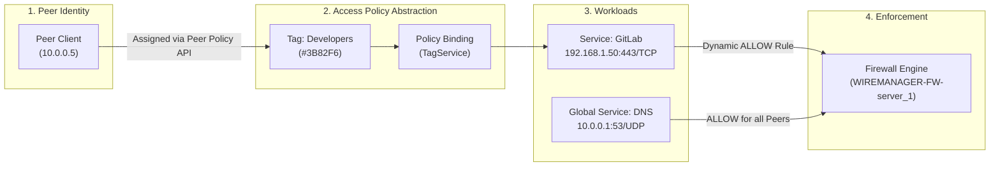
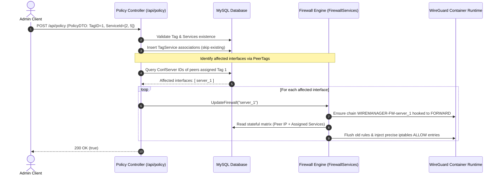

# Policy & Access Control API

The WireManager REST API provides a declarative, Zero-Trust policy engine for orchestrating network micro-segmentation. Through the `/api/policy` resource, administrators manage logical **Tags**, define protected internal network **Services** (Layer-3/4 packet endpoints and Layer-7 reverse proxy domains), and bind them into access policies that dynamically re-evaluate and inject stateful Linux kernel `iptables` packet filtering rules inside the WireGuard container.

---

## Architectural Lifecycle & Enforcement Mechanics

WireManager rejects broad subnet-wide VPN access. Instead, clients are completely isolated by default, and network traffic is strictly authorized through a tripartite model:



### Dynamic Firewall Re-evaluation Flow

When an administrator creates, modifies, or deletes a Tag or Service, WireManager's `PolicyServices` and `FirewallServices` automatically trace affected peers, locate their host WireGuard interfaces (`server_{id}`), and update the dedicated iptables sub-chain (`WIREMANAGER-FW-server_{id}`):



---

## Authorization & Access Levels

All policy management endpoints require authentication via a valid JWT Bearer token:

| Scope | Endpoints | Required Role / Permission |
| :--- | :--- | :--- |
| **Inspection** | `GET /api/policy/tags`, `GET /api/policy/tags/{id}`, `GET /api/policy/services`, `GET /api/policy/services/{id}` | `Admin`, `Operator` |
| **Administration** | `POST /api/policy/tags`, `PUT /api/policy/tags/{tagId}`, `DELETE /api/policy/tags/{id}`, `DELETE /api/policy/tags/{tagId}/services/{serviceId}`, `POST /api/policy/services`, `DELETE /api/policy/services/{id}`, `POST /api/policy` | `Admin` |

:::note System Initialization Gatekeeper
Like all operational controllers, `PolicyController` is decorated with the `[RequireSetup]` attribute. Incoming requests are rejected until initial setup onboarding has been completed via `/api/setup`.
:::

---

## Endpoints Overview

The following endpoints are exposed by `PolicyController`:

| Method | Endpoint | Authorization | Description |
| :--- | :--- | :--- | :--- |
| `GET` | `/api/policy/tags` | Admin, Operator | Retrieves all policy tags including their associated services. |
| `GET` | `/api/policy/tags/{id}` | Admin, Operator | Retrieves full details for a specific policy tag with nested services. |
| `POST` | `/api/policy/tags` | Admin | Creates a new policy tag with optional initial service associations. |
| `PUT` | `/api/policy/tags/{tagId}` | Admin | Updates tag properties and replaces associated service IDs, triggering firewall re-evaluation. |
| `DELETE` | `/api/policy/tags/{id}` | Admin | Deletes a tag, cascades associations, and updates affected interface firewalls. |
| `DELETE` | `/api/policy/tags/{tagId}/services/{serviceId}` | Admin | Removes a specific service from a tag and recalculates firewall rules. |
| `GET` | `/api/policy/services` | Admin, Operator | Retrieves all registered internal network services. |
| `GET` | `/api/policy/services/{id}` | Admin, Operator | Retrieves full configuration details for a specific service. |
| `POST` | `/api/policy/services` | Admin | Registers a new network service. If marked `isGlobal`, updates firewall on all active interfaces. |
| `DELETE` | `/api/policy/services/{id}` | Admin | Deletes a network service, unlinks it from tags, and purges corresponding firewall rules. |
| `POST` | `/api/policy` | Admin | Binds one or more services to an existing tag (bulk policy association). |

---

## Request & Response Specifications

### 1. List All Tags (`GET /api/policy/tags`)

Retrieves all defined policy tags along with their linked services.

#### Request
```http
GET /api/policy/tags HTTP/1.1
Host: localhost:5070
Authorization: Bearer <token>
Accept: application/json
```

#### Response (`200 OK`)
```json
[
  {
    "id": 1,
    "name": "Developers",
    "color": "#3B82F6",
    "peerTags": null,
    "tagServices": [
      {
        "id": 10,
        "tagId": 1,
        "serviceId": 4,
        "service": {
          "id": 4,
          "name": "Internal GitLab",
          "port": 443,
          "protocol": "tcp",
          "targetIp": "192.168.1.50",
          "domain": "gitlab.internal.net",
          "isGlobal": false
        }
      }
    ]
  }
]
```

---

### 2. Get Tag by ID (`GET /api/policy/tags/{id}`)

Retrieves a single tag by identifier, including all bundled services.

#### Request
```http
GET /api/policy/tags/1 HTTP/1.1
Host: localhost:5070
Authorization: Bearer <token>
Accept: application/json
```

#### Path Parameters

| Parameter | Type | Constraints | Description |
| :--- | :--- | :--- | :--- |
| `id` | Integer | `id > 0` | Unique identifier of the policy tag. |

#### Response (`200 OK`)
```json
{
  "id": 1,
  "name": "Developers",
  "color": "#3B82F6",
  "peerTags": null,
  "tagServices": [
    {
      "id": 10,
      "tagId": 1,
      "serviceId": 4,
      "service": {
        "id": 4,
        "name": "Internal GitLab",
        "port": 443,
        "protocol": "tcp",
        "targetIp": "192.168.1.50",
        "domain": "gitlab.internal.net",
        "isGlobal": false
      }
    }
  ]
}
```

#### Error Responses
- `400 Bad Request`: `Invalid ID.` if `id <= 0`.
- `404 Not Found`: `Tag with ID {id} not found.`

---

### 3. Create Tag (`POST /api/policy/tags`)

Creates a new policy tag with a name, a HEX color code, and an optional list of pre-existing service IDs to attach immediately.

#### Request
```http
POST /api/policy/tags HTTP/1.1
Host: localhost:5070
Authorization: Bearer <token>
Content-Type: application/json

{
  "name": "Database-Admins",
  "color": "#10B981",
  "servicesId": [1, 3]
}
```

#### Request Payload Properties (`TagDTO`)

| Field | Type | Required | Constraints | Description |
| :--- | :--- | :--- | :--- | :--- |
| `name` | String | Yes | Max 100 chars | Human-readable tag identifier (e.g. `DevOps`, `Staging-Access`). |
| `color` | String | Yes | Regex `^#([A-Fa-f0-9]{6}\|[A-Fa-f0-9]{3})$` | Hexadecimal color code for UI badging (e.g., `#3B82F6` or `#FFF`). |
| `servicesId` | Array of Integers | No | Valid service IDs | Optional initial service IDs to bind to this tag upon creation. |

#### Response (`200 OK`)
```json
{
  "id": 2,
  "name": "Database-Admins",
  "color": "#10B981",
  "peerTags": null,
  "tagServices": null
}
```

---

### 4. Update Tag (`PUT /api/policy/tags/{tagId}`)

Updates tag metadata (name, color) and optionally replaces the entire set of associated services with a new list. If service associations are modified, all affected peer firewall chains are re-synchronized.

#### Request
```http
PUT /api/policy/tags/2 HTTP/1.1
Host: localhost:5070
Authorization: Bearer <token>
Content-Type: application/json

{
  "name": "DB-Admins-Production",
  "color": "#059669",
  "servicesId": [1, 3, 5]
}
```

#### Path Parameters

| Parameter | Type | Constraints | Description |
| :--- | :--- | :--- | :--- |
| `tagId` | Integer | `tagId > 0` | Unique identifier of the tag to update. |

#### Response (`200 OK`)
```json
true
```

---

### 5. Delete Tag (`DELETE /api/policy/tags/{id}`)

Deletes a policy tag, removes all associated `TagService` bridge records, and re-evaluates firewall rules for any peer interfaces that were assigned this tag.

#### Request
```http
DELETE /api/policy/tags/2 HTTP/1.1
Host: localhost:5070
Authorization: Bearer <token>
```

#### Path Parameters

| Parameter | Type | Constraints | Description |
| :--- | :--- | :--- | :--- |
| `id` | Integer | `id > 0` | Identifier of the tag to delete. |

#### Response (`200 OK`)
```json
true
```

---

### 6. Remove Service from Tag (`DELETE /api/policy/tags/{tagId}/services/{serviceId}`)

Dissociates a single service from a tag without deleting the service or the tag, triggering an immediate firewall rule flush and regeneration for affected peers.

#### Request
```http
DELETE /api/policy/tags/1/services/4 HTTP/1.1
Host: localhost:5070
Authorization: Bearer <token>
```

#### Path Parameters

| Parameter | Type | Constraints | Description |
| :--- | :--- | :--- | :--- |
| `tagId` | Integer | `tagId > 0` | Identifier of the policy tag. |
| `serviceId` | Integer | `serviceId > 0` | Identifier of the service to unlink. |

#### Response (`200 OK`)
```json
true
```

---

### 7. List All Services (`GET /api/policy/services`)

Retrieves the complete catalog of registered network services.

#### Request
```http
GET /api/policy/services HTTP/1.1
Host: localhost:5070
Authorization: Bearer <token>
Accept: application/json
```

#### Response (`200 OK`)
```json
[
  {
    "id": 1,
    "name": "Core DNS",
    "port": 53,
    "protocol": "udp",
    "targetIp": "10.0.0.1",
    "domain": null,
    "isGlobal": true,
    "tagServices": null
  },
  {
    "id": 4,
    "name": "Internal GitLab",
    "port": 443,
    "protocol": "tcp",
    "targetIp": "192.168.1.50",
    "domain": "gitlab.internal.net",
    "isGlobal": false,
    "tagServices": null
  }
]
```

---

### 8. Get Service by ID (`GET /api/policy/services/{id}`)

Retrieves configuration and network properties for a specific service.

#### Request
```http
GET /api/policy/services/4 HTTP/1.1
Host: localhost:5070
Authorization: Bearer <token>
Accept: application/json
```

#### Path Parameters

| Parameter | Type | Constraints | Description |
| :--- | :--- | :--- | :--- |
| `id` | Integer | `id > 0` | Unique identifier of the service. |

#### Response (`200 OK`)
```json
{
  "id": 4,
  "name": "Internal GitLab",
  "port": 443,
  "protocol": "tcp",
  "targetIp": "192.168.1.50",
  "domain": "gitlab.internal.net",
  "isGlobal": false,
  "tagServices": null
}
```

#### Error Responses
- `400 Bad Request`: `Invalid ID.` if `id <= 0`.
- `404 Not Found`: `Service with ID {id} not found.`

---

### 9. Create Service (`POST /api/policy/services`)

Registers a new internal network destination.

:::tip Global Services vs Local Services
- **Local Services (`isGlobal: false`)**: Denied by default; accessible only to peers assigned tags that bundle this service.
- **Global Services (`isGlobal: true`)**: Automatically accessible to **all** peers across every active server interface. Setting `isGlobal: true` triggers an immediate firewall rule injection across all interfaces.
:::

#### Request
```http
POST /api/policy/services HTTP/1.1
Host: localhost:5070
Authorization: Bearer <token>
Content-Type: application/json

{
  "name": "Production Database",
  "port": 5432,
  "protocol": "tcp",
  "targetIp": "192.168.1.100",
  "domain": "postgres.internal.net",
  "isGlobal": false
}
```

#### Request Payload Properties (`ServiceDTO`)

| Field | Type | Required | Constraints | Description |
| :--- | :--- | :--- | :--- | :--- |
| `name` | String | Yes | Max 100 chars | Descriptive service label. |
| `port` | Integer | Conditional | `1`–`65535` (or `0` for portless) | Destination port. Mandatory for port-based protocols (`tcp`, `udp`, `sctp`); set to `0` or omitted for portless and wildcard protocols (`icmp`, `esp`, `gre`, `igmp`, `all`, `any`). |
| `protocol` | String | Yes | `tcp`, `udp`, `sctp`, `icmp`, `esp`, `gre`, `igmp`, `all`, `any` | Transport or network layer protocol (case-insensitive). Supports port-based protocols (`tcp`, `udp`, `sctp`), portless Layer-3/tunneling protocols (`icmp`, `esp`, `gre`, `igmp`), and wildcard matching (`all` / `any`). |
| `targetIp` | String | Yes | Valid IPv4 or IPv6 | Host destination IP address behind the VPN. |
| `domain` | String | No | FQDN / Hostname | Optional domain name used for Layer-7 reverse proxy authorization. |
| `isGlobal` | Boolean | No | Default `false` | When `true`, automatically allows access to all connected peers. |
| `tagsId` | Array of Integers | No | Valid tag IDs | Optional list of tag IDs to immediately link to this service. |

:::info Supported Protocols & Port Behavior
- **Port-Based Protocols (`tcp`, `udp`, `sctp`)**: Requires a valid destination port between `1` and `65535`. Generates port-targeted packet filtering rules (`iptables ... -p <proto> --dport <port> -j ACCEPT`).
- **Portless Protocols (`icmp`, `esp`, `gre`, `igmp`)**: Operates at Layer 3 or without transport port concepts (diagnostics, IPsec/GRE tunneling, multicast). Port is set to `0` or omitted; generated rules filter only by destination IP and protocol (`iptables ... -p <proto> -j ACCEPT`).
- **Wildcard Protocols (`all` / `any`)**: Unconditionally permits all traffic and protocols to the target IP (`iptables ... -d <targetIp> -j ACCEPT`).
:::

#### Response (`200 OK`)
```json
{
  "id": 5,
  "name": "Production Database",
  "port": 5432,
  "protocol": "tcp",
  "targetIp": "192.168.1.100",
  "domain": "postgres.internal.net",
  "isGlobal": false,
  "tagServices": null
}
```

---

### 10. Delete Service (`DELETE /api/policy/services/{id}`)

Removes a service from the database, unlinks it from all associated tags, and purges the corresponding `iptables` packet filtering rules from all affected interfaces.

#### Request
```http
DELETE /api/policy/services/5 HTTP/1.1
Host: localhost:5070
Authorization: Bearer <token>
```

#### Path Parameters

| Parameter | Type | Constraints | Description |
| :--- | :--- | :--- | :--- |
| `id` | Integer | `id > 0` | Identifier of the service to delete. |

#### Response (`200 OK`)
```json
true
```

---

### 11. Bind Policy (`POST /api/policy`)

Binds a list of service IDs to a specified tag. WireManager validates existence, deduplicates input IDs, checks for existing associations to avoid primary key collisions, and persists new bindings.

#### Request
```http
POST /api/policy HTTP/1.1
Host: localhost:5070
Authorization: Bearer <token>
Content-Type: application/json

{
  "tagID": 1,
  "serviceId": [4, 5]
}
```

#### Request Payload Properties (`PolicyDTO`)

| Field | Type | Required | Constraints | Description |
| :--- | :--- | :--- | :--- | :--- |
| `tagID` | Integer | Yes | Range `1` to `2147483647` | Identifier of the destination tag. |
| `serviceId` | Array of Integers | Yes | Minimum 1 item | List of service IDs to associate with the tag. |

#### Response (`200 OK`)
```json
true
```

---

## Client Integration Examples

### cURL / Bash

```bash
#!/usr/bin/env bash
set -euo pipefail

API_URL="http://localhost:5070/api"

# 1. Login as Administrator
TOKEN=$(curl -s -X POST "$API_URL/auth/login" \
  -H "Content-Type: application/json" \
  -d '{"username": "admin", "password": "SuperSecretPassword123!"}' \
  | jq -r '.token')

AUTH_HEADER="Authorization: Bearer $TOKEN"
JSON_HEADER="Content-Type: application/json"

# 2. Create a protected Service
SERVICE_JSON=$(curl -s -X POST "$API_URL/policy/services" \
  -H "$AUTH_HEADER" -H "$JSON_HEADER" \
  -d '{
    "name": "Grafana Dashboard",
    "port": 3000,
    "protocol": "tcp",
    "targetIp": "192.168.1.150",
    "domain": "grafana.internal.net",
    "isGlobal": false
  }')
SERVICE_ID=$(echo "$SERVICE_JSON" | jq -r '.id')
echo "Created Service ID: $SERVICE_ID"

# 3. Create a Tag
TAG_JSON=$(curl -s -X POST "$API_URL/policy/tags" \
  -H "$AUTH_HEADER" -H "$JSON_HEADER" \
  -d '{
    "name": "Monitoring-Team",
    "color": "#8B5CF6"
  }')
TAG_ID=$(echo "$TAG_JSON" | jq -r '.id')
echo "Created Tag ID: $TAG_ID"

# 4. Bind Service to Tag (Create Policy)
curl -s -X POST "$API_URL/policy" \
  -H "$AUTH_HEADER" -H "$JSON_HEADER" \
  -d "{
    \"tagID\": $TAG_ID,
    \"serviceId\": [$SERVICE_ID]
  }"

echo "Service bound to tag successfully. Firewall rules updated."
```

---

### Python

```python
import requests

BASE_URL = "http://localhost:5070/api"

# 1. Login
auth_resp = requests.post(f"{BASE_URL}/auth/login", json={
    "username": "admin",
    "password": "SuperSecretPassword123!"
})
auth_resp.raise_for_status()
token = auth_resp.json()["token"]

session = requests.Session()
session.headers.update({
    "Authorization": f"Bearer {token}",
    "Content-Type": "application/json"
})

# 2. List all policy tags and nested services
tags_resp = session.get(f"{BASE_URL}/policy/tags")
tags_resp.raise_for_status()
for tag in tags_resp.json():
    services = tag.get("tagServices") or []
    print(f"Tag: {tag['name']} ({tag['color']}) - {len(services)} services attached")

# 3. Provision a Global Service (e.g. Corporate NTP)
ntp_service = {
    "name": "Internal NTP",
    "port": 123,
    "protocol": "udp",
    "targetIp": "10.0.0.1",
    "isGlobal": True
}
create_resp = session.post(f"{BASE_URL}/policy/services", json=ntp_service)
create_resp.raise_for_status()
print("Global service created:", create_resp.json()["name"])
```

---

### TypeScript (Node.js / Fetch API)

```typescript
const BASE_URL = 'http://localhost:5070/api';

interface ServiceResponse {
  id: number;
  name: string;
  port: number;
  protocol: string;
  targetIp: string;
  domain?: string;
  isGlobal: boolean;
}

interface TagResponse {
  id: number;
  name: string;
  color: string;
}

async function configureZeroTrustPolicy(adminToken: string) {
  const headers = {
    Authorization: `Bearer ${adminToken}`,
    'Content-Type': 'application/json',
  };

  // 1. Create a service
  const serviceRes = await fetch(`${BASE_URL}/policy/services`, {
    method: 'POST',
    headers,
    body: JSON.stringify({
      name: 'Staging API',
      port: 8080,
      protocol: 'tcp',
      targetIp: '192.168.20.10',
      isGlobal: false,
    }),
  });
  const service: ServiceResponse = await serviceRes.json();

  // 2. Create a tag bundling this service directly
  const tagRes = await fetch(`${BASE_URL}/policy/tags`, {
    method: 'POST',
    headers,
    body: JSON.stringify({
      name: 'QA-Engineers',
      color: '#F59E0B',
      servicesId: [service.id],
    }),
  });
  const tag: TagResponse = await tagRes.json();

  console.log(`Tag created: ${tag.name} (ID ${tag.id}) with Service: ${service.name}`);
}
```

---

## Validation & Error Handling

The API validates data integrity and business rules across all policy endpoints:

| Status Code | Scenario | Reason / Cause |
| :--- | :--- | :--- |
| **`400 Bad Request`** | Non-positive identifier (`id <= 0`, `tagId <= 0`, `serviceId <= 0`) | Invalid path parameter specified in URL. |
| **`400 Bad Request`** | Invalid HEX color format | Tag color must match 3 or 6 digit hexadecimal regex (e.g. `#FFF` or `#3B82F6`). |
| **`400 Bad Request`** | Invalid protocol | Service protocol must be one of the supported values: `tcp`, `udp`, `sctp`, `icmp`, `esp`, `gre`, `igmp`, `all`, `any`. |
| **`400 Bad Request`** | Invalid port number | Port must be within range `1` to `65535` for port-based protocols (`tcp`, `udp`, `sctp`). |
| **`400 Bad Request`** | Non-existent Service ID during tag creation/update | One or more specified service IDs do not exist in the database. |
| **`400 Bad Request`** | Empty service list in policy binding | `PolicyDTO.ServiceId` must contain at least 1 item. |
| **`401 Unauthorized`** | Missing or expired JWT token | Client did not provide a valid Bearer token. |
| **`403 Forbidden`** | Non-administrative role | Attempted modification by a user lacking `Admin` role. |
| **`404 Not Found`** | Resource not found | Specified tag or service ID does not exist in the database. |

---

## Related Documentation

- **[Concepts: Access Policies](../concepts/access-policies.md)** — Architectural theory, Zero-Trust model, and policy mathematics.
- **[Concepts: Tags](../concepts/tags.md)** — Role grouping and tag association mechanics.
- **[Concepts: Services](../concepts/services.md)** — Service definitions, protocols, and Layer-7 reverse proxy domain bindings.
- **[Peer Management API](./peers.md)** — Binding policy tags to peers via `/api/peer/{id}/policies/{policyId}`.
- **[Server Management API](./servers.md)** — Server interface definitions hosting policy firewall chains.
- **[API Reference Catalog](./reference.md)** — Master index of all REST API endpoints.
