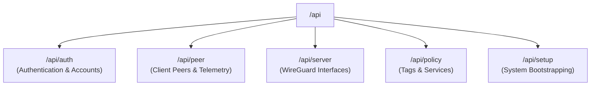

# API Reference Catalog

This document provides a comprehensive index of the REST API endpoints available in WireManager.

---

## Core Resource Domains

The WireManager API is organized into five primary resource areas:

---

## Dedicated API Guides

For in-depth guides with complete request/response schemas, JSON examples, and client SDK integration snippets, refer to the dedicated references:

- **[System Setup & Initialization API](./setup.md)** — System bootstrapping, initial administrator account provisioning, execution mode configuration, and the [RequireSetup] gatekeeper.
- **[Authentication & User Management API](./authentication.md)** — JWT generation, account provisioning, and role assignment.
- **[Peer Management API](./peers.md)** — Peer provisioning, configuration export (`.conf`, QR code), status toggle, policy tags, live telemetry, and reverse proxy forward-auth.
- **[Server Management API](./servers.md)** — WireGuard server interface provisioning, atomic configuration updates, network synchronization, and lifecycle management.
- **[Policy & Zero-Trust Access Control API](./policies.md)** — Tag management, protected network service definitions, policy bindings, and dynamic firewall orchestration.
- **[API Architecture & Overview](./overview.md)** — Base URLs, authentication lifecycles, and system requirements.

---

## Endpoints Summary

### Authentication & Users (`/api/auth`)

| Method | Endpoint | Access | Description |
| :--- | :--- | :--- | :--- |
| `POST` | `/api/auth/login` | Anonymous | Authenticates credentials and returns a signed JWT Bearer token. |
| `POST` | `/api/auth/register` | Admin | Creates a new user account with assigned role (`Admin` or `Operator`). |
| `GET` | `/api/auth/users` | Admin | Retrieves a paginated list of registered accounts. |
| `DELETE` | `/api/auth/users/{uuid}` | Admin | Deletes a user account by UUID. |
| `PATCH` | `/api/auth/users/{uuid}/role/{role}` | Admin | Updates a user's system role (`Admin` or `Operator`). |

*See full documentation in [API Authentication](./authentication.md).*

---

### Peers & Telemetry (`/api/peer`)

| Method | Endpoint | Access | Description |
| :--- | :--- | :--- | :--- |
| `GET` | `/api/peer` | Admin, Operator | Retrieves a paginated list of peers with optional search query. |
| `GET` | `/api/peer/{id}` | Admin, Operator | Retrieves full details for a specific peer. |
| `POST` | `/api/peer` | Admin, Operator | Provisions a new peer, assigns IP address, and synchronizes WireGuard. |
| `PUT` | `/api/peer/{id}` | Admin, Operator | Updates peer configuration properties. |
| `DELETE` | `/api/peer/{id}` | Admin, Operator | Deletes peer and releases its allocated IP. |
| `PATCH` | `/api/peer/{id}/status/{status}` | Admin, Operator | Activates (`true`) or deactivates (`false`) peer access. |
| `GET` | `/api/peer/{id}/conf` | Admin, Operator | Downloads the generated `.conf` client configuration file. |
| `GET` | `/api/peer/{id}/qrcode` | Admin, Operator | Returns the client configuration as a PNG QR code image. |
| `GET` | `/api/peer/{id}/policies` | Admin, Operator | Lists policy tags attached to the peer. |
| `POST` | `/api/peer/{id}/policies/{policyId}` | Admin, Operator | Attaches a policy tag to the peer and updates firewall rules. |
| `DELETE` | `/api/peer/{id}/policies/{policyID}` | Admin, Operator | Removes a policy tag from the peer and updates firewall rules. |
| `GET` | `/api/peer/{id}/live-stats` | Admin, Operator | Retrieves real-time transfer counters and handshake timestamp from kernel. |
| `GET` | `/api/peer/{id}/stats` | Admin, Operator | Retrieves up to 100 historical bandwidth consumption records. |
| `GET` | `/api/peer/authorized` | Anonymous | Reverse proxy forward-auth verification (`X-Forwarded-For`, `X-Forwarded-Host`). |

*See full documentation in [Peer Management API](./peers.md).*

---

### WireGuard Servers (`/api/server`)

| Method | Endpoint | Access | Description |
| :--- | :--- | :--- | :--- |
| `GET` | `/api/server` | Admin, Operator | Retrieves configured WireGuard server instances. |
| `GET` | `/api/server/{id}` | Admin, Operator | Retrieves configuration for a specific server instance. |
| `POST` | `/api/server` | Admin | Provisions a new WireGuard server interface. |
| `PUT` | `/api/server/{id}` | Admin | Updates server interface settings (endpoint, port, subnet). |
| `DELETE` | `/api/server/{id}` | Admin | Deletes a server interface and associated peers. |
| `POST` | `/api/server/{id}/sync` | Admin | Triggers live interface synchronization via `wg syncconf`. |

*See full documentation in [Server Management API](./servers.md).*

---

### Zero-Trust Policies, Tags & Services (`/api/policy`)

| Method | Endpoint | Access | Description |
| :--- | :--- | :--- | :--- |
| `GET` | `/api/policy/tags` | Admin, Operator | Retrieves available policy tags with associated services. |
| `GET` | `/api/policy/tags/{id}` | Admin, Operator | Retrieves full configuration for a specific policy tag. |
| `POST` | `/api/policy/tags` | Admin | Creates a new policy tag with optional initial services. |
| `PUT` | `/api/policy/tags/{tagId}` | Admin | Updates tag properties and associated services. |
| `DELETE` | `/api/policy/tags/{id}` | Admin | Deletes a policy tag and refreshes firewall rules. |
| `DELETE` | `/api/policy/tags/{tagId}/services/{serviceId}` | Admin | Unlinks a service from a tag. |
| `GET` | `/api/policy/services` | Admin, Operator | Lists all registered internal network services. |
| `GET` | `/api/policy/services/{id}` | Admin, Operator | Retrieves configuration for a specific network service. |
| `POST` | `/api/policy/services` | Admin | Registers a new network service (IP, port, protocol, domain). |
| `DELETE` | `/api/policy/services/{id}` | Admin | Deletes a registered network service. |
| `POST` | `/api/policy` | Admin | Binds service IDs to a tag (bulk policy association). |

*See full documentation in [Policy & Access Control API](./policies.md).*

---

### System Initialization (`/api/setup`)

| Method | Endpoint | Access | Description |
| :--- | :--- | :--- | :--- |
| `GET` | `/api/setup/status` | Anonymous | Checks whether system bootstrapping has been completed. |
| `POST` | `/api/setup` | Anonymous | First-time onboarding wizard (disabled once completed). |

*See full documentation in [System Setup & Initialization API](./setup.md).*
