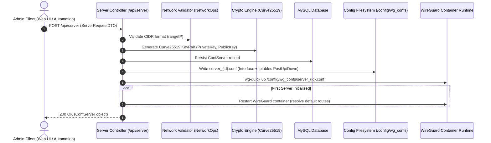
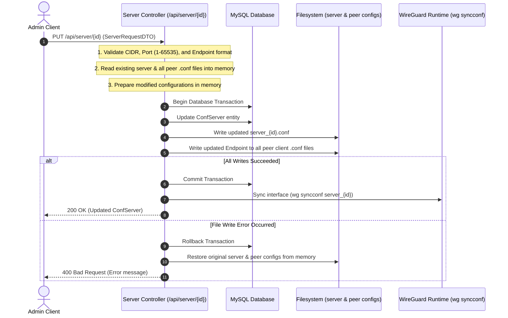
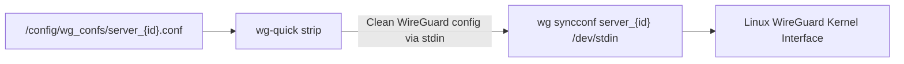

# Server API

The WireManager REST API provides a dedicated set of endpoints for provisioning, modifying, synchronizing, and destroying WireGuard server interfaces. Through the `/api/server` resource, administrators manage core VPN listening gateways, define CIDR subnet boundaries for client IPAM allocation, automate Curve25519 server cryptographic keys, and ensure kernel-level synchronization across container boundaries.

---

## Architectural Lifecycle & Operational Flows

Each WireGuard server in WireManager is represented by a `ConfServer` entity in the MySQL database, a physical configuration file on disk (`/config/wg_confs/server_{id}.conf`), and an active network interface (`server_{id}`) inside the WireGuard container.

### 1. Server Provisioning Flow (`POST /api/server`)

When creating a new server, WireManager executes validation, keypair generation, database registration, physical filesystem writing, and runtime interface activation in a coordinated sequence:



---

### 2. Atomic Update & Endpoint Propagation (`PUT /api/server/{id}`)

Modifying a server's network parameters (such as changing the external endpoint hostname or listen port) requires updating both the server and every active client peer configuration file. WireManager guarantees data consistency using an **in-memory backup and atomic transaction** workflow:



---

### 3. Non-Disruptive Interface Synchronization (`POST /api/server/{id}/sync`)

WireManager supports live configuration reload without dropping established tunnels. When invoked, `wg-quick strip` removes IP and firewall directives from the configuration file, passing the raw peer table directly to `wg syncconf` via standard input:



---

## Authorization & Access Levels

All server management endpoints require authentication via a valid JWT Bearer token:

| Scope | Endpoints | Required Role / Permission |
| :--- | :--- | :--- |
| **Server Inspection** | `GET /api/server`, `GET /api/server/{id}` | `Admin`, `Operator` |
| **Server Provisioning & Lifecycle** | `POST /api/server`, `PUT /api/server/{id}`, `DELETE /api/server/{id}`, `POST /api/server/{id}/sync` | `Admin` |

:::note System Initialization Gatekeeper
Like all operational controllers in WireManager, `ServerController` is decorated with the `[RequireSetup]` filter attribute. All requests will return an error until initial setup onboarding has been completed via `/api/setup`.
:::

---

## Endpoints Overview

The following endpoints are exposed by `ServerController`:

| Method | Endpoint | Authorization | Description |
| :--- | :--- | :--- | :--- |
| `GET` | `/api/server` | Admin, Operator | Retrieves all configured WireGuard server instances and their attached peers. |
| `GET` | `/api/server/{id}` | Admin, Operator | Retrieves configuration and peer associations for a specific server instance. |
| `POST` | `/api/server` | Admin | Provisions a new WireGuard server, generates keypairs, writes config files, and activates the interface. |
| `PUT` | `/api/server/{id}` | Admin | Atomically updates server configuration and propagates endpoint changes to all peer profiles. |
| `DELETE` | `/api/server/{id}` | Admin | Tears down the kernel interface, purges the database record, and deletes the server configuration file. |
| `POST` | `/api/server/{id}/sync` | Admin | Triggers live interface synchronization via `wg syncconf` without disrupting established tunnels. |

---

## Request & Response Specifications

### 1. List Servers (`GET /api/server`)

Retrieves all configured WireGuard server instances, including their child peer collections.

#### Request
```http
GET /api/server HTTP/1.1
Host: localhost:5070
Authorization: Bearer <token>
Accept: application/json
```

#### Query Parameters
*None.*

#### Response (`200 OK`)
Returns an array of `ConfServer` objects. Note that the server's `privateKey` is securely kept server-side and omitted from API responses.

```json
[
  {
    "id": 1,
    "publicKey": "7y7gOaX9Zf1E5rT0hK8uL3wV4qN2mP5sI6jB7vC8xD0=",
    "rangeIP": "10.0.0.1/24",
    "listenPort": 51820,
    "endPoint": "vpn.company.com:51820",
    "peers": [
      {
        "id": 1,
        "clientName": "alice-laptop",
        "publicKey": "wG7qK8s0...2Fj=",
        "address": "10.0.0.2/32",
        "dnsAddress": "1.1.1.1",
        "allowedIPs": "0.0.0.0/0",
        "persistentKeepAlive": 25,
        "isActive": true,
        "confServerId": 1
      }
    ]
  }
]
```

---

### 2. Get Server by ID (`GET /api/server/{id}`)

Retrieves detailed configuration parameters and assigned peers for a single server instance.

#### Request
```http
GET /api/server/1 HTTP/1.1
Host: localhost:5070
Authorization: Bearer <token>
Accept: application/json
```

#### Path Parameters

| Parameter | Type | Constraints | Description |
| :--- | :--- | :--- | :--- |
| `id` | Integer | `id > 0` | Unique identifier of the WireGuard server instance. |

#### Response (`200 OK`)
```json
{
  "id": 1,
  "publicKey": "7y7gOaX9Zf1E5rT0hK8uL3wV4qN2mP5sI6jB7vC8xD0=",
  "rangeIP": "10.0.0.1/24",
  "listenPort": 51820,
  "endPoint": "vpn.company.com:51820",
  "peers": [
    {
      "id": 1,
      "clientName": "alice-laptop",
      "publicKey": "wG7qK8s0...2Fj=",
      "address": "10.0.0.2/32",
      "dnsAddress": "1.1.1.1",
      "allowedIPs": "0.0.0.0/0",
      "persistentKeepAlive": 25,
      "isActive": true,
      "confServerId": 1
    }
  ]
}
```

#### Error Responses
- `400 Bad Request`: `Invalid ID.` if `id <= 0`.
- `404 Not Found`: If no server instance exists with the specified ID.

---

### 3. Create Server (`POST /api/server`)

Provisions a new WireGuard server instance, generates a Curve25519 keypair, writes the server configuration file (`server_{id}.conf`), and launches the network interface using `wg-quick up`.

#### Request
```http
POST /api/server HTTP/1.1
Host: localhost:5070
Authorization: Bearer <token>
Content-Type: application/json

{
  "rangeIP": "10.10.0.1/24",
  "listenPort": 51821,
  "endPoint": "vpn.company.com:51821"
}
```

#### Request Payload Properties (`ServerRequestDTO`)

| Field | Type | Required | Constraints | Description |
| :--- | :--- | :--- | :--- | :--- |
| `rangeIP` | String | Yes | Valid CIDR IPv4 (e.g., `10.0.0.1/24`) | Subnet IP and CIDR mask assigned to the server interface. Used by IPAM for peer address allocation. |
| `listenPort` | Integer | Yes | Range `1` to `65535` | UDP listening port bound by the WireGuard interface on the host network. |
| `endPoint` | String | Yes | Max 255 chars | Publicly reachable IP or FQDN (with optional port) advertised to client peers. |
| `id` | Integer | No | Range `0` to `2147483647` | Entity identifier (generated automatically upon database insert). |

#### Generated Interface Configuration

Upon creation, WireManager automatically generates `/config/wg_confs/server_{id}.conf` containing standard routing and iptables NAT rules:

```ini
[Interface]
PrivateKey = <generated-private-key>
Address = 10.10.0.1/24
ListenPort = 51821
PostUp = iptables -A FORWARD -i %i -j ACCEPT; iptables -A FORWARD -o %i -j ACCEPT; iptables -t nat -A POSTROUTING -j MASQUERADE
PostDown = iptables -D FORWARD -i %i -j ACCEPT; iptables -D FORWARD -o %i -j ACCEPT; iptables -t nat -D POSTROUTING -j MASQUERADE
```

#### Response (`200 OK`)
Returns the initialized `ConfServer` entity:

```json
{
  "id": 2,
  "publicKey": "Nk29LpX4Qv1Rt6Y8wK0uM3nB5sI7jF9vC1xD3zO5qE8=",
  "rangeIP": "10.10.0.1/24",
  "listenPort": 51821,
  "endPoint": "vpn.company.com:51821",
  "peers": null
}
```

---

### 4. Update Server (`PUT /api/server/{id}`)

Updates configuration parameters of an existing server instance.

:::important Atomic Multi-File Propagation
When updating `endPoint`, `listenPort`, or `rangeIP`:
1. The server configuration file `server_{id}.conf` is updated on disk.
2. All `.conf` profile files for client peers belonging to this server are updated with the new `Endpoint = <host>:<port>`.
3. If any file write fails, changes are rolled back both in MySQL and on the filesystem.
4. The live kernel interface is synchronized via `wg syncconf`.
:::

#### Request
```http
PUT /api/server/1 HTTP/1.1
Host: localhost:5070
Authorization: Bearer <token>
Content-Type: application/json

{
  "rangeIP": "10.0.0.1/24",
  "listenPort": 51820,
  "endPoint": "vpn-new.company.com:51820"
}
```

#### Path Parameters

| Parameter | Type | Constraints | Description |
| :--- | :--- | :--- | :--- |
| `id` | Integer | `id > 0` | Identifier of the server to update. |

#### Request Payload Properties (`ServerRequestDTO`)

| Field | Type | Required | Constraints | Description |
| :--- | :--- | :--- | :--- | :--- |
| `rangeIP` | String | Yes | Valid CIDR IPv4 | New interface address and subnet mask. |
| `listenPort` | Integer | Yes | Range `1` to `65535` | New UDP listening port. |
| `endPoint` | String | Yes | Max 255 chars | New public host or IP. If no port is specified in the string, `listenPort` is appended automatically. |

#### Response (`200 OK`)
```json
{
  "id": 1,
  "publicKey": "7y7gOaX9Zf1E5rT0hK8uL3wV4qN2mP5sI6jB7vC8xD0=",
  "rangeIP": "10.0.0.1/24",
  "listenPort": 51820,
  "endPoint": "vpn-new.company.com:51820",
  "peers": []
}
```

---

### 5. Delete Server (`DELETE /api/server/{id}`)

Completely removes a WireGuard server instance, shuts down the interface, and deletes configuration files.

#### Request
```http
DELETE /api/server/2 HTTP/1.1
Host: localhost:5070
Authorization: Bearer <token>
```

#### Path Parameters

| Parameter | Type | Constraints | Description |
| :--- | :--- | :--- | :--- |
| `id` | Integer | `id > 0` | Identifier of the server instance to remove. |

#### Deletion Sequence
1. Shuts down kernel interface using `wg-quick down server_{id}`.
2. Removes the `ConfServer` record from the database (cascading child peer records).
3. Deletes `/config/wg_confs/server_{id}.conf` from the physical disk.

#### Response (`200 OK`)
```http
HTTP/1.1 200 OK
```

---

### 6. Synchronize Server Interface (`POST /api/server/{id}/sync`)

Forces real-time synchronization between the on-disk WireGuard configuration and the active interface inside the container without dropping active sessions.

#### Request
```http
POST /api/server/1/sync HTTP/1.1
Host: localhost:5070
Authorization: Bearer <token>
```

#### Path Parameters

| Parameter | Type | Constraints | Description |
| :--- | :--- | :--- | :--- |
| `id` | Integer | `id > 0` | Identifier of the server instance to synchronize. |

#### Mechanism
Executes within the WireGuard runtime environment:
```bash
sh -c "wg-quick strip /config/wg_confs/server_{id}.conf | wg syncconf server_{id} /dev/stdin"
```

#### Response (`200 OK`)
```http
HTTP/1.1 200 OK
```

#### Error Response (`400 Bad Request`)
If `wg syncconf` returns a non-zero exit code:
```http
HTTP/1.1 400 Bad Request
Content-Type: text/plain

Error during server synchronization.
```

---

## Client Integration Examples

### cURL / Bash

```bash
#!/usr/bin/env bash
set -euo pipefail

API_URL="http://localhost:5070/api"

# 1. Obtain JWT Bearer Token
TOKEN=$(curl -s -X POST "$API_URL/auth/login" \
  -H "Content-Type: application/json" \
  -d '{"username": "admin", "password": "SuperSecretPassword123!"}' \
  | jq -r '.token')

echo "Authenticated successfully."

# 2. Provision a new WireGuard server instance
SERVER_JSON=$(curl -s -X POST "$API_URL/server" \
  -H "Authorization: Bearer $TOKEN" \
  -H "Content-Type: application/json" \
  -d '{
    "rangeIP": "10.50.0.1/24",
    "listenPort": 51825,
    "endPoint": "vpn.example.org:51825"
  }')

SERVER_ID=$(echo "$SERVER_JSON" | jq -r '.id')
PUBLIC_KEY=$(echo "$SERVER_JSON" | jq -r '.publicKey')
echo "Server provisioned with ID $SERVER_ID (Public Key: $PUBLIC_KEY)"

# 3. Update server endpoint
curl -s -X PUT "$API_URL/server/$SERVER_ID" \
  -H "Authorization: Bearer $TOKEN" \
  -H "Content-Type: application/json" \
  -d '{
    "rangeIP": "10.50.0.1/24",
    "listenPort": 51825,
    "endPoint": "gateway-backup.example.org:51825"
  }' | jq .

# 4. Force kernel synchronization
curl -s -X POST "$API_URL/server/$SERVER_ID/sync" \
  -H "Authorization: Bearer $TOKEN"

echo "Kernel interface server_$SERVER_ID synchronized successfully."
```

---

### Python

```python
import requests

BASE_URL = "http://localhost:5070/api"

# 1. Login as Administrator
auth_resp = requests.post(f"{BASE_URL}/auth/login", json={
    "username": "admin",
    "password": "SuperSecretPassword123!"
})
auth_resp.raise_for_status()
token = auth_resp.json()["token"]

session = requests.Session()
session.headers.update({
    "Authorization": f"Bearer {token}",
    "Content-Type": "application/json"
})

# 2. List all configured servers and attached peers
servers_resp = session.get(f"{BASE_URL}/server")
servers_resp.raise_for_status()
for s in servers_resp.json():
    peer_count = len(s.get("peers") or [])
    print(f"Server {s['id']}: {s['rangeIP']} on UDP:{s['listenPort']} ({peer_count} peers)")

# 3. Create a new server instance
new_server = {
    "rangeIP": "192.168.100.1/24",
    "listenPort": 51822,
    "endPoint": "vpn-external.corp.net:51822"
}
create_resp = session.post(f"{BASE_URL}/server", json=new_server)
create_resp.raise_for_status()
created = create_resp.json()
print(f"Created Server {created['id']} with Public Key: {created['publicKey']}")

# 4. Trigger interface reload
sync_resp = session.post(f"{BASE_URL}/server/{created['id']}/sync")
sync_resp.raise_for_status()
print(f"Interface server_{created['id']} synced cleanly.")
```

---

### TypeScript (Node.js / Fetch API)

```typescript
const BASE_URL = 'http://localhost:5070/api';

interface ConfPeerSummary {
  id: number;
  clientName: string;
  address: string;
}

interface ConfServerResponse {
  id: number;
  publicKey: string;
  rangeIP: string;
  listenPort: number;
  endPoint: string;
  peers: ConfPeerSummary[] | null;
}

async function manageServers() {
  // 1. Authenticate
  const loginRes = await fetch(`${BASE_URL}/auth/login`, {
    method: 'POST',
    headers: { 'Content-Type': 'application/json' },
    body: JSON.stringify({
      username: 'admin',
      password: 'SuperSecretPassword123!',
    }),
  });

  const { token } = await loginRes.json();
  const headers = {
    Authorization: `Bearer ${token}`,
    'Content-Type': 'application/json',
  };

  // 2. Fetch server details
  const res = await fetch(`${BASE_URL}/server/1`, { headers });
  if (!res.ok) {
    throw new Error(`Failed to fetch server: ${res.statusText}`);
  }
  const server: ConfServerResponse = await res.json();
  console.log(`Server endpoint: ${server.endPoint}, Peers connected: ${server.peers?.length ?? 0}`);

  // 3. Trigger live interface synchronization
  const syncRes = await fetch(`${BASE_URL}/server/${server.id}/sync`, {
    method: 'POST',
    headers,
  });

  if (syncRes.ok) {
    console.log(`Server ${server.id} synchronized successfully.`);
  }
}
```

---

## Validation & Error Handling

The API enforces validation constraints across server operations:

| Status Code | Scenario | Reason / Cause |
| :--- | :--- | :--- |
| **`400 Bad Request`** | Non-positive identifier (`id <= 0`) | Invalid path parameter specified in request URL. |
| **`400 Bad Request`** | Invalid CIDR format (`rangeIP`) | Provided subnet does not match IPv4 CIDR regex (e.g., missing mask or invalid octets). |
| **`400 Bad Request`** | Out-of-bounds port (`listenPort`) | Listen port must be within network range `1` to `65535`. |
| **`400 Bad Request`** | Invalid endpoint string | Hostname or IP format cannot be parsed by URI parser. |
| **`400 Bad Request`** | Interface startup failure | Kernel interface creation failed via `wg-quick up`. |
| **`400 Bad Request`** | Synchronization failure | `wg syncconf` command exited with non-zero status code. |
| **`401 Unauthorized`** | Missing or expired JWT token | Client did not provide a valid Bearer token. |
| **`403 Forbidden`** | Insufficient role permissions | Endpoint requires `Admin` role (e.g., non-admin attempting `POST`, `PUT`, `DELETE`, or `/sync`). |
| **`404 Not Found`** | Server not found | Specified server ID does not exist in the database. |

---

## Related Documentation

- **[API Overview](./overview.md)** — Architecture, authentication gatekeeper, and base URLs.
- **[Peer Management API](./peers.md)** — Managing client peers hosted by WireGuard server instances.
- **[API Authentication](./authentication.md)** — Bearer token generation, claims, and role management.
- **[API Reference Catalog](./reference.md)** — Complete index of all WireManager endpoints.
- **[Concepts: Architecture & Overview](../concepts/overview.md)** — Architectural model connecting servers, peers, tags, and services.
