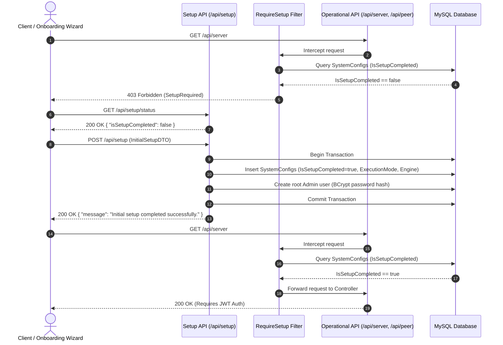

# System Setup & Initialization API

The WireManager REST API includes a dedicated bootstrapping subsystem designed to guarantee security for fresh deployments. Through the `/api/setup` resource, new installations configure the root Administrator account, define system execution mode (`Docker` vs `Native`), and persist core firewall preferences.

---

## The Setup Gatekeeper & Bootstrapping Architecture

To prevent unauthorized access or privilege escalation on unconfigured deployments, WireManager implements an automated system gatekeeper powered by the `[RequireSetup]` action filter (`RequireSetupAttribute`).



### The `SetupRequired` Interception

When an API client attempts to invoke any operational endpoint (`/api/server`, `/api/peer`, `/api/policy`, `/api/auth/register`, etc.) before completing initial setup, the `[RequireSetup]` filter intercepts execution and immediately returns an HTTP `403 Forbidden` response:

```http
HTTP/1.1 403 Forbidden
Content-Type: application/json; charset=utf-8

{
  "error": "SetupRequired",
  "message": "È necessario completare il setup del sistema prima di accedere a questa risorsa."
}
```

Once the initial setup wizard completes, the gatekeeper permanently allows traffic to proceed to standard JWT authentication and RBAC validation.

---

## Authorization & Access Levels

Because setup operations occur before any user accounts exist, both setup endpoints are publicly accessible without authentication tokens:

| Scope | Endpoint | Access Level | Description |
| :--- | :--- | :--- | :--- |
| **Readiness Check** | `GET /api/setup/status` | Anonymous (`[AllowAnonymous]`) | Verifies whether initial bootstrapping has already taken place. |
| **System Bootstrapping** | `POST /api/setup` | Anonymous (`[AllowAnonymous]`) | Provisions the initial Administrator account and system environment variables. |

:::info Idempotency Safeguard
The `POST /api/setup` endpoint is self-protecting. If invoked after initial setup has already been completed, it will not overwrite credentials or reconfigure settings, returning an informational response instead.
:::

---

## Endpoints Overview

The following endpoints are exposed by `SetupController`:

| Method | Endpoint | Authorization | Description |
| :--- | :--- | :--- | :--- |
| `GET` | `/api/setup/status` | Anonymous | Returns a boolean flag indicating if the system setup has been completed. |
| `POST` | `/api/setup` | Anonymous | Bootstraps root credentials, selects execution runtime, and initializes the system. |

---

## Request & Response Specifications

### 1. Check Setup Status (`GET /api/setup/status`)

Queries the database to determine if system initialization has already occurred.

#### Request
```http
GET /api/setup/status HTTP/1.1
Host: localhost:5070
Accept: application/json
```

#### Query Parameters
*None.*

#### Response (`200 OK` — Setup Pending)
When the system has not yet been initialized:
```json
{
  "isSetupCompleted": false
}
```

#### Response (`200 OK` — Setup Completed)
When the system has already been bootstrapped:
```json
{
  "isSetupCompleted": true
}
```

---

### 2. Perform Initial Setup (`POST /api/setup`)

Executes initial bootstrapping within an atomic database transaction:
1. Validates admin credentials and environment options.
2. Persists core entries in the `SystemConfigs` table (`IsSetupCompleted`, `ExecutionMode`, `FirewallEngine`, and container/path configurations).
3. Creates the root Administrator account with a BCrypt-hashed password.
4. Commits the transaction and unlocks the operational API.

#### Request
```http
POST /api/setup HTTP/1.1
Host: localhost:5070
Content-Type: application/json

{
  "adminUsername": "admin",
  "adminPassword": "SuperSecretAdminPassword123!",
  "executionMode": true,
  "containerWireguardName": "wireguard",
  "firewallEngine": "iptables"
}
```

#### Request Payload Properties (`InitialSetupDTO`)

| Field | Type | Required | Constraints | Description |
| :--- | :--- | :--- | :--- | :--- |
| `adminUsername` | String | Yes | Length `3` to `50` chars | Username for the primary administrative superuser account. |
| `adminPassword` | String | Yes | Length `8` to `128` chars | Strong password for the root administrator (securely hashed with BCrypt). |
| `executionMode` | Boolean | Yes | `true` or `false` | Runtime mode: `true` for Docker container management; `false` for native host execution. Currently configured automatically as an architectural preparation. |
| `containerWireguardName` | String | No | Max 100 chars | Name of the running WireGuard container (defaults to `wireguard` when `executionMode = true`). |
| `wireGuardConfigPath` | String | No | Max 255 chars | Filesystem directory for WireGuard configs (defaults to `config`). Automatically configured as a preparation for future native host support. |
| `firewallEngine` | String | Yes | Non-empty | Packet filtering engine to use (defaults to `iptables`). Automatically configured. |

:::info Automated Defaults & Future Native WireGuard Support
Parameters such as `executionMode`, `wireGuardConfigPath`, and `firewallEngine` are currently configured automatically with sensible defaults during the onboarding process.

These fields are built into the data model and configuration engine as a forward-looking architectural preparation to allow WireGuard installed natively on the host operating system in future iterations. Because native execution is an advanced capability that still requires thorough design, planning, and evaluation to determine its appropriate timing alongside standard containerized setups, these settings are handled automatically without requiring manual configuration from the user.
:::

#### Database Records Generated

Upon successful execution, the following rows are committed to `SystemConfigs`:

| Key | Value Example | Description |
| :--- | :--- | :--- |
| `IsSetupCompleted` | `"true"` | Global gatekeeper flag inspected by `[RequireSetup]`. |
| `ExecutionMode` | `"Docker"` or `"Native"` | Determines whether operations interact via Docker socket or local CLI. |
| `FirewallEngine` | `"iptables"` | Kernel firewall backend. |
| `ContainerName` | `"wireguard"` | Target container name for Docker SDK commands (if Docker mode). |
| `WireGuardConfigPath` | `"/etc/wireguard"` | Configuration directory (if Native mode). |

In addition, a record is added to the `Users` table:
- **`Username`**: `dto.AdminUsername`
- **`Password`**: `BCrypt.Net.BCrypt.HashPassword(dto.AdminPassword)`
- **`Role`**: `"Admin"`

#### Response (`200 OK` — First-Time Success)
```json
{
  "message": "Initial setup completed successfully."
}
```

#### Response (`200 OK` — Already Completed)
If the endpoint is called when `IsSetupCompleted` is already `true`:
```json
{
  "message": "Initial setup alredy completed"
}
```

#### Error Response (`400 Bad Request`)
If database write or user creation fails:
```json
{
  "message": "Initial setup failed."
}
```

---

## Client Integration Examples

### cURL / Bash

Automated onboarding script suitable for cloud-init, CI/CD, or automated provisioning:

```bash
#!/usr/bin/env bash
set -euo pipefail

API_URL="http://localhost:5070/api"

# 1. Check if setup is needed
STATUS=$(curl -s "$API_URL/setup/status" | jq -r '.isSetupCompleted')

if [ "$STATUS" = "true" ]; then
  echo "System is already initialized. Skipping setup."
else
  echo "System uninitialized. Bootstrapping WireManager..."

  # 2. Perform initial setup
  SETUP_RES=$(curl -s -X POST "$API_URL/setup" \
    -H "Content-Type: application/json" \
    -d '{
      "adminUsername": "sysadmin",
      "adminPassword": "EnterprisePassword2026!",
      "executionMode": true,
      "containerWireguardName": "wireguard",
      "firewallEngine": "iptables"
    }')

  echo "Setup Result: $(echo "$SETUP_RES" | jq -r '.message')"
fi

# 3. Log in with newly created administrator credentials
LOGIN_RES=$(curl -s -X POST "$API_URL/auth/login" \
  -H "Content-Type: application/json" \
  -d '{
    "username": "sysadmin",
    "password": "EnterprisePassword2026!"
  }')

TOKEN=$(echo "$LOGIN_RES" | jq -r '.token')
echo "Authenticated successfully. JWT Bearer token acquired."
```

---

### Python

```python
import requests

BASE_URL = "http://localhost:5070/api"

# 1. Inspect setup readiness
status_resp = requests.get(f"{BASE_URL}/setup/status")
status_resp.raise_for_status()
is_configured = status_resp.json().get("isSetupCompleted", False)

if not is_configured:
    print("Executing one-time setup...")
    setup_payload = {
        "adminUsername": "admin",
        "adminPassword": "InitialStrongPassword2026!",
        "executionMode": True,
        "containerWireguardName": "wireguard",
        "firewallEngine": "iptables"
    }
    setup_resp = requests.post(f"{BASE_URL}/setup", json=setup_payload)
    setup_resp.raise_for_status()
    print("Setup completed:", setup_resp.json()["message"])
else:
    print("WireManager is already bootstrapped.")

# 2. Proceed to login
auth_resp = requests.post(f"{BASE_URL}/auth/login", json={
    "username": "admin",
    "password": "InitialStrongPassword2026!"
})
auth_resp.raise_for_status()
jwt_token = auth_resp.json()["token"]
print("Administrator authenticated. Token:", jwt_token[:20] + "...")
```

---

### TypeScript (Node.js / Browser)

```typescript
const BASE_URL = 'http://localhost:5070/api';

interface SetupStatusResponse {
  isSetupCompleted: boolean;
}

interface SetupActionResponse {
  message: string;
}

async function ensureSystemInitialized(): Promise<void> {
  // 1. Check status
  const statusRes = await fetch(`${BASE_URL}/setup/status`);
  const { isSetupCompleted }: SetupStatusResponse = await statusRes.json();

  if (isSetupCompleted) {
    console.log('System is already configured.');
    return;
  }

  // 2. Perform bootstrapping
  console.log('Bootstrapping system with initial administrator account...');
  const setupRes = await fetch(`${BASE_URL}/setup`, {
    method: 'POST',
    headers: { 'Content-Type': 'application/json' },
    body: JSON.stringify({
      adminUsername: 'admin',
      adminPassword: 'SuperSecurePassword2026!',
      executionMode: true,
      containerWireguardName: 'wireguard',
      firewallEngine: 'iptables',
    }),
  });

  if (!setupRes.ok) {
    throw new Error(`Setup failed: ${await setupRes.text()}`);
  }

  const result: SetupActionResponse = await setupRes.json();
  console.log(result.message);
}
```

---

## Validation & Error Handling

| Status Code | Scenario | Reason / Cause |
| :--- | :--- | :--- |
| **`200 OK`** | Setup completed or already done | Initial configuration succeeded, or system was previously bootstrapped. |
| **`400 Bad Request`** | Short username (`< 3` chars) | `AdminUsername` does not satisfy minimum length constraint. |
| **`400 Bad Request`** | Weak password (`< 8` chars) | `AdminPassword` must be at least 8 characters. |
| **`400 Bad Request`** | Database transaction failure | An error occurred persisting settings or the root user in MySQL. |
| **`403 Forbidden`** | Interception on operational endpoints | Triggered by `[RequireSetup]` if accessing any other controller before setup is finished. |

---

## Related Documentation

- **[API Overview](./overview.md)** — High-level architecture, base URLs, and system requirements.
- **[API Authentication](./authentication.md)** — JWT generation and user accounts created after setup.
- **[Server Management API](./servers.md)** — Provisioning WireGuard server interfaces post-setup.
- **[Peer Management API](./peers.md)** — Managing client VPN connections.
- **[Policy & Access Control API](./policies.md)** — Micro-segmentation tags and services.
- **[API Reference Catalog](./reference.md)** — Master endpoint catalog.
