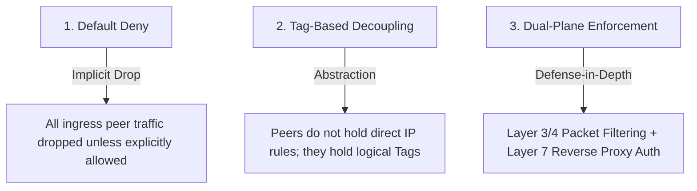
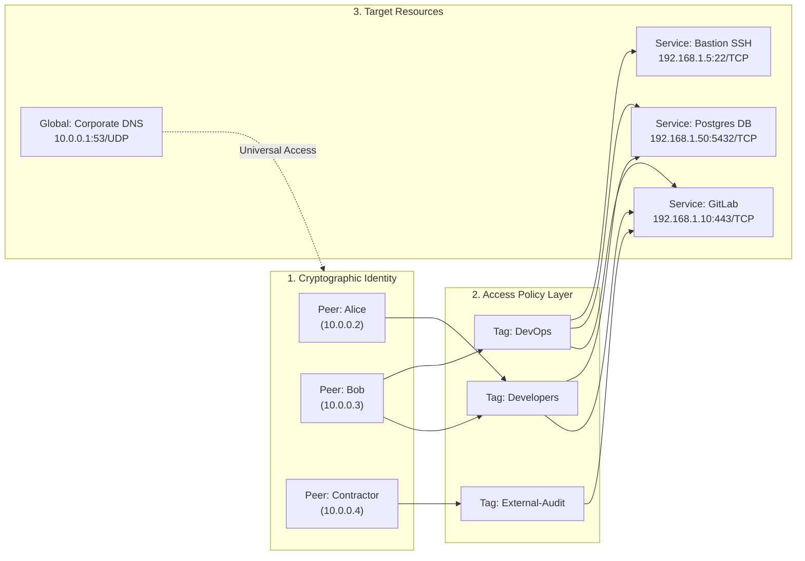
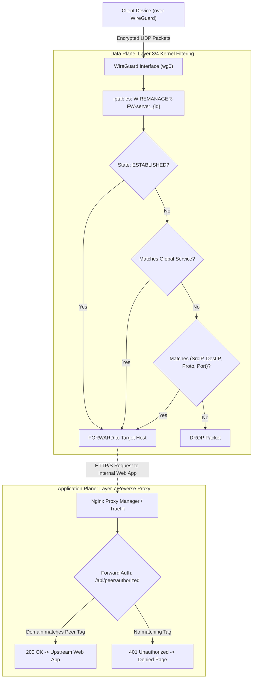
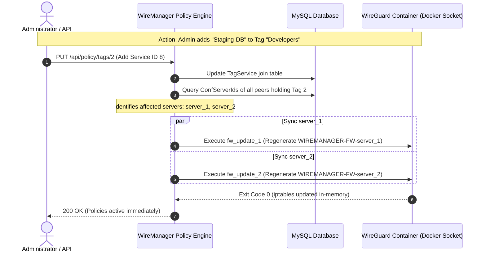

# Access Policies

In WireManager, **Access Policies** govern how network traffic is authorized, calculated, and enforced between VPN clients (**Peers**) and protected internal workloads (**Services**). Operating under a strict **Zero-Trust Network Access (ZTNA)** model, WireManager replaces broad perimeter routing with a dynamic, declarative policy engine that continuously translates high-level tag associations into low-level kernel firewall rules and Layer-7 reverse proxy authorizations.

This document details the architectural principles, mathematical resolution model, dual-layer enforcement mechanics, event-driven synchronization, and design patterns of access policies in WireManager.

---

## Architectural Principles

Traditional VPN architectures rely on an **implicit trust perimeter**: once a client authenticates to the VPN gateway, they are granted broad Layer-3 access to entire subnets (e.g. `10.0.0.0/16`). Any compromised laptop or misconfigured device can traverse the internal network laterally to probe vulnerable databases, internal web consoles, and management interfaces.

WireManager implements a **Zero-Trust Micro-Segmentation** model based on three core principles:



1. **Default Deny (Implicit Drop)**: All ingress traffic from a peer is dropped by default. No communication between peers, or between a peer and internal infrastructure, is permitted unless explicitly covered by an active policy rule.
2. **Tag-Based Decoupling**: Direct point-to-point Access Control Lists (ACLs) between client IP addresses and target servers do not scale. WireManager decouples clients from targets by introducing **Tags** as the policy abstraction layer.
3. **Dual-Plane Enforcement**: Policies are enforced simultaneously at the network packet layer (via Linux kernel `iptables`) and at the application layer (via reverse proxy HTTP forward-auth).

---

## The Tripartite Policy Graph

WireManager structures access policies across three distinct entities:



### Why a 3-Tier Model?

| Model | Administrative Complexity | Scalability | Blast Radius of Misconfiguration |
| :--- | :--- | :--- | :--- |
| **Point-to-Point ACLs** (Peer → Service) | Very High (`O(M × N)` rules) | Poor (Requires manual updates for every peer) | High (Prone to stale IP rules) |
| **Subnet Routing** (Peer → CIDR Subnet) | Low | High | Critical (Full lateral network access) |
| **WireManager Tag Policies** (Peer ↔ Tag ↔ Service) | **Low & Declarative** (`O(M + N)`) | **Linear & Modular** | **Minimal (Micro-segmented least privilege)** |

---

## Policy Resolution Algorithm

WireManager evaluates access permissions using an **additive union model**. For any connected peer `p` residing on WireGuard server interface `s`, the effective set of accessible network targets is computed as:

```text
EffectiveAccess(peer) = GlobalServices ∪ ( ⋃ Services(tag) for all tags assigned to peer )
```

### Key Rules of Evaluation:

1. **Additive Union**: Multiple tags granted to a peer combine additively. If `Tag A` provides access to GitLab and `Tag B` provides access to PostgreSQL, the peer receives access to both GitLab and PostgreSQL.
2. **No Explicit Deny Tags**: Security is maintained through exclusion rather than negative override rules. To restrict access to a resource, simply do not attach the tag containing that service.
3. **Peer Inactivity Override**: If a peer's state is toggled to **Inactive** (`IsActive = false`) or if its scheduled expiration date has passed, the resolution engine evaluates its effective tag rules to an empty set (`∅`). The peer remains registered in the database, but all its firewall rules are purged.
4. **Server Isolation Scoping**: Access policies are compiled on a per-server basis. Peers connected to `server_1` only have firewall rules generated within `WIREMANAGER-FW-server_1`.

### Resolution in Code

The following query from `FirewallServices.cs` illustrates how the backend resolves effective policy rules for an interface:

```csharp
var activeRules = await _context.Set<PeerTag>()
    .AsNoTracking()
    .Where(pt => pt.Peer.IsActive && pt.Peer.ConfServerId == serverId)
    .SelectMany(pt => pt.Tag.TagServices
        .Where(ts => !ts.Service.IsGlobal)
        .Select(ts => new RuleFirewallDTO
        {
            SrcIp = pt.Peer.Address,
            DestIp = ts.Service.TargetIp,
            Port = ts.Service.Port,
            Protocol = ts.Service.Protocol
        }))
    .Distinct()
    .ToListAsync();
```

The `.Distinct()` operator guarantees that even if a peer is assigned multiple tags that reference the same underlying service, exactly one deduplicated firewall rule is written.

---

## Dual-Plane Enforcement Mechanics

WireManager enforces access policies across two distinct network planes:



### 1. Data Plane: Kernel Packet Filter (iptables)
The Data Plane operates inside the WireGuard container and intercepts every forwarded packet:
- **Connection Tracking**: Stateful inspection permits return packets for existing outbound connections (`ESTABLISHED, RELATED`).
- **Global Ingress**: Packets matching global services (e.g. DNS port `53/UDP`) pass regardless of client IP.
- **Micro-Segmented Tag Rules**: Packet headers (`Source IP`, `Destination IP`, `Protocol`, `Destination Port`) are matched against the calculated policy matrix.
- **Implicit Drop**: Any unmatched traffic reaching the end of the chain is unconditionally dropped.

### 2. Application Plane: Reverse Proxy External Authentication
The Application Plane operates at the HTTP/HTTPS reverse proxy layer (e.g., Nginx Proxy Manager):
- Even if a peer has network-level reachability to the reverse proxy server, accessing individual web applications requires Layer-7 validation.
- When an HTTP request is made to an internal domain (e.g., `git.internal.net`), the reverse proxy queries `/api/peer/authorized`.
- WireManager inspects the `X-Forwarded-For` and `X-Forwarded-Host` headers, checking if the peer belongs to a tag that explicitly references that domain.
- This prevents lateral access to web applications hosted behind a shared reverse proxy IP address.


## Event-Driven Policy Synchronization

Policies in WireManager are **event-driven and non-blocking**. Modifications to the policy graph trigger immediate reconciliation across the infrastructure:



### Change Triggers & Reconciliation Scope

| Administrative Action | Affected Scope | Synchronization Action |
| :--- | :--- | :--- |
| **Assign Tag to Peer** (`AddPolicyToPeer`) | Peer's hosting server | Re-evaluates active peer tags and updates `WIREMANAGER-FW-server_{id}`. |
| **Revoke Tag from Peer** (`RemovePolicyFromPeer`) | Peer's hosting server | Removes peer's rules from `WIREMANAGER-FW-server_{id}`. |
| **Toggle Peer Active / Inactive** | Peer's hosting server | If inactive: The user simply cannot access the network. If active: maintain the rules that alredy exists. |
| **Peer Reaches Expiration Date** | Peer's hosting server | Background daemon delete peer and purges rules. |
| **Add / Remove Service in Tag** | All servers hosting peers with this tag | Rebuilds firewall chains on all affected server interfaces. |
| **Create / Delete Global Service** | **All servers** across infrastructure | Rebuilds firewall chains on every WireGuard server instance. |

:::note Zero Tunnel Disruption
All policy synchronization is executed by writing atomic shell batches directly into the kernel's memory via the Docker socket. Existing WireGuard peer tunnels, public keys, and cryptographic states remain completely uninterrupted during policy updates.
:::

---

## REST API Reference

The following endpoints manage the policy graph and peer-to-tag associations:

| Method | Endpoint | Authorization | Description |
| :--- | :--- | :--- | :--- |
| `POST` | `/api/policy` | Admin | Associates a list of service IDs to a specified tag ID (`PolicyDTO`). |
| `POST` | `/api/policy/tags` | Admin | Creates a new policy tag with an initial list of services. |
| `PUT` | `/api/policy/tags/{tagId}` | Admin | Modifies a tag and redefines its associated services. |
| `DELETE` | `/api/policy/tags/{tagId}/services/{serviceId}` | Admin | Disassociates a single service from a tag. |
| `POST` | `/api/peer/{id}/policies/{policyId}` | Admin, Operator | Grants an access policy (tag) to a specific peer. |
| `DELETE` | `/api/peer/{id}/policies/{policyId}` | Admin, Operator | Revokes an access policy (tag) from a specific peer. |
| `GET` | `/api/peer/{id}/policies` | Admin, Operator | Lists all policy tags currently assigned to a peer. |
| `GET` | `/api/peer/authorized` | Anonymous | Forward-auth validation endpoint for reverse proxies (NPM). |

---

## Best Practices & Security Guidelines

:::tip Access Policy Recommendations
1. **Apply the Principle of Least Privilege**: Grant peers only the minimal set of tags necessary to perform their work. Never create a "Super-Tag" containing all network services.
2. **Segregate Production from Development**: Maintain separate policy tags for production and non-production environments (e.g. `Billing-Prod` vs. `Billing-Staging`). Even if an employee is in the engineering team, grant production tags only when required.
3. **Use Ephemeral Expiration for Temporary Access**: Whenever granting elevated or third-party tags to contractors, enforce a peer expiration date. The automated background cleanup ensures that permissions expire without manual intervention.
4. **Combine Layer-3 and Layer-7 Verification**: For web applications, configure both the IP/Port and the `Domain` property. This ensures that only authorized peers can pass through the firewall and that the reverse proxy validates their identity before serving web traffic.
5. **Audit Tag Memberships Regularly**: Periodically review the tags assigned to each peer using `GET /api/peer/{id}/policies` or the web console to eliminate privilege creep as employee roles evolve.
:::

---

## Related Documentation

- **[Architecture & Concepts](./overview.md)** — High-level architecture of WireManager.
- **[Peers](./peers.md)** — Peer attributes, key management, addressing, and lifecycle.
- **[Tags](./tags.md)** — Tag data models, UI management, and color categorization.
- **[Services](./services.md)** — Defining target IPs, ports, protocols, and global services.
- **[External Authentication](./external-auth.md)** — Step-by-step integration with Nginx Proxy Manager forward auth.
- **[Configure Access Guide](../guides/configure-access.md)** — Practical walkthrough for setting up end-to-end access policies.
