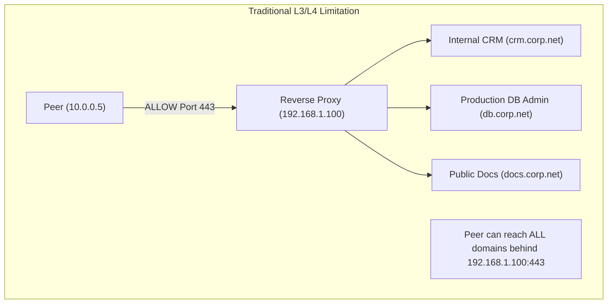
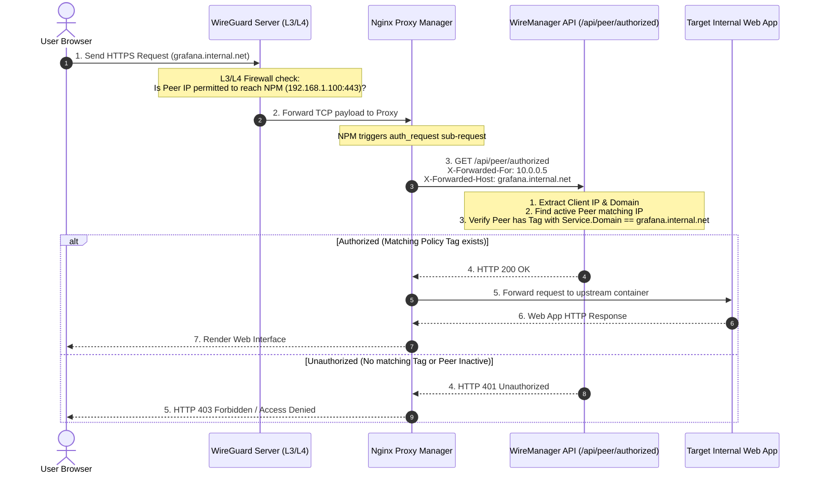

# External Authentication

In WireManager, **External Authentication** is the mechanism that extends Zero-Trust policy enforcement to Layer 7 (the application layer). By integrating with reverse proxies such as **Nginx Proxy Manager (NPM)** or Traefik, WireManager enables granular, domain-based access control for internal web applications — without requiring secondary login portals or client-side certificates.

This document details the concepts, architectural flow, reverse proxy integration mechanics, verification logic, and security advantages of External Authentication.

---

## What is External Authentication?

Traditional VPN access controls operate almost exclusively at Layer 3 and Layer 4 (IP addresses, protocols, and port numbers). However, in modern containerized or cloud environments, multiple internal web applications are frequently hosted behind a **single shared reverse proxy** listening on ports `80` and `443`.

If an administrator opens port `443` on the reverse proxy to a peer, the peer can theoretically reach **every** website, administration dashboard, and API routed through that proxy.



**External Authentication** solves this limitation by using **Forward Authentication (`auth_request`)**:
1. When a peer requests an internal web page, the reverse proxy pauses the request.
2. The proxy queries WireManager's verification endpoint (`/api/peer/authorized`), passing the client's VPN IP and the requested hostname.
3. WireManager checks whether the peer holds a **Tag** containing a **Service** with that matching **Domain**.
4. If authorized, the proxy forwards the request to the upstream web application. Otherwise, access is denied immediately with HTTP `401 Unauthorized`.

---

## Architectural Flow & Request Lifecycle

The diagram below illustrates the lifecycle of an authenticated HTTP request across the WireGuard tunnel and reverse proxy:



### Evaluation Steps

1. **Network Ingress**: The client transmits traffic over the encrypted WireGuard UDP tunnel. The kernel firewall verifies that the client is active and permitted to connect to the reverse proxy's IP and port.
2. **Reverse Proxy Interception**: Nginx Proxy Manager receives the HTTP `Host` header and triggers an internal sub-request to WireManager.
3. **Identity & Policy Resolution**: WireManager inspects the source VPN IP and requested domain against its database:
   ```csharp
   return await _context.ConfPeers
       .AsNoTracking()
       .Where(p => p.Address == ip || p.Address.StartsWith(ip + "/"))
       .AnyAsync(p => p.PeerTags.Any(pt =>
           pt.Tag.TagServices.Any(ts =>
               ts.Service.Domain == domain
           )
       ));
   ```
4. **Instant Enforcement**:
   - **`200 OK`**: The peer holds an active tag granting access to the requested domain. The proxy completes the connection to the upstream application.
   - **`401 Unauthorized`**: The peer does not exist, is marked inactive, has expired, or lacks the necessary tag. Nginx drops the request.
   - **`400 Bad Request`**: The request is missing the required client IP or domain headers.

---

## Core Components & Data Relationship

External authentication brings together the primary building blocks of WireManager:

| Component | Role in External Authentication | Example |
| :--- | :--- | :--- |
| **Peer** (`ConfPeer`) | Provides the source client IP (`Address`) extracted from the `X-Forwarded-For` header. Must be active. | `10.0.0.5` (`alice-laptop`) |
| **Tag** (`Tag`) | The logical policy scope connecting the peer to authorized domain services. | `DevOps-Tools` |
| **Service** (`Service`) | Defines the protected target workload and specifies the **Domain** (FQDN). | `grafana.internal.net` |
| **Reverse Proxy** | Enforces the authentication decision at the edge using sub-requests. | Nginx Proxy Manager |

:::tip Seamless User Experience
Users never have to log into an intermediate portal, configure SOCKS5 proxies, or install client-side TLS certificates. Their cryptographic identity is determined entirely by their WireGuard tunnel IP address.
:::

---

## Reverse Proxy Integration (Nginx Proxy Manager)

Integrating WireManager External Authentication with **Nginx Proxy Manager (NPM)** requires adding a custom `auth_request` snippet to the proxy host configuration.

### Configuration Snippet

In Nginx Proxy Manager, open your Proxy Host settings, navigate to the **Custom Locations** or **Advanced** tab, and add the following configuration:

```nginx
# Forward authentication sub-request definition
location = /wiremanager-auth {
    internal;
    proxy_pass http://wiremanager-api:8080/api/peer/authorized;
    proxy_pass_request_body off;
    proxy_set_header Content-Length "";
    proxy_set_header X-Forwarded-For $remote_addr;
    proxy_set_header X-Forwarded-Host $host;
}

# Enforce external authentication on primary location
location / {
    auth_request /wiremanager-auth;
    auth_request_set $auth_status $upstream_status;

    # Standard proxy headers
    proxy_set_header Host $host;
    proxy_set_header X-Real-IP $remote_addr;
    proxy_set_header X-Forwarded-For $proxy_add_x_forwarded_for;
    proxy_set_header X-Forwarded-Proto $scheme;

    # Upstream pass (configured automatically by NPM or set manually)
    proxy_pass $forward_scheme://$server:$port;
}
```

### Directive Breakdown

- `location = /wiremanager-auth`: Declares a dedicated URI endpoint for the auth sub-request.
- `internal`: Ensures external web clients cannot invoke this endpoint directly from the internet or VPN.
- `proxy_pass http://wiremanager-api:8080/api/peer/authorized`: Points to the WireManager API container within the Docker network.
- `proxy_pass_request_body off` & `Content-Length ""`: Drops the client's request payload (e.g. POST form data or file uploads) during the authentication sub-request to conserve bandwidth and reduce latency.
- `proxy_set_header X-Forwarded-For $remote_addr`: Transmits the peer's actual WireGuard VPN IP address to WireManager.
- `proxy_set_header X-Forwarded-Host $host`: Transmits the requested domain name (e.g. `drive.netrod.xyz`) to WireManager.
- `auth_request /wiremanager-auth`: Halts execution of the main block until `/wiremanager-auth` returns `2xx`.

---

## Security Benefits & Zero-Trust Defense-in-Depth

Combining WireManager's packet-level firewall with Layer-7 External Authentication delivers substantial security advantages:

### 1. Multi-Layered Defense-in-Depth
- **Layer 3/4**: WireManager's iptables engine drops unauthorized port scans, raw TCP/UDP probes, and non-HTTP protocol attacks before packets reach internal hosts.
- **Layer 7**: External Authentication inspects the requested HTTP hostname, ensuring that even if multiple web apps share the same reverse proxy IP, peers can only access their designated virtual hosts.

### 2. Instant Access Revocation
When an administrator modifies a peer's tags or deactivates a peer:
- The change is committed immediately to the database.
- The next HTTP request sent by the user's browser triggers an auth check that returns `401 Unauthorized`.
- Access is severed in sub-milliseconds without having to restart Nginx, flush DNS caches, or wait for active web sessions to expire.

### 3. Protection Against Internal Domain Enumeration
Even if an unauthorized user discovers the internal domain name of a restricted application (e.g. through documentation or DNS leaks), any attempt to connect returns an immediate access denial.

---

## REST API Reference

The following endpoint provides External Authentication for reverse proxies:

| Method | Endpoint | Authorization | Description |
| :--- | :--- | :--- | :--- |
| `GET` | `/api/peer/authorized` | Anonymous | Forward-auth validation endpoint for reverse proxies. |

### Header Requirements

| Header Name | Required | Description | Example |
| :--- | :--- | :--- | :--- |
| `X-Forwarded-For` | Yes | The source IP address of the client device. | `10.0.0.5` |
| `X-Forwarded-Host` | Yes | The requested target domain (FQDN). | `grafana.internal.net` |

### HTTP Response Codes

| Status Code | Reason | Meaning |
| :--- | :--- | :--- |
| `200 OK` | Authorized | The peer is active and holds a tag granting access to the requested domain. |
| `401 Unauthorized` | Forbidden | No active peer with that IP exists, or no matching domain tag is attached. |
| `400 Bad Request` | Invalid Input | The request is missing the required client IP or domain headers. |

---

## Best Practices & Troubleshooting

:::tip Operational Best Practices
1. **Use Stable Docker Container IPs / DNS Names**: Ensure your reverse proxy can reach WireManager API reliably. Use Docker service names (e.g., `http://wiremanager-api:8080`) within a shared Docker bridge network.
2. **Always Pass the Real Client IP**: Ensure that the reverse proxy sets proxy_set_header X-Forwarded-For $remote_addr. The value of $remote_addr must be the peer's WireGuard VPN IP. If the proxy sees the internal gateway or Docker bridge address instead, WireManager cannot correctly identify the peer. A later guide explains how to configure the network to preserve the original peer IP and prevent NAT from replacing it with the proxy's or gateway's address.
3. **Accurate Domain Formatting**: Ensure the `domain` field configured in WireManager matches the exact FQDN received in the HTTP `Host` header (e.g. `grafana.internal.net` without trailing slashes or protocol schemes like `https://`).
4. **Manual Verification via `curl`**: You can test the authentication endpoint manually from inside your network:
   ```bash
   curl -i -H "X-Forwarded-For: 10.0.0.5" -H "X-Forwarded-Host: grafana.internal.net" http://wiremanager-api:8080/api/peer/authorized
   ```
:::

---

## Related Documentation

- **[Architecture & Concepts](./overview.md)** — Architectural overview of WireManager.
- **[Peers](./peers.md)** — Managing VPN client identities, IP addresses, and lifecycles.
- **[Tags](./tags.md)** — Organizing peers and services into policy scopes.
- **[Services](./services.md)** — Configuring target endpoints and domain associations.
- **[Access Policies](./access-policies.md)** — Detailed policy resolution rules and dual-plane enforcement.
- **[Nginx Proxy Manager Guide](../guides/nginx-proxy-manager.md)** — Step-by-step setup guide for NPM integration.
