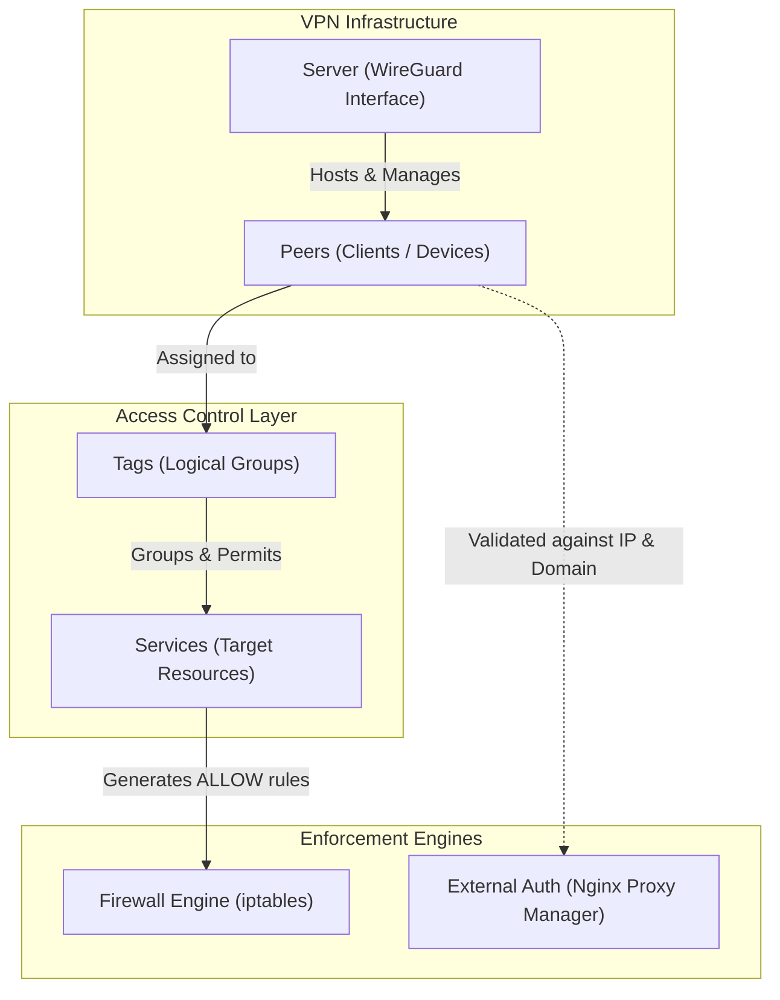

# Architecture & Core Concepts

WireManager transforms standard WireGuard into an enterprise-ready, policy-driven Network Access Control (NAC) platform. Rather than granting full subnet access to every connected client, WireManager adopts a **Zero-Trust** security model: every connection is denied by default, and network traffic is strictly allowed only to explicitly authorized services.

This page provides a high-level conceptual overview of the building blocks that make up WireManager and illustrates how they interact.

---

## Conceptual Model

The relationship between the primary components is illustrated below:

---

## Core Components

### 1. Servers (WireGuard Interfaces)

A **Server** represents an active WireGuard interface instance (such as `wg0`). It serves as the primary ingress gateway for VPN clients.

Key responsibilities:
- **Subnet Definition**: Allocates an IP CIDR block (e.g., `10.0.0.0/24`) used to hand out unique private IPs to connected peers.
- **Cryptographic Gateway**: Generates and manages the server's private and public key pair.
- **Network Listener**: Listens on a dedicated UDP port (typically `51820`) and advertises a public endpoint (domain or static IP) that clients connect to.
- **Container Synchronization**: Coordinates with the WireGuard runtime to load peer configurations and maintain interface state.

---

### 2. Peers (VPN Clients)

A **Peer** is any device or user connecting to the VPN network — such as an employee laptop, an administrator mobile device, or an external workload.

Key capabilities:
- **Cryptographic Identity**: Each peer maintains a unique WireGuard key pair. WireManager securely generates these keys and provides ready-to-use client `.conf` files and QR codes.
- **Automatic IP Allocation**: WireManager automatically assigns the next free address in the server's subnet, eliminating manual IP address management (IPAM).
- **Lifecycle & Expiration**: Peers can have a planned expiration date (e.g., for temporary contractors or short-term access). Once expired, they are deactivated automatically.
- **Real-Time Telemetry**: Real-time upload/download metrics, transfer histories, and handshake timestamps are tracked for every peer.
- **Instant Activation / Revocation**: Peers can be toggled active or inactive on the fly with immediate synchronization.

---

### 3. Services (Protected Resources)

A **Service** represents an internal network resource that you want to make reachable through the VPN. Instead of opening an entire CIDR block, you expose only specific endpoints.

Key properties:
- **Destination Targeting**: Defined by an internal IP address (`Target IP`), network protocol (`TCP`, `UDP`, `ICMP`, `ALL`, etc.), and port (e.g., `22` for SSH, `443` for HTTPS).
- **Domain Association**: Optional FQDN/domain name (e.g., `grafana.internal.net`) used by the External Authentication system to verify reverse-proxy web traffic.
- **Global vs. Local**:
  - **Local Services**: Denied by default; accessible only to peers assigned tags that contain this service.
  - **Global Services**: Infrastructure-wide utilities (such as internal DNS, NTP, or monitoring agents) that are automatically made accessible to **all** active peers.

---

### 4. Tags (Policy Grouping)

**Tags** are the glue connecting peers to services. Instead of creating rigid one-to-one firewall rules between individual clients and target hosts, WireManager uses tag-based role definitions.

How tags work:
- Administrators define logical tags representing roles, environments, or teams (e.g., `Developers`, `DevOps`, `Database-Admins`).
- Each tag links to one or more **Services**.
- When a tag is assigned to a **Peer**, WireManager computes the policy union and permits that peer to access all services bundled within the tag.
- Updating a tag (e.g., adding a new staging service) automatically updates access permissions for all peers carrying that tag.

---

### 5. Firewall Engine

The **Firewall Engine** translates high-level tag and service definitions into low-level network packet filtering rules (e.g., using `iptables` inside the WireGuard container).

Security principles:
- **Default DROP**: Unless explicitly permitted, traffic originating from a peer toward any internal IP is blocked.
- **Dynamic Rule Management**: When peers, tags, or services are created or modified, the firewall engine dynamically injects stateful `ALLOW` rules specifically mapping the peer's assigned IP to the destination service's IP, protocol, and port.

---

### 6. External Authentication (Reverse Proxy Integration)

WireManager provides an **External Authentication** endpoint designed to integrate with reverse proxies like **Nginx Proxy Manager (NPM)** or Traefik.

How it works:
- When a user accesses an internal web application via a browser over the VPN, the reverse proxy queries WireManager's authentication endpoint (`/api/peer/authorized`).
- WireManager inspects the incoming request's client IP (`X-Forwarded-For`) and target domain (`X-Forwarded-Host`).
- WireManager verifies whether the client IP corresponds to an active peer that holds a tag granting access to the requested domain service.
- If authorized, the proxy forwards the request to the backend; otherwise, access is rejected with `401 Unauthorized` or redirected.

---

## How It All Works Together

A typical lifecycle in WireManager follows these stages:

1. **Deploy Interface**: You configure a **Server** with its listening port and IP range.
2. **Define Topology**: You register your internal applications as **Services** and group them into role-specific **Tags**.
3. **Onboard Clients**: You create a **Peer** and assign relevant tags. WireManager automatically allocates an IP address, generates encryption keys, and prepares the connection profile.
4. **Enforce in Real-Time**: WireManager synchronizes the WireGuard server configuration and applies exact firewall rules.
5. **Connect & Verify**: The user imports the configuration, establishes the tunnel, and reaches authorized services with continuous usage monitoring.

---

## Explore Detailed Concepts

Dive deeper into each individual component:

- **[Peers](./peers.md)** — Detailed peer attributes, addressing, and lifecycle management.
- **[Tags](./tags.md)** — Designing scalable tag hierarchies and policy mappings.
- **[Services](./services.md)** — Portless protocols, global services, and domain linking.
- **[Access Policies](./access-policies.md)** — How policy resolution works between peers, tags, and services.
- **[External Authentication](./external-auth.md)** — Integrating WireManager with reverse proxies for web access control.
