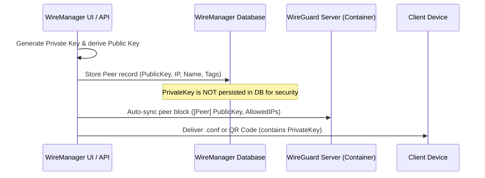
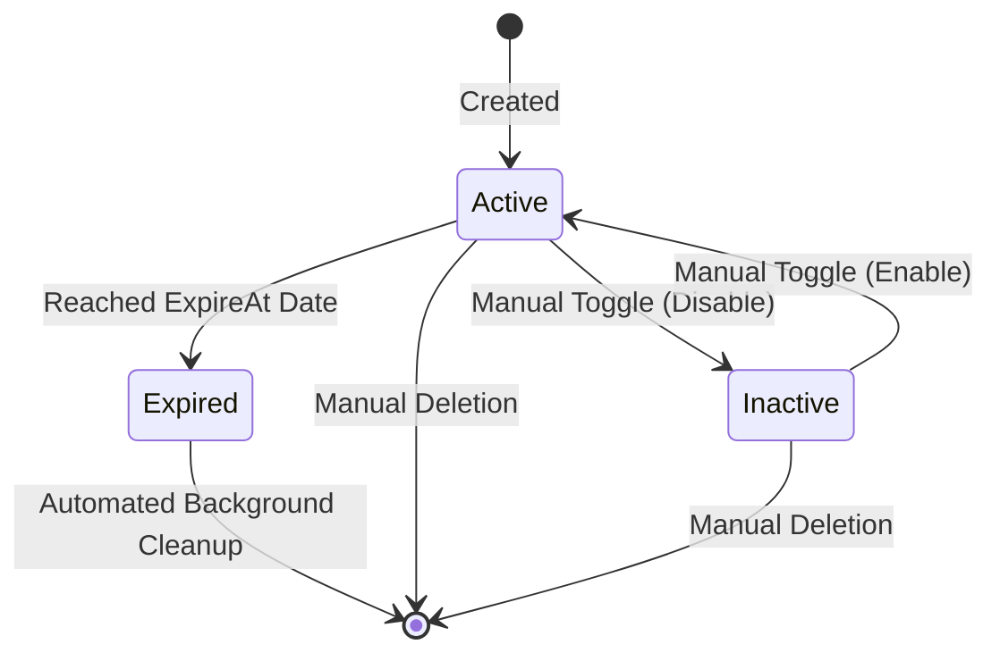

# Peers

In WireGuard, every connected node is fundamentally a cryptographic **peer**. WireManager builds on this foundation by providing centralized, automated peer management — transforming raw public keys into managed VPN identities with automated IP assignment, access control tags, expiration policies, and live telemetry.

This document details the concepts, lifecycle, configuration options, and architectural role of peers in WireManager.

---

## What is a Peer?

A **Peer** represents an authorized VPN client device. It can be an employee workstation, a mobile device, an IoT appliance, or a server in another datacenter.

Unlike traditional VPN solutions that rely on usernames and shared secrets, WireGuard identifies peers purely by their **public key**. WireManager enhances this model by associating each public key with:
- A human-readable identifier (**Client Name**).
- A private subnet IP address (**Address**).
- A set of access rules (**Tags**).
- Lifecycle rules (**Active/Inactive state** and **Expiration date**).
- Traffic and connectivity statistics (**Telemetry**).

---

## Core Attributes

Each peer in WireManager is defined by the following core properties:

| Parameter | Type | Required | Description | Example |
| :--- | :--- | :--- | :--- | :--- |
| **Client Name** | String | Yes | Unique human-readable identifier for the device or user. | `alice-laptop` |
| **Address** | CIDR IPv4 | No | The peer's private VPN IP. If omitted, WireManager automatically assigns the next available IP in the server's subnet. | `10.0.0.5/32` |
| **DNS Address** | IP / Host | Yes | The DNS server configured in the client's interface block. | `1.1.1.1` or `10.0.0.1` |
| **Allowed IPs** | CIDR List | Yes | Determines which traffic the client routes through the VPN tunnel. | `0.0.0.0/0` (Full) or `10.0.0.0/24` (Split) |
| **Persistent KeepAlive** | Integer | No | Frequency in seconds to send keepalive packets. Keeps stateful NAT/firewall mappings open. | `25` |
| **Server** | Reference | Yes | The WireGuard server instance hosting this peer. | Server `#1` (`vpn.example.com`) |
| **Expire At** | Timestamp | No | Scheduled date/time when the peer is automatically deleted. | `2026-10-01T00:00:00Z` |
| **Tags** | Array | No | Access control tags that govern which network services the peer can access. | `[Developers, Staging]` |

---

## Cryptography & Key Management

WireGuard uses **Curve25519** for high-speed, modern elliptic-curve cryptography.

### How Key Pairs are Handled



1. **Key Generation**: When a peer is created, WireManager securely generates an asymmetric key pair.
2. **Server-Side Storage**: Only the **Public Key** is stored in the database. The public key is written to the server's WireGuard configuration (`wg0.conf`):
   ```ini
   [Peer]
   # alice-laptop
   PublicKey = wG7qK...abc=
   AllowedIPs = 10.0.0.5/32
   ```
3. **Client Configuration**: The **Private Key** is provided to the administrator at creation time via the downloadable `.conf` profile or QR code. Once downloaded, the private key resides exclusively on the client device.

:::note Security Consideration
WireManager follows security best practices by not storing private keys in the database. After a peer is created, its WireGuard configuration is stored on the server's filesystem. This allows access to be restored if the client loses their private key.
:::

---

## IP Address Allocation (IPAM)

WireManager includes an automated IP Address Management (IPAM) engine:

- **Automatic Assignment**: When creating a peer, leaving the **Address** field blank prompts WireManager to scan the assigned server's CIDR range (e.g., `10.0.0.0/24`), identify the lowest available address not currently allocated to any other active or reserved peer, and assign it with a `/32` subnet mask (e.g., `10.0.0.2/32`).
- **Static Assignment**: You can override automatic assignment by explicitly supplying an IP address within the server's subnet range. WireManager validates the address to prevent collisions with existing peers or reserved gateway addresses.

---

## Tunnel Routing: Full Tunnel vs. Split Tunnel

The **Allowed IPs** parameter on the peer profile controls how the client device directs traffic across the tunnel:

### Full Tunnel (`0.0.0.0/0`)
- Routes **all** client internet and intranet traffic through the WireGuard VPN tunnel.
- **Use Cases**: Public Wi-Fi protection, total traffic inspection, centralized egress through a corporate gateway.
- **Trade-offs**: Higher bandwidth consumption on the VPN server; client internet speed depends on the server's uplink.

### Split Tunnel (Specific Subnets)
- Routes only traffic destined for specified subnets through the tunnel (e.g., `10.0.0.0/24, 192.168.10.0/24`), while normal internet browsing exits through the client's local ISP.
- **Use Cases**: Remote developer access to internal databases, corporate staging environments, or homelab services without proxying commercial web browsing.
- **Trade-offs**: Reduced server bandwidth; client's local traffic remains unencrypted by the VPN.

---

## NAT Traversal & Persistent KeepAlive

WireGuard is UDP-based and connectionless. If a client is behind a stateful NAT firewall (such as a home router or mobile carrier NAT), the router will eventually close the UDP translation mapping if no packets are exchanged.

- **Persistent KeepAlive**: When set (typically to `25` seconds), the client sends an authenticated, empty UDP packet every N seconds.
- This ensures the router's NAT table entry remains active, allowing the WireGuard server to send inbound packets to the peer at any time.
- **Recommendation**: Enable `25` seconds for mobile devices, laptops, or any peer operating behind NAT. For cloud servers with static public IPs, it can be left disabled (`0`).

---

## Peer Lifecycle & Expiration

WireManager supports dynamic lifecycle management for zero-trust environments:



### Active vs. Inactive State
Peers can be activated or deactivated with a single click in the UI without losing their configuration, assigned IP, or tag associations:
- **Active**: The peer is present in the WireGuard server configuration and authorized in firewall rules.
- **Inactive**: The peer is removed from the active WireGuard interface immediately. Any attempts to transmit data are dropped at the network layer.

### Ephemeral Access & Expiration
For contractors, external auditors, or temporary project access, you can set an **Expiration** date:
- **Presets**: 1, 3, 5, 7, 14, or 30 days (expiring at midnight).
- **Custom Date & Time**: Accurate down to the minute.
- **Automated Cleanup**: A background worker periodically audits expired peers, revokes their access, and frees their allocated IP address.
- **Visual Urgency Badges**: The UI provides color-coded indicators (Red for expired, Orange for ≤ 2 days, Amber for ≤ 7 days) so administrators can anticipate expiring access.

---

## Access Control & Tag Assignment

In WireManager, peers **do not** have hardcoded firewall rules directly attached to them. Instead, access permissions are managed through **Tags**:

1. A peer is assigned one or more tags (e.g., `Frontend-Dev`, `QA-Team`).
2. Each tag references one or more internal **Services** (e.g., `GitLab:443`, `Staging-DB:5432`).
3. WireManager's firewall engine calculates the effective permissions and writes isolated packet filter rules (`iptables`) that allow the peer's IP to reach only those specific service targets.
4. If a tag is modified or removed, the peer's network reachability adapts in real time.

---

## Real-Time Telemetry & Monitoring

WireManager provides deep visibility into client activity without logging private payload data:

- **Live Handshake Detection**: Displays the exact timestamp of the most recent cryptographic handshake. If a handshake occurred within the last few minutes, the peer is considered actively connected.
- **Real-Time Bandwidth**: Live counters display current Download (RX) and Upload (TX) throughput polled directly from the WireGuard interface.
- **Historical Transfer Charts**: An interactive SVG area graph visualizes historical data transfer patterns over time, helping administrators spot anomalous bandwidth spikes or verify connection stability.

---

## Configuration Distribution

WireManager makes onboarding seamless across desktop and mobile platforms:

### 1. Downloadable `.conf` File
Generates a complete WireGuard configuration file formatted according to the standard specification:
```ini
[Interface]
PrivateKey = <ClientPrivateKey>
Address = 10.0.0.5/32
DNS = 1.1.1.1

[Peer]
PublicKey = <ServerPublicKey>
Endpoint = vpn.example.com:51820
AllowedIPs = 0.0.0.0/0
PersistentKeepalive = 25
```
Compatible with the official WireGuard client on Windows, macOS, Linux, IOS and Android.

### 2. QR Code Display
Renders the `.conf` configuration as an on-screen QR code:
- Users open the official WireGuard app on iOS or Android.
- Tap **Add a Tunnel** → **Scan from QR code**.
- The entire key pair, address, and server endpoint are configured instantly without manual typing.

---

## User Interface & Management Workflows

The WireManager web dashboard (`/peers`) provides centralized operations for managing, monitoring, and auditing client VPN peers:

### 1. View Layouts & Navigation
- **Grid View**: Displays each peer as an interactive card featuring the client's name, assigned IP, server instance, active toggle switch, colored tag badges, real-time connection dot, and expiration countdown.
- **List View**: A high-density data table optimized for larger deployments. Columns include client name, address, server, tags, active status, expiration urgency, and contextual actions.
- **State Persistence**: The view selection is saved in the browser's `localStorage` (`wm-view-peers`) for a consistent experience across sessions.
- **Server Filtering & Search**: A server selector filters peers by WireGuard interface (or "All Servers"), while a debounced live search bar instantly filters records by client name or IP address.
- **Pagination**: Supports server-side pagination (10 peers per page) with total count tracking via HTTP response headers (`X-Total-Count`).

### 2. Live Status & Expiration Badges
The UI gives operators immediate visual feedback on peer health and access status:
- **Inline Status Toggle**: A prominent switch allows instant activation or deactivation of the peer directly from the table or card view without navigating away.
- **Color-Coded Expiration Badges**:
  - **Red**: Peer has expired and network traffic is dropped.
  - **Orange**: Critical urgency (expires in ≤ 2 days or within hours).
  - **Amber**: Impending expiration (expires in ≤ 7 days).
  - **Slate / Gray**: Standard long-term expiration (> 7 days).
- **Interactive Policy Tag Badges**: Renders the assigned tags with their respective custom hex colors.

### 3. Peer Creation & Configuration Modal (`PeerModal`)
The creation modal simplifies peer provisioning through automated defaults:
- **Name Sanitization**: Automatically normalizes client names into filesystem-safe strings for `.conf` profile generation.
- **Smart IPAM**: Leaving the address field blank automatically allocates the lowest available IP address within the server's CIDR subnet. Manual IP assignment provides instant collision validation.
- **Routing & Keepalive Controls**: Quickly configure Full Tunnel (`0.0.0.0/0`) or Split Tunnel subnets, and configure `PersistentKeepalive` intervals (default `25`s for NAT traversal).
- **Ephemeral Scheduling**: Easily set access lifetimes using quick presets (1, 3, 5, 7, 14, or 30 days) or select a custom date and time down to the minute.
- **Multi-Tag Selector**: Assign one or more policy tags with live color chips during creation or modification.

### 4. Peer Details & Telemetry Modal (`PeerDetailDialog`)
Clicking on a peer opens a detailed dashboard with its operational information:
- **Real-Time Interface Telemetry**: Displays current upload (TX) and download (RX) throughput polled directly from WireGuard kernel counters.
- **Historical Transfer Chart**: An interactive SVG area graph plots data transfer trends over time, helping administrators spot anomalous bandwidth spikes or connection drops.
- **Connection Metadata**: Displays the latest endpoint IP address, port, total transferred bytes, and exact timestamp of the last handshake.

---

## REST API Reference

The following endpoints manage peers and their configurations:

| Method | Endpoint | Authorization | Description |
| :--- | :--- | :--- | :--- |
| `GET` | `/api/peer` | Admin, Operator | Retrieves a paginated list of peers with optional server filtering and search query. |
| `GET` | `/api/peer/{id}` | Admin, Operator | Retrieves detailed configuration and metadata for a specific peer. |
| `POST` | `/api/peer` | Admin, Operator | Creates a new peer, allocates an IP address, and synchronizes the WireGuard server. |
| `PUT` | `/api/peer/{id}` | Admin, Operator | Updates peer parameters (name, DNS, Allowed IPs, KeepAlive, Expiration). |
| `DELETE` | `/api/peer/{id}` | Admin, Operator | Deletes a peer, purges its configuration files, and frees its IP in the subnet. |
| `PATCH` | `/api/peer/{id}/status/{status}` | Admin, Operator | Toggles the peer between active (`true`) and inactive (`false`). |
| `GET` | `/api/peer/{id}/conf` | Admin, Operator | Downloads the generated `.conf` client profile. |
| `GET` | `/api/peer/{id}/qrcode` | Admin, Operator | Returns the client configuration as a PNG QR code image. |
| `GET` | `/api/peer/{id}/stats/live-stats` | Admin, Operator | Retrieves real-time handshake and throughput metrics from the WireGuard runtime. |
| `GET` | `/api/peer/{id}/stats` | Admin, Operator | Retrieves historical transfer data points for usage graphing. |

---

## Best Practices

:::tip Security & Management Recommendations
1. **Assign Meaningful Names**: Use standard naming conventions (e.g., `username-device` or `role-hostname`) to simplify auditing and tag assignment.
2. **Use Ephemeral Expiration for Guests**: Always configure an expiration date when granting access to third-party consultants or temporary team members.
3. **Prefer Split Tunneling for Internal Tools**: If users only need access to specific internal services, restrict `AllowedIPs` to the corporate subnets rather than `0.0.0.0/0`.
4. **Deactivate Before Deleting**: If a device is temporarily misplaced or an employee is on leave, toggle the peer to **Inactive** instead of deleting it. This preserves their IP address and tag configuration while blocking traffic immediately.
:::

---

## Related Documentation

- **[Architecture & Concepts](./overview.md)** — High-level overview of how peers connect to the rest of the system.
- **[Tags](./tags.md)** — Learn how to organize peers into policy groups.
- **[Services](./services.md)** — Define the network resources peers can connect to.
- **[Create a Peer Guide](../guides/create-peer.md)** — Step-by-step practical guide to creating and distributing a peer.
