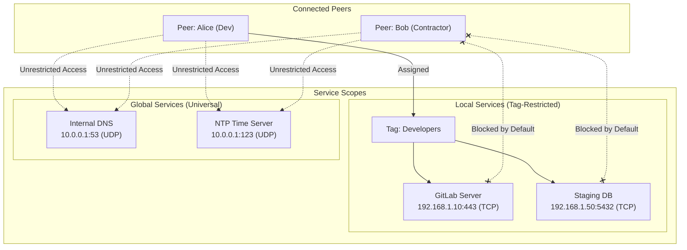
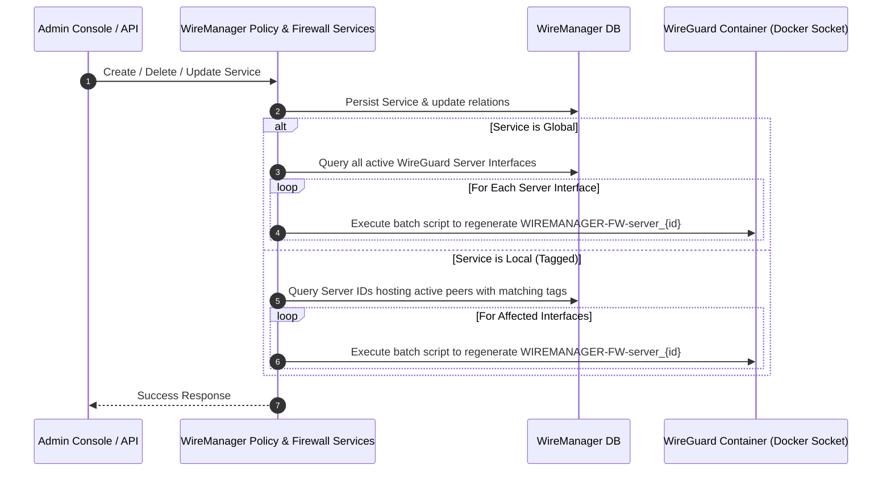

# Services

In WireManager, a **Service** represents a protected network destination within your internal infrastructure. Rather than exposing entire subnets or allowing unrestricted lateral movement, WireManager adheres to the **Zero-Trust** principle of least privilege: connected clients (**Peers**) cannot communicate with any internal IP address unless access is explicitly granted to that specific service through a **Tag** or declared as a **Global Service**.

This document details the concepts, data model, protocol support, global versus local scoping, automated firewall rule generation, reverse proxy authorization, and lifecycle management of services.

---

## What is a Service?

A **Service** defines a discrete internal network resource. It encapsulates the destination IP address, transport protocol, network port, and optional web domain needed to identify and secure target workloads.

In traditional VPN setups, connecting to the VPN interface typically routes the entire client subnet (e.g., `10.0.0.0/8` or `192.168.0.0/16`), giving every client direct reachability to all servers, printers, management interfaces, and databases. WireManager replaces this broad perimeter model with fine-grained service endpoints:
- **Granular Least Privilege**: You define only the exact IP, protocol, and port that workloads need to expose (e.g., `192.168.1.50:5432/TCP` for PostgreSQL).
- **Decoupled Architecture**: Services exist independently of client keys or server configurations. They are linked to peers dynamically via **Tags**.
- **Dual-Layer Enforcement**: A service definition can enforce packet-level firewall filtering at Layer 3/4 and HTTP reverse-proxy authentication at Layer 7.

---

## Core Attributes

Each service in WireManager is characterized by the following parameters:

| Parameter | Type | Required | Description | Example |
| :--- | :--- | :--- | :--- | :--- |
| **Id** | Integer | System | Unique numerical identifier assigned by the database. | `5` |
| **Name** | String | Yes | Human-readable name identifying the application or workload. | `Production-Database` |
| **Target IP** | IPv4 / IPv6 | Yes | Internal IP address of the target destination host or container. | `192.168.1.50` |
| **Protocol** | String | Yes | Network/transport protocol (`TCP`, `UDP`, `ICMP`, `ESP`, `GRE`, `IGMP`, `ALL`). | `TCP` |
| **Port** | Integer | Conditional | Destination port (`1`–`65535`). Required for port-based protocols; omitted for portless protocols. | `5432` |
| **Domain** | String / FQDN | No | Internal domain name used by reverse proxies (e.g. Nginx Proxy Manager) for Layer 7 verification. | `db.internal.net` |
| **IsGlobal** | Boolean | No | If `true`, the service is universally accessible to all active peers on all servers without needing tags. | `false` |
| **Tags** | Collection | No | List of policy tags that bundle this service for peer assignment. | `[Database-Admins, Backend-Dev]` |

---

## Scoping: Local Services vs. Global Services

WireManager distinguishes between two scopes of services depending on the intended audience:



### 1. Local Services (`IsGlobal = false`)
- **Default Behavior**: Blocked by default.
- **Access Path**: Must be bundled into at least one **Tag**, which is then assigned to a **Peer**.
- **Use Cases**: Development environments, production databases, SSH bastion hosts, internal APIs, and administration panels.

### 2. Global Services (`IsGlobal = true`)
- **Default Behavior**: Automatically accessible to **all** active peers across all WireGuard server interfaces.
- **Access Path**: Does not require tag association. WireManager injects universal `ALLOW` rules for the destination IP and port without restricting the source IP.
- **Use Cases**: Shared infrastructure services that every client needs to function, such as:
  - Internal DNS resolvers (e.g., Pi-hole, AdGuard Home, CoreDNS, Unbound).
  - Network Time Protocol (NTP) daemons.
  - Organization-wide forward or reverse proxies.
  - Centrally accessible monitoring agents or package mirrors.

:::caution Restrict Global Flags
Never mark sensitive workloads (such as production databases, management consoles, or SSH endpoints) as Global Services. Global services bypass tag-based RBAC and open traffic to every connected peer device.
:::

---

## Protocol Handling & Portless Protocols

WireManager accommodates both standard transport-layer protocols and lower-level network diagnostic or tunneling protocols.

### Port-Based Protocols
For standard layer-4 protocols, specifying a destination port (`1`–`65535`) is mandatory:
- **`TCP`**: Web servers (`80`, `443`), databases (`3306`, `5432`), SSH (`22`), message brokers (`5672`).
- **`UDP`**: DNS (`53`), WireGuard-in-WireGuard tunnels (`51820`), Syslog (`514`).
- **`SCTP`**: Telecom signaling and specialized streaming applications.

### Portless Protocols
Certain protocols operate at Layer 3 or do not have the concept of transport port numbers. WireManager natively detects these protocols, automatically hiding and disabling the port input field in the UI and compiling portless firewall rules:
- **`ICMP`**: Enables network diagnostics (`ping`, path MTU discovery, traceroute) to specific targets without exposing application ports.
- **`ESP`** / **`GRE`**: IPsec encapsulation and generic tunneling protocols.
- **`IGMP`**: Multicast group management.
- **`ALL` / `ANY`**: Wildcard rule that accepts **all** protocols and all ports destined for the target IP address. Useful for multi-service VMs, Docker hosts, or dedicated routers.

| Protocol Selection | Requires Port? | Generated iptables Rule Pattern |
| :--- | :--- | :--- |
| `TCP` / `UDP` / `SCTP` | **Yes** | `iptables -A <chain> [src] -d <TargetIP> -p <proto> --dport <port> -j ACCEPT` |
| `ICMP` / `ESP` / `GRE` / `IGMP` | **No** | `iptables -A <chain> [src] -d <TargetIP> -p <proto> -j ACCEPT` |
| `ALL` / `ANY` | **No** | `iptables -A <chain> [src] -d <TargetIP> -j ACCEPT` |

---

## Firewall Engine Integration

The WireManager backend (`FirewallServices.cs`) automatically translates active services into Linux kernel packet-filtering rules (`iptables`):



### Generated Rule Structure

For each WireGuard interface (e.g., `server_1`), WireManager creates an isolated chain `WIREMANAGER-FW-server_1` attached as the first rule of the kernel `FORWARD` table:

```bash
#!/bin/sh
# 1. Flush existing rules in the chain
iptables -F WIREMANAGER-FW-server_1

# 2. Allow return traffic for established sessions
iptables -A WIREMANAGER-FW-server_1 -m state --state RELATED,ESTABLISHED -j ACCEPT

# 3. Inject Global Services (no source IP filter)
iptables -A WIREMANAGER-FW-server_1 -d 10.0.0.1 -p udp --dport 53 -j ACCEPT
iptables -A WIREMANAGER-FW-server_1 -d 10.0.0.1 -p icmp -j ACCEPT

# 4. Inject Local Services (bound to peer IP via Tags)
iptables -A WIREMANAGER-FW-server_1 -s 10.0.0.5 -d 192.168.1.50 -p tcp --dport 5432 -j ACCEPT
iptables -A WIREMANAGER-FW-server_1 -s 10.0.0.8 -d 192.168.1.10 -j ACCEPT

# 5. Final Drop
iptables -A WIREMANAGER-FW-server_1 -j DROP
```

Execution is performed asynchronously inside the WireGuard container via a mounted Docker socket, eliminating the need to restart the WireGuard interface or disrupt existing tunnels.

---

## Reverse Proxy Integration (External Auth)

Services can define an optional **Domain** property (e.g. `grafana.corp.internal` or `nextcloud.example.com`). This property connects WireManager to reverse proxies like **Nginx Proxy Manager (NPM)** or Traefik via the **External Authentication** endpoint (`/api/peer/authorized`).

### How It Works:
1. When a browser initiates an HTTP request to an internal web service, the reverse proxy sends an authentication check to WireManager:
   - Header `X-Forwarded-For`: Peer's VPN IP (e.g., `10.0.0.5`).
   - Header `X-Forwarded-Host`: Requested domain (e.g., `drive.netrod.xyz`).
2. WireManager queries the database:
   ```csharp
   return await _context.ConfPeers
       .AsNoTracking()
       .Where(p => p.Address == ip || p.Address.StartsWith(ip + "/"))
       .AnyAsync(p => p.PeerTags.Any(pt =>
           pt.Tag.TagServices.Any(ts =>
               ts.Service.Domain == domain
           )
       ));
   ```
3. If the peer belongs to a tag containing a service with that exact domain, the endpoint returns `200 OK`, allowing the proxy to forward the request. Otherwise, it returns `401 Unauthorized`.

This delivers Layer 7 application protection: users cannot bypass access controls even if they know the web application's internal domain name.

---

## User Interface & Smart Detection

The WireManager web console (`/services`) streamlines service configuration through an intuitive interface:

### 1. Grid and List Views
- **Grid Cards**: Display the service name, ID badge, Global badge, target IP, protocol/port badge, and domain indicator.
- **Table View**: Compact, sortable overview suitable for larger enterprise environments.
- User preference is preserved in browser storage (`wm-view-services`).

### 2. Smart Global Service Detection
When typing a name into the Service Creation Modal, WireManager analyzes the input against a database of well-known infrastructure keywords:
- Keywords recognized: `dns`, `dhcp`, `ntp`, `ldap`, `radius`, `syslog`, `smtp`, `prometheus`, `grafana`, `gateway`, `pki`, `nfs`, `traefik`, and more.
- If a match is detected, the UI displays a suggestion banner:
  > **Suggerimento**: *DNS* è tipicamente un servizio utilizzato da tutti i peer. Potresti voler attivare il flag **Servizio Globale**.
- Administrators can accept the suggestion with a single click or dismiss it.

### 3. Dynamic Protocol Forms
Selecting `ICMP`, `ESP`, `GRE`, `IGMP`, or `ALL` automatically animates and conceals the **Port** field, preventing accidental input errors or invalid firewall declarations.

---

## REST API Reference

The following endpoints manage network services and their configurations:

| Method | Endpoint | Authorization | Description |
| :--- | :--- | :--- | :--- |
| `GET` | `/api/policy/services` | Admin, Operator | Retrieves the complete list of registered network services. |
| `GET` | `/api/policy/services/{id}` | Admin, Operator | Fetches details and metadata for a specific service by ID. |
| `POST` | `/api/policy/services` | Admin | Creates a new service. Automatically updates firewalls across servers if marked global. |
| `DELETE` | `/api/policy/services/{id}` | Admin | Deletes a service, cascades removal from all tags, and synchronizes affected firewalls. |
| `DELETE` | `/api/policy/tags/{tagId}/services/{serviceId}` | Admin | Removes a service from a specific tag and updates affected peer firewalls. |
| `POST` | `/api/policy` | Admin | Bulk associates a list of service IDs to a specified tag ID. |

---

## Best Practices & Recommendations

:::tip Engineering Best Practices
1. **Specify Exact Ports Whenever Possible**: Avoid using protocol `ALL` unless the target is a multi-service gateway or test environment. Restricting traffic to exact ports (`80`, `443`, `22`, etc.) prevents unintended lateral access across other services running on the host.
2. **Keep Global Services Minimal**: Only mark services as **Global** if 100% of connected peers genuinely require access (e.g., DNS or NTP). Any application with authentication or confidential data should be a local service assigned via tags.
3. **Always Configure Domains for Web Apps**: If an internal application is routed through a reverse proxy, populate the `domain` attribute so that WireManager can enforce Layer 7 access verification via Nginx Proxy Manager.
4. **Use Structured Naming Conventions**: Adopt a standardized naming format (e.g., `[App] - [Role] - [Env]`, such as `Postgres - Primary - Prod` or `Redis - Cache - Staging`) to keep the service catalogue navigable.
5. **Pair ICMP with Application Services**: If your teams need to diagnose connectivity using `ping`, create a dedicated ICMP service for target subnets and add it to relevant developer tags.
:::

---

## Related Documentation

- **[Architecture & Concepts](./overview.md)** — Core conceptual model of WireManager.
- **[Peers](./peers.md)** — How VPN client devices are configured, assigned IPs, and monitored.
- **[Tags](./tags.md)** — Organizing services into access control policies for peers.
- **[Access Policies](./access-policies.md)** — How policy resolution works between peers, tags, and services.
- **[External Authentication](./external-auth.md)** — Integrating WireManager services with Nginx Proxy Manager.
