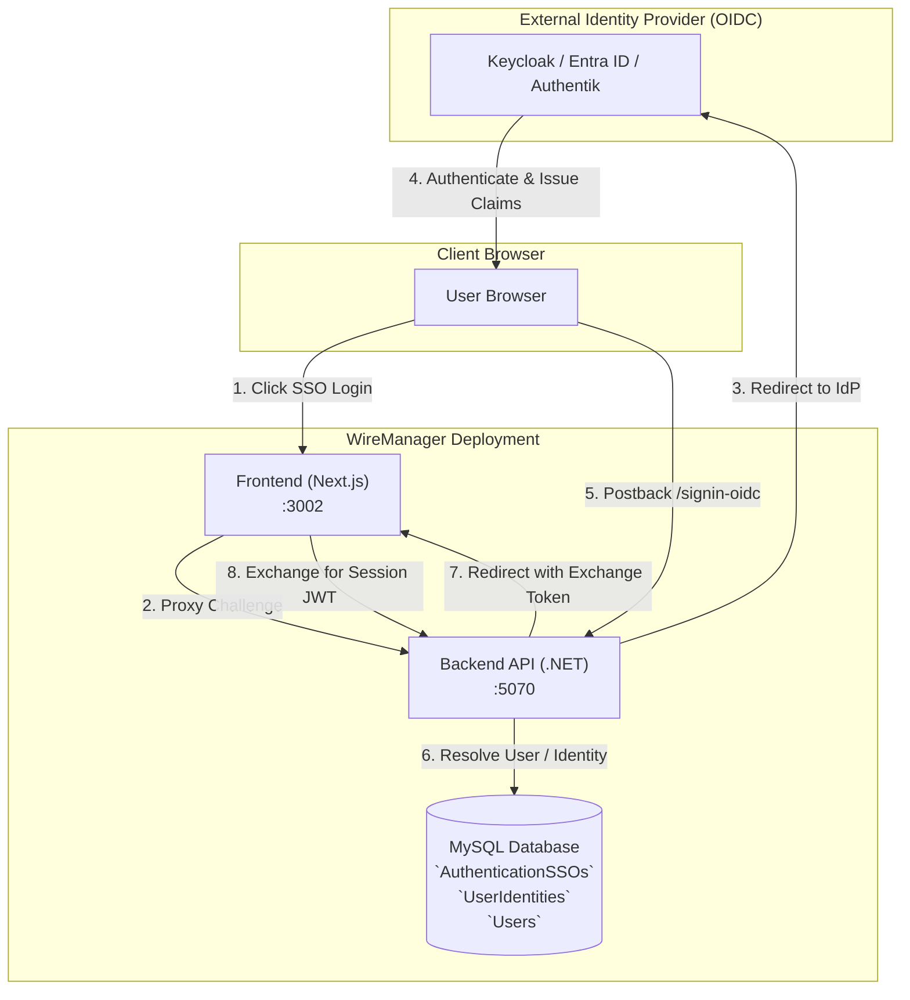
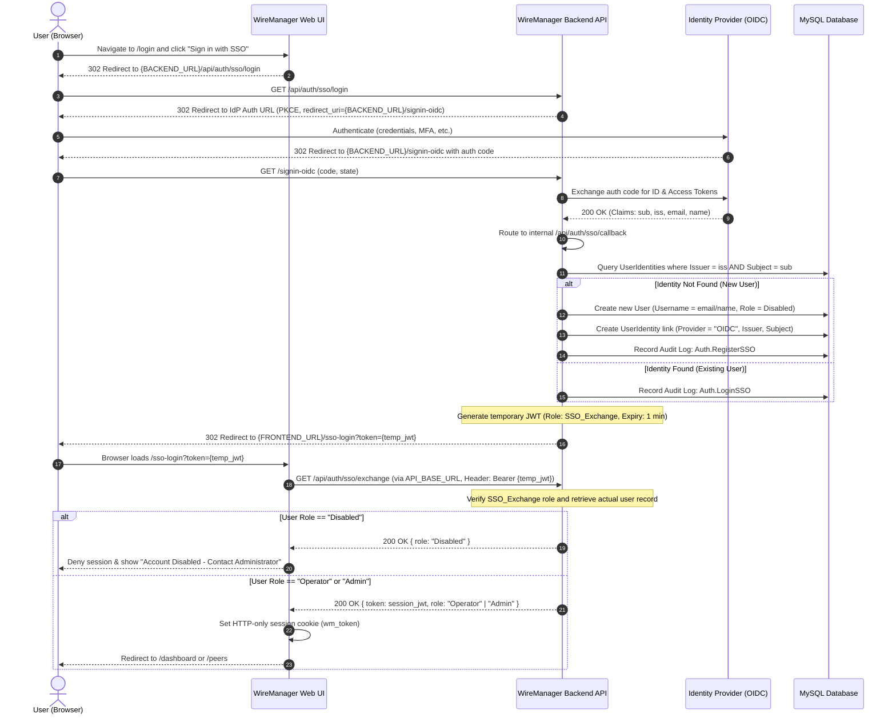
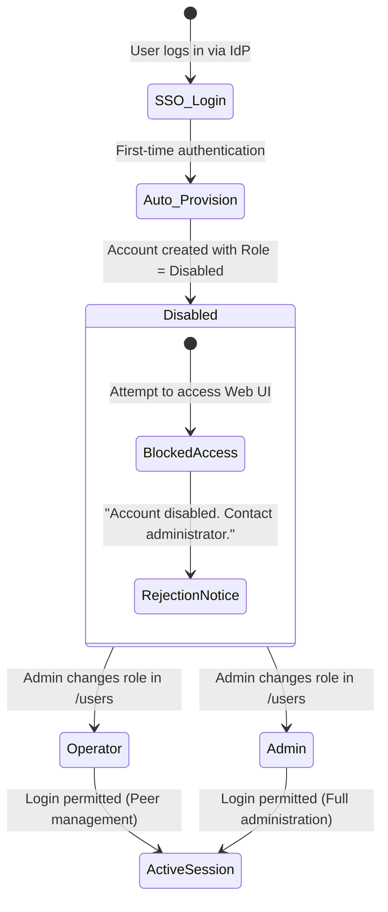

# Single Sign-On (SSO / OIDC)

WireManager supports federated authentication using **OpenID Connect (OIDC)**, an identity layer built on top of the OAuth 2.0 protocol. With SSO enabled, organizations can centralize administrative access to WireManager using their corporate Identity Provider (IdP) — such as **Keycloak**, **Microsoft Entra ID (Azure AD)**, **Authentik**, **Google Workspace**, or **Okta**.

This document details the architectural model, the authentication lifecycle, the two-phase token exchange mechanism, identity mapping, and the Zero-Trust approval workflow for newly registered accounts.

---

## Architectural Overview

WireManager's SSO implementation bridges your corporate Identity Provider with WireManager's internal Role-Based Access Control (RBAC) engine:



### Key Components

1. **Identity Provider (IdP)**: Issues verified identity tokens containing user claims (`sub`, `iss`, `email`, `name`).
2. **WireManager API (`wiremanager-api`)**: Hosts the ASP.NET Core OpenID Connect handler, validates IdP cryptographic signatures, manages provider settings, and coordinates user provisioning.
3. **WireManager Web (`wiremanager-web`)**: Next.js web application offering the user-facing "Sign in with SSO" flow and the `/sso-login` token-exchange landing page.
4. **Identity Store (`UserIdentities` table)**: Links external federated identity subjects (`iss` + `sub`) to internal WireManager user UUIDs.

---

## Authentication Lifecycle & Two-Phase Exchange

WireManager implements a **two-phase token exchange pattern** to transfer authentication state safely from the OIDC callback back to the single-page application. This architecture ensures that long-lived session JWT tokens are never exposed in browser address bars, redirect parameters, or web server access logs.



---

## The Zero-Trust Approval Workflow

A critical security feature of WireManager's SSO integration is the **Zero-Trust Onboarding Model**:



### Why Accounts Default to `Disabled`

In enterprise environments, hundreds or thousands of users may belong to an identity realm (e.g. an Azure Active Directory tenant or organization-wide Keycloak instance). 

If federated login automatically granted operator or administrative access upon first login, **any authenticated corporate employee could inspect VPN tunnels or manage network peers**.

To enforce least-privilege Zero-Trust access:
1. **Automatic Provisioning**: WireManager extracts user claims (`email`, `name`) and records the account in the database.
2. **Initial Inactive Tier**: The role is set to `Disabled`.
3. **Session Lock**: The user cannot log in, generate WireGuard peers, or invoke protected APIs. The web console displays a notification instructing them to contact an administrator.
4. **Administrator Activation**: An existing Administrator navigates to **Users** (`/users`), locates the newly registered account, and assigns either the `Operator` or `Admin` role.

---

## Identity Mapping & Conflict Resolution

WireManager maps federated users to internal accounts using the composite key of:
- **`Issuer` (`iss`)**: The canonical URL of the Identity Provider (e.g., `https://auth.example.com/realms/corp`).
- **`Subject` (`sub`)**: The immutable unique identifier assigned to the user by that Identity Provider.

### Username Derivation & Collision Handling

When an account is created via SSO, WireManager derives the username according to the following logic:
1. Prefers the `email` claim (e.g., `john.doe@example.com`).
2. If `email` is absent, falls back to the `name` claim (e.g., `John Doe`).
3. If an existing account already holds that username, an incremental integer suffix is automatically appended (`john.doe1`, `john.doe2`, etc.) to preserve uniqueness.

### Passwordless Security

Accounts created through SSO have their password hash stored as `null`. They **cannot** be logged into using traditional username/password forms, ensuring that credential compromise outside the corporate Identity Provider cannot be leveraged against WireManager.

---

## Configuration Model (`AuthenticationSSOs`)

SSO configuration is managed entirely through the web interface or via the API (`GET` / `PUT /api/auth/sso`). Only **Administrators** can read or modify these settings.

| Setting | Type | Description | Example |
| :--- | :--- | :--- | :--- |
| **`OidcEnabled`** | Boolean | Global toggle to enable or disable OIDC federated authentication. | `true` |
| **`OidcAuthority`** | String (URI) | Base URL of the OIDC Identity Provider (used to discover `.well-known/openid-configuration`). | `https://auth.corp.net/realms/wiremanager` |
| **`OidcClientId`** | String | Client Identifier registered in the Identity Provider. | `wiremanager-web` |
| **`OidcClientSecret`** | String | Confidential client secret generated by the Identity Provider. | `sec_98f7a...` |

:::note Dynamic Configuration
WireManager reconfigures its internal ASP.NET Core OpenID Connect options dynamically using `IConfigureNamedOptions<OpenIdConnectOptions>`. You do not need to restart containers or edit static configuration files when modifying SSO settings.
:::

---

## Environment Requirements: `FRONTEND_URL` & `BACKEND_URL`

For Single Sign-On to operate correctly across distributed container networks and reverse proxies, both the backend API and frontend web application require dedicated URL environment variables:

| Container | Variable | Direction / Scope | Purpose |
| :--- | :--- | :--- | :--- |
| **`wiremanager-api`** | `FRONTEND_URL` | Public / Browser | URL where the web interface is accessible. The API issues an HTTP 302 redirect here (`/sso-login?token={temp_jwt}`) after completing OIDC token validation. |
| **`wiremanager-api`** | `BACKEND_URL` | Public / IdP | Public URL of the backend API. Used by ASP.NET Core OpenID Connect to construct the exact `RedirectUri` (`${BACKEND_URL}/signin-oidc`) sent to the Identity Provider during authorization. |
| **`wiremanager-web`** | `API_BASE_URL` | Internal Docker Network | Internal address of the API container (e.g. `http://wiremanager-api:8080`). Used by the Next.js server runtime for backend API proxying. |
| **`wiremanager-web`** | `BACKEND_URL` | Public / Browser | Public URL of the backend API. Used by the Next.js routes (`/api/auth/sso/status` and `/api/auth/sso/login`) to redirect the user's browser to the backend API (`/api/Auth/sso/login`). |

### Docker Compose Example

In your `docker-compose.yaml`, configure both containers with their appropriate URLs:

```yaml
services:
  # WireManager Backend API
  wiremanager-api:
    image: ghcr.io/gwsimorod/wiremanager:latest
    environment:
      - FRONTEND_URL=https://wireguard.netrod.xyz # or http://<server-ip>:3002
      - BACKEND_URL=https://api-wiremanager.netrod.xyz # or http://<server-ip>:5070

  # WireManager Frontend Web UI
  wiremanager-web:
    image: ghcr.io/gwsimorod/wiremanager-web:latest
    environment:
      - API_BASE_URL=http://wiremanager-api:8080
      - BACKEND_URL=https://api-wiremanager.netrod.xyz # or http://<server-ip>:5070
```

:::caution Why BACKEND_URL is Required in Containerized Setups
In Docker deployments, `API_BASE_URL` is configured to `http://wiremanager-api:8080`, allowing the Next.js server to communicate with the backend over the private bridge network. However, the client's browser operates outside the Docker network and cannot resolve `wiremanager-api`.

By setting `BACKEND_URL`:
1. The frontend correctly redirects the user's browser to the publicly accessible API endpoint.
2. The backend generates the canonical public redirect URI (`${BACKEND_URL}/signin-oidc`) expected by your Identity Provider, avoiding `redirect_uri_mismatch` errors behind reverse proxies (such as Nginx Proxy Manager, Traefik, or Caddy).
:::

---

## Audit Logs & Security Tracing

All SSO lifecycle events are logged to the database and viewable by Administrators in the **Audit Logs** (`/audit-logs`) console:

| Action | Category | Description |
| :--- | :--- | :--- |
| **`Auth.UpdateSSO`** | `SSO` | Administrator updated the SSO/OIDC configuration (enabled/disabled, authority, credentials). |
| **`Auth.RegisterSSO`** | `User` | A new user authenticated via SSO for the first time; account provisioned in `Disabled` state. |
| **`Auth.LoginSSO`** | `User` | An existing federated user authenticated successfully through the Identity Provider. |

---

## Related Documentation

- **[SSO Configuration Guide](../guides/sso-configuration.md)** — Step-by-step instructions for configuring Keycloak, Entra ID, and WireManager.
- **[User Management Guide](../guides/user-management.md)** — Promoting SSO accounts from `Disabled` to `Operator` or `Admin`.
- **[API Authentication Guide](../api/authentication.md)** — Complete API documentation for the `/api/auth/sso/*` endpoints.
- **[Inspect Audit Logs Guide](../guides/audit-logs.md)** — Reviewing administrative and SSO authentication trails.
