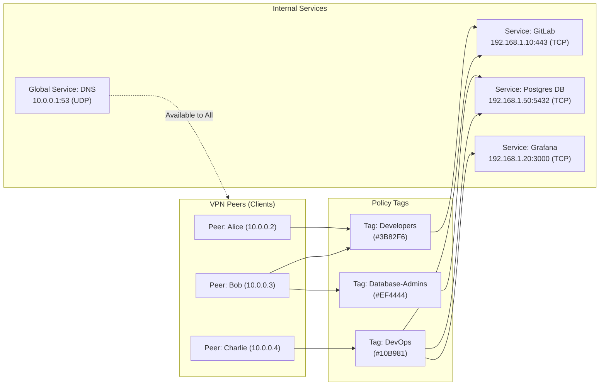
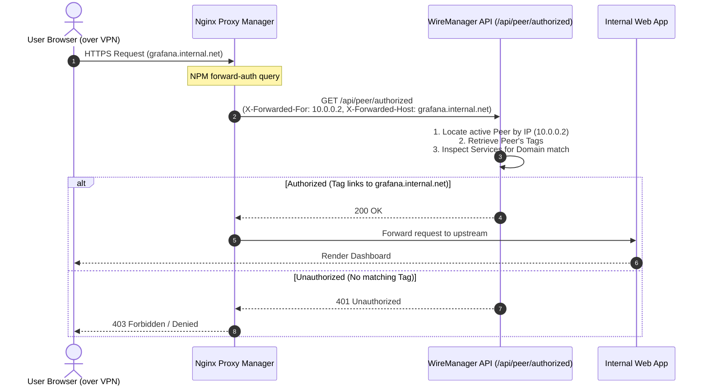

# Tags

In WireManager, **Tags** serve as the policy abstraction layer between VPN clients (**Peers**) and protected network resources (**Services**). Rather than binding static firewall rules directly to individual IP addresses or public keys, WireManager utilizes tag-based Role-Based Access Control (RBAC) to dynamically orchestrate network reachability and reverse proxy authorization.

This document details the concepts, data model, lifecycle, automated firewall enforcement, and design patterns of tags in WireManager.

---

## What is a Tag?

A **Tag** is a named logical group that bundles one or more internal network services together. When a tag is attached to a peer, the peer immediately inherits permission to communicate with every service defined inside that tag.

Traditional VPN management requires administrators to write custom, fragile iptables or firewall scripts for every new device. WireManager replaces this complexity with declarative tags:
- **Decoupled Security**: Peers never reference destination IP addresses or port numbers directly. They simply hold tags (e.g., `Backend-Dev`, `DevOps-Team`).
- **Dynamic Policy Propagation**: Modifying the services assigned to a tag automatically recompiles and deploys firewall rules across all active VPN server interfaces hosting peers with that tag.
- **Multi-Tenant Flexibility**: A peer can hold multiple tags simultaneously, and a single service can be shared across multiple tags.

---

## Core Attributes

Every tag in WireManager consists of the following attributes:

| Parameter | Type | Required | Description | Example |
| :--- | :--- | :--- | :--- | :--- |
| **Id** | Integer | System | Unique numerical identifier generated by the database. | `3` |
| **Name** | String | Yes | Human-readable descriptor representing the role, team, or access tier. | `Database-Admins` |
| **Color** | Hex String | Yes | Hexadecimal color code used for UI badges, visual tagging, and fast identification. | `#8B5CF6` |
| **Services** | Collection | No | Internal network destinations (IP, port, protocol, domain) bundled under this tag. | `[PostgreSQL (5432), Redis (6379)]` |
| **Peers** | Collection | No | Active or inactive VPN clients currently granted the permissions of this tag. | `[alice-laptop, bob-desktop]` |

---

## Architectural Role: Bridging Peers and Services

WireManager operates under a strict **Zero-Trust** network paradigm: all incoming peer traffic is dropped by default. Tags provide the bridge that opens granular network pathways through the firewall and reverse proxy layers.



### Policy Resolution (Additive Union)

Access rights are evaluated as an **additive union**:
- If a peer has **no tags**, it can only reach **Global Services** (e.g., DNS, NTP) and cannot communicate with any local private service or other peers.
- If a peer is assigned **multiple tags**, its effective permissions are the cumulative sum of all services in those tags.
- There are no negative (explicit deny) tags; security is enforced by restricting tag assignment according to the principle of least privilege.

---

## Dynamic Enforcement Engines

When tags are created, altered, or assigned to peers, WireManager synchronizes two distinct enforcement layers:

### 1. Network Layer: Kernel Firewall Engine (iptables)

WireManager manages an isolated, custom iptables chain on each WireGuard interface container (`WIREMANAGER-FW-server_{serverId}`):

1. **State Tracking**: Automatically admits established and related connections:
   ```bash
   iptables -A WIREMANAGER-FW-server_1 -m state --state RELATED,ESTABLISHED -j ACCEPT
   ```
2. **Global Rules**: Injects rules for infrastructure-wide services (`IsGlobal = true`) allowing any client source IP:
   ```bash
   iptables -A WIREMANAGER-FW-server_1 -d 10.0.0.1 -p udp --dport 53 -j ACCEPT
   ```
3. **Tag-Derived Rules**: For each active peer assigned a tag, WireManager queries all non-global services within that tag and emits targeted rules:
   ```bash
   iptables -A WIREMANAGER-FW-server_1 -s 10.0.0.2 -d 192.168.1.10 -p tcp --dport 443 -j ACCEPT
   ```
4. **Default Drop**: Any packet from a peer that does not match a tag-permitted destination is rejected:
   ```bash
   iptables -A WIREMANAGER-FW-server_1 -j DROP
   ```

:::note Automatic Recalculation
Adding a new service to a tag or revoking a tag from a peer automatically triggers a non-disruptive update script inside the WireGuard container via the Docker socket, keeping rules consistent without dropping active VPN tunnels.
:::

---

### 2. Application Layer: Reverse Proxy External Authentication

In addition to layer-3/4 packet filtering, tags govern layer-7 HTTP reverse proxy access (e.g., **Nginx Proxy Manager**):



Because reverse proxy access is tied to the tag graph, revoking a team's tag instantly cuts off their web access to internal portals without requiring reload or reconfiguration of Nginx Proxy Manager.

---

## Tag Lifecycle & Operations

### Creation

Tags can be created from the web dashboard or via API. During creation, administrators specify:
- A descriptive **Name**.
- A brand or category **Color** for visual identification.
- An optional initial selection of **Services** to bundle.

WireManager performs atomic validation, ensuring that all referenced service IDs exist before persisting the new tag entity and bridge records (`TagService`).

### Association with Peers

Tags are associated with peers through two primary workflows:
1. **Peer Creation / Update Form**: Select one or more tag badges in the peer modal.
2. **Granular API Calls**: Add or remove individual tags dynamically using `/api/peer/{id}/policies/{policyId}`.

### Modifying Services within a Tag

When services within a tag are added or removed:
1. WireManager updates the join records in the database.
2. Identifies all server interfaces hosting peers that carry the updated tag.
3. Automatically triggers an iptables firewall resynchronization across each affected server.

### Deletion & Cleanup

When a tag is deleted:
1. WireManager queries all server interfaces currently associated with the tag via `PeerTags`.
2. Removes all entries from the bridge tables (`TagServices` and `PeerTags`).
3. Deletes the `Tag` record itself.
4. Executes a firewall update on all affected server interfaces to immediately strip any firewall rules that were granted by that tag.

---

## User Interface & Experience

The WireManager web console (`/tags`) provides management tools tailored for day-to-day operations:

### Grid & List Views
- **Grid View**: Displays tags as structured cards showing the tag's color accent, name, total count of linked services, interactive action menus, and badges for linked services.
- **List View**: A compact table format ideal for large installations with dozens of tags.
- The view preference is automatically remembered across browser sessions via `localStorage`.

### Preset Color Palette
To maintain clean visual hierarchy, the tag creation modal offers 16 curated preset colors alongside custom hex support:

| Color Code | Sample Accent | Recommended Usage |
| :--- | :--- | :--- |
| `#EF4444` / `#F87171` | Crimson / Red | Production environments, high-security infrastructure, databases |
| `#F97316` / `#F59E0B` | Orange / Amber | Staging environments, external contractors, temporary access |
| `#3B82F6` / `#0EA5E9` | Blue / Sky | Core engineering, general development, default corporate access |
| `#10B981` / `#22C55E` | Emerald / Green | Monitoring tools, observability (Grafana, Prometheus), docs |
| `#8B5CF6` / `#A855F7` | Violet / Purple | DevOps, CI/CD pipelines, Kubernetes cluster management |
| `#6B7280` / `#78716C` | Slate / Gray | Read-only access, guest subnets, IoT appliances |

---

## REST API Reference

The following endpoints manage tags and their policy associations:

| Method | Endpoint | Authorization | Description |
| :--- | :--- | :--- | :--- |
| `GET` | `/api/policy/tags` | Admin, Operator | Retrieves all tags, including nested service entities. |
| `GET` | `/api/policy/tags/{id}` | Admin, Operator | Fetches a single tag by ID with its associated services. |
| `POST` | `/api/policy/tags` | Admin | Creates a new tag with an optional list of initial service IDs. |
| `PUT` | `/api/policy/tags/{tagId}` | Admin | Updates a tag's name, color, and redefines linked services. |
| `DELETE` | `/api/policy/tags/{id}` | Admin | Deletes a tag, removing peer and service associations and updating affected firewalls. |
| `DELETE` | `/api/policy/tags/{tagId}/services/{serviceId}` | Admin | Disassociates a single service from a tag. |
| `POST` | `/api/policy` | Admin | Associates a list of service IDs to a specified tag. |
| `GET` | `/api/peer/{id}/policies` | Admin, Operator | Returns all tags currently assigned to a given peer. |
| `POST` | `/api/peer/{id}/policies/{policyId}` | Admin, Operator | Assigns a tag policy to a specific peer and synchronizes iptables. |
| `DELETE` | `/api/peer/{id}/policies/{policyId}` | Admin, Operator | Removes a tag policy from a peer and updates the firewall. |

---

## Tag Design Patterns & Best Practices

:::tip Architectural Recommendations
1. **Model Roles, Not Individuals**: Create tags named after job functions or project scopes (e.g., `QA-Engineers`, `Data-Analysts`) rather than individual people (`Alice-Access`). This keeps policies scalable as team members join or depart.
2. **Separate Staging from Production**: Never place production databases and development environments in the same tag. Create distinct tiers such as `App-Staging` and `App-Production`.
3. **Use Color as a Threat Indicator**: Standardize on color codes across your organization (e.g., Red for sensitive production clusters, Green for internal testbeds). This helps operators avoid accidental privilege grants in the UI.
4. **Leverage Global Services for Common Utilities**: Do not add internal DNS servers or network time protocols (NTP) to individual tags. Mark them as **Global Services** so every peer receives access automatically without tag clutter.
5. **Audit Empty Tags**: Periodically review tags that have no linked services or no assigned peers to keep the firewall rule calculation lean and maintain clean documentation.
:::

---

## Related Documentation

- **[Architecture & Concepts](./overview.md)** — Architectural overview of the Zero-Trust model in WireManager.
- **[Peers](./peers.md)** — Learn how peers are created, addressed, and connected to the VPN.
- **[Services](./services.md)** — Guide to defining target IP addresses, ports, and internal domains.
- **[Access Policies](./access-policies.md)** — In-depth breakdown of multi-tag resolution and access flow.
- **[External Authentication](./external-auth.md)** — Integrate WireManager tags with Nginx Proxy Manager.
