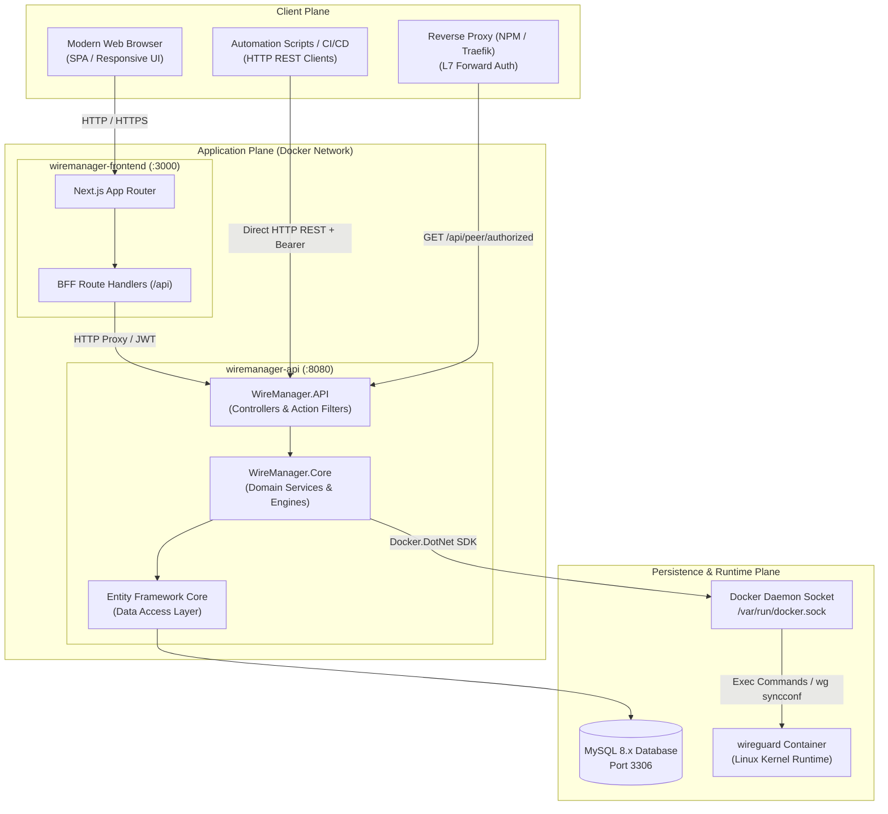
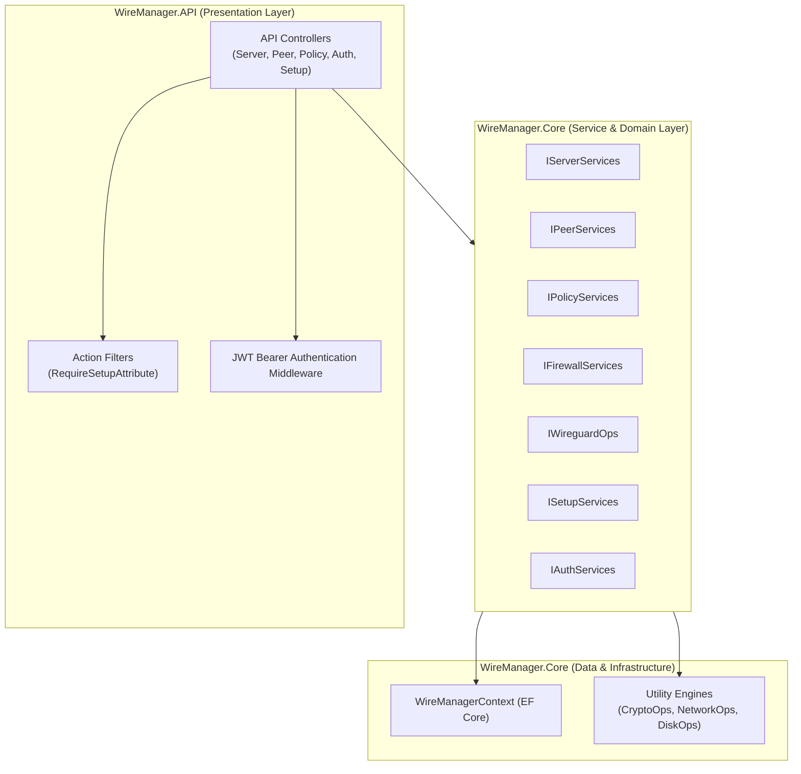
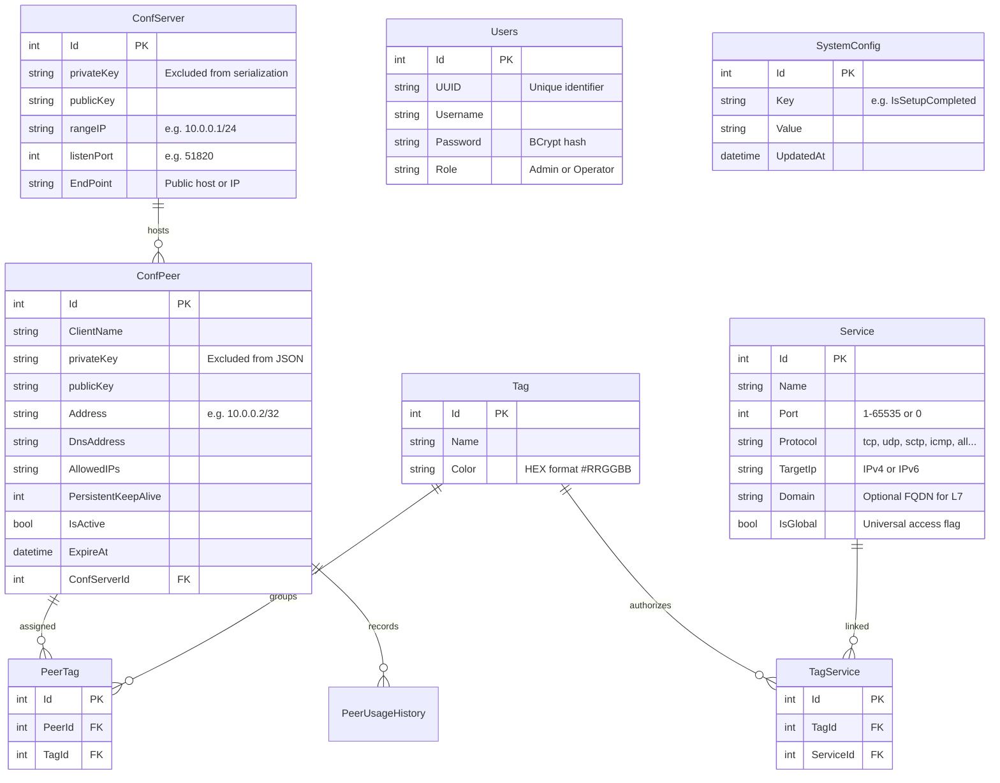
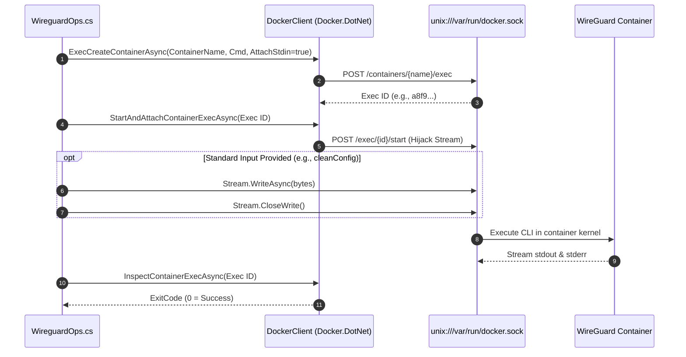
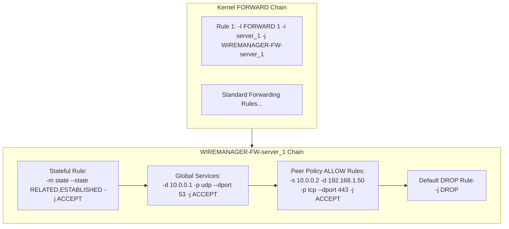
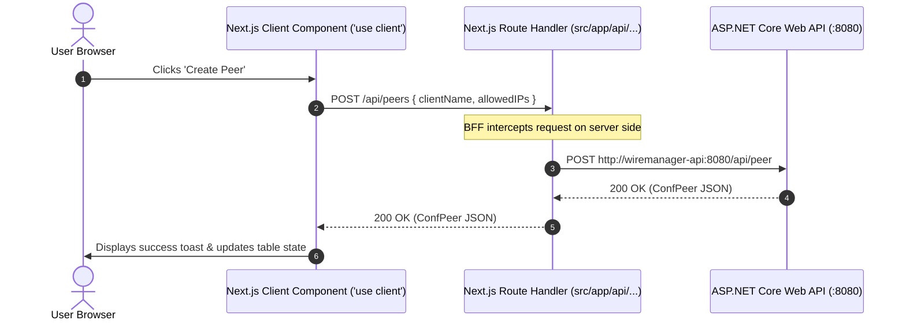
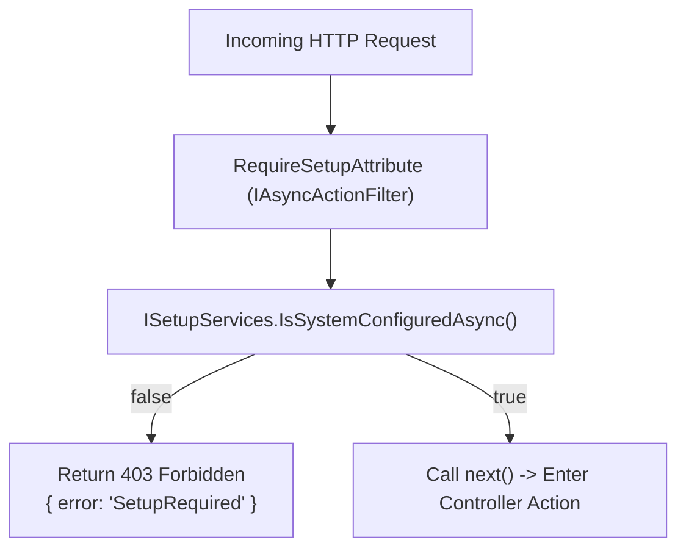

# System Architecture & Internal Design

This document provides a comprehensive technical overview of the internal software architecture, engineering patterns, and subsystem interactions powering **WireManager**. Intended for developers, contributors, and systems engineers, this guide examines how the application coordinates ASP.NET Core, Next.js, Entity Framework Core, the Docker daemon, and the Linux kernel WireGuard subsystem.

---

## 1. High-Level System Topology

WireManager is engineered as a distributed multi-tier architecture consisting of four primary pillars:



### Module Responsibilities

| Module / Subsystem | Technology Stack | Primary Architectural Role |
| :--- | :--- | :--- |
| **`WireManager.Frontend`** | Next.js 15+, React 19, Tailwind CSS v4, shadcn/ui | Serves the user interface, renders client dashboards, and provides a Backend-for-Frontend (BFF) proxy to manage sessions and shield internal API endpoints. |
| **`WireManager.API`** | ASP.NET Core 9/10, C# | Exposes the external REST API, enforces Role-Based Access Control (RBAC) and gatekeeper filters, handles request serialization, and generates OpenAPI schemas. |
| **`WireManager.Core`** | .NET Class Library, Entity Framework Core | Contains the core domain entities, business logic services, asymmetric cryptography, CIDR network calculations, and filesystem management. |
| **`MySQL Database`** | MySQL 8.0+ | Persists relational configuration data, client cryptographic credentials, tag-service policy graphs, and historical bandwidth telemetry. |
| **`WireGuard Container`** | Linux Kernel, `wireguard-tools`, `iptables` | Hosts active WireGuard network interfaces (`server_{id}`), executes cryptographic handshakes, routes VPN traffic, and enforces packet micro-segmentation. |

---

## 2. Backend Layering & Dependency Inversion

WireManager's backend adheres to clean layered architecture and dependency inversion principles. All core business operations are defined through abstract interfaces in `WireManager.Core.Interfaces` and registered into the ASP.NET Core Dependency Injection (DI) container.



### Key Service Interfaces & Responsibilities

| Interface | Concrete Implementation | Primary Responsibilities |
| :--- | :--- | :--- |
| [`IServerServices`](file:///c:/Users/simon/source/repos/WireManager/WireManager/Interfaces/IServerServices.cs) | `ServerServices` | WireGuard server interface provisioning, atomic configuration updates with in-memory filesystem rollback, and instance teardown. |
| [`IPeerServices`](file:///c:/Users/simon/source/repos/WireManager/WireManager/Interfaces/IPeerServices.cs) | `PeerServices` | Client IPAM automatic subnet address allocation, Curve25519 keypair generation, peer activation toggling, and client `.conf` / QR code export. |
| [`IPolicyServices`](file:///c:/Users/simon/source/repos/WireManager/WireManager/Interfaces/IPolicyServices.cs) | `PolicyServices` | CRUD operations for Tags, Services, and policy bindings (`TagService`). Automatically resolves affected server interfaces to trigger firewall updates. |
| [`IFirewallServices`](file:///c:/Users/simon/source/repos/WireManager/WireManager/Interfaces/IFirewallServices.cs) | `FirewallServices` | Compiles peer-service policy matrices into low-level Linux `iptables` packet-filtering rules within custom interface sub-chains. |
| [`IWireguardOps`](file:///c:/Users/simon/source/repos/WireManager/WireManager/Interfaces/IWireguardOps.cs) | `WireguardOps` | Interacts with the Docker daemon via `Docker.DotNet` to execute `wg-quick`, `wg syncconf`, and `ip link` commands inside the WireGuard container. |
| [`ISetupServices`](file:///c:/Users/simon/source/repos/WireManager/WireManager/Interfaces/ISetupServices.cs) | `SetupServices` | System bootstrapping readiness checks (`IsSystemConfiguredAsync`), initial admin user creation, and environment configuration persistence. |
| [`IAuthServices`](file:///c:/Users/simon/source/repos/WireManager/WireManager/Interfaces/IAuthServices.cs) | `AuthServices` | BCrypt password hashing, credential verification, JWT token issuance (HS256), and administrative user management. |

---

## 3. Domain Model & Entity-Relationship Schema

The relational data model is managed via Entity Framework Core with code-first migrations. The following entity-relationship diagram illustrates the core domain associations:



### Relational Dynamics & Cascades

- **Servers and Peers**: Each `ConfPeer` is strictly owned by a single `ConfServer`. When a server is deleted, all dependent peers and configuration profiles on disk are cascade-deleted.
- **Many-to-Many Policy Decoupling**: Rather than linking peers directly to target services, the model decouples them via `Tag`:
  - `PeerTag`: Maps client identities to logical tags.
  - `TagService`: Maps logical tags to protected network destinations.
  - Modifying a tag's services dynamically alters permissions for all peers holding that tag without altering client configurations or keys.

---

## 4. Container Runtime Orchestration (`WireguardOps`)

WireManager controls the WireGuard engine without requiring host-level root privileges for the API container. Instead, the API mounts the Docker daemon socket (`/var/run/docker.sock`) and uses the `Docker.DotNet` SDK.



### Zero-Downtime Interface Synchronization

Updating an existing server interface or synchronizing peer configurations must not terminate active VPN sessions. WireManager achieves live kernel synchronization using standard Linux pipelines:

```bash
sh -c "wg-quick strip /config/wg_confs/server_{id}.conf | wg syncconf server_{id} /dev/stdin"
```

1. **`wg-quick strip`**: Reads the server's `.conf` file and strips runtime directives (`Address`, `PostUp`, `PostDown`) that cannot be re-applied to an existing interface.
2. **Standard Input Injection**: The sanitized configuration is passed directly into `wg syncconf` via standard input (`/dev/stdin`).
3. **Kernel Diff Engine**: The WireGuard kernel module computes the delta between running peers and the incoming configuration, adding new public keys, updating allowed IPs, and removing revoked peers without resetting cryptographic sessions.

### Single-Server Container Restart Heuristic

When the first WireGuard server interface (`server_1`) is initialized in a fresh container, default routing tables inside the container network namespace may lack proper gateway bindings. `ServerServices` detects this condition:
```csharp
var serverCount = await _context.ConfServers.CountAsync();
if (serverCount - 1 == 0)
{
    await RestartWireguardContainerAsync();
}
```
If `serverCount == 1`, the container is restarted once with a 1-second timeout to establish network namespaces and routing tables cleanly.

---

## 5. Dynamic Firewall Engine Architecture (`FirewallServices`)

WireManager enforces micro-segmentation by compiling relational policies into kernel `iptables` rules inside the container network namespace.



### Compilation Pipeline

1. **Sub-Chain Attachment**: When an interface is updated, `FirewallServices.InitializeFirewall(interfaceName)` ensures a dedicated chain (`WIREMANAGER-FW-server_{id}`) exists. It checks whether the rule `iptables -C FORWARD -i {interfaceName} -j {chainName}` exists; if not, it inserts it at position 1 (`-I FORWARD 1`).
2. **Stateful Connection Tracking**: The rule `-m state --state RELATED,ESTABLISHED -j ACCEPT` is placed at the top of the chain, ensuring bidirectional reply packets flow without duplicate rule declarations.
3. **Global Service Injection**: All services where `IsGlobal == true` are emitted with no source IP restriction (`srcIp = null`), permitting all peers connected to that server to reach critical infrastructure (DNS, NTP).
4. **Active Peer Policy Matrix**: For all active peers (`IsActive == true`), the engine joins `PeerTag` $\rightarrow$ `TagService` $\rightarrow$ `Service`, building distinct tuples of `(SrcIp, DestIp, Protocol, Port)`.
5. **Protocol Differentiation (`BuildIptablesRule`)**:
   - **Wildcard (`all` / `any`)**: Generates `iptables -A <chain> -s <src> -d <dest> -j ACCEPT`.
   - **Portless (`icmp`, `esp`, `gre`, `igmp`)**: Generates `iptables -A <chain> -s <src> -d <dest> -p <proto> -j ACCEPT`.
   - **Port-Based (`tcp`, `udp`, `sctp`)**: Generates `iptables -A <chain> -s <src> -d <dest> -p <proto> --dport <port> -j ACCEPT`.
6. **Default Drop**: Traffic that does not match an explicit policy rule falls through to a terminating `-j DROP` rule.

---

## 6. Frontend Architecture & BFF Pattern

`WireManager.Frontend` is built on the Next.js 15+ App Router using the **Backend-for-Frontend (BFF)** pattern:



### Architectural Benefits of the BFF Pattern

- **CORS Mitigation**: Browsers communicate exclusively with the Next.js origin. All requests between Next.js and the ASP.NET Core API happen over Docker's internal container network.
- **Environment Isolation**: Internal backend URLs (`http://wiremanager-api:8080`) are never leaked to client browsers.
- **Unified Error Normalization**: The API client wrapper (`api-client.ts`) intercepts HTTP error statuses, handles 401 unauthenticated redirects cleanly, and standardizes validation messages.

---

## 7. Security Architecture & Cross-Cutting Concerns

### Stateless Authentication & RBAC

1. **HMAC-SHA256 Token Signing**: Upon successful login (`POST /api/auth/login`), `AuthServices` creates a symmetric JWT token signed with the configured secret key.
2. **Claims Evaluation**: Each token carries the user's UUID (`nameidentifier`), username (`name`), and role (`role`).
3. **Role Enforcement**: Operational endpoints use ASP.NET Core's declarative authorization attributes:
   - `[Authorize(Roles = "Admin")]`: Restricts destructive operations, server provisioning, user accounts, and policy tag modifications.
   - `[Authorize(Roles = "Admin,Operator")]`: Permits read-only telemetry inspection, peer provisioning, and configuration exports.

### The `RequireSetup` Gatekeeper Pipeline

To guarantee that uninitialized instances cannot be manipulated, all operational controllers implement `[RequireSetup]`:



### Reverse Proxy Forward-Auth Integration

For organizations fronting web applications with reverse proxies (e.g., Nginx Proxy Manager, Traefik), WireManager provides a dedicated Layer-7 authorization hook at `GET /api/peer/authorized`:

1. The reverse proxy intercepts incoming web traffic and forwards client headers (`X-Forwarded-For` containing client VPN IP and `X-Forwarded-Host` containing the requested domain).
2. The endpoint checks whether a peer with that VPN IP is active.
3. It resolves the peer's tags and verifies whether any associated service matches the requested domain.
4. If authorized, it returns `200 OK`; otherwise, it returns `401 Unauthorized` or `403 Forbidden`, instructing the reverse proxy to drop the connection.

## Related Documentation

- **[Contributing Guidelines](./contributing.md)** — Pull request lifecycle, branching model, and code style.
- **[Concepts: Architecture & Overview](../concepts/overview.md)** — High-level conceptual overview for system administrators.
- **[Concepts: Access Policies](../concepts/access-policies.md)** — Deep dive into Zero-Trust network access and policy mathematics.
- **[API Overview](../api/overview.md)** — REST API base URLs, authentication lifecycles, and request conventions.
