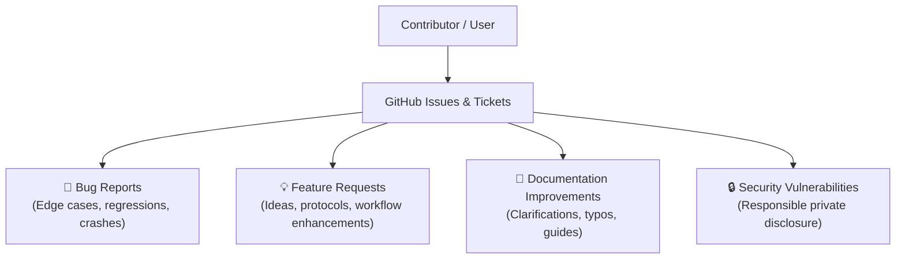

# Contributing to WireManager

Thank you for your interest in **WireManager**! Community feedback, bug reports, and suggestions are essential for making WireGuard management robust, secure, and accessible.

:::caution External Pull Requests Policy
**WireManager does not accept external Pull Requests (PRs).** 

All code changes, architecture decisions, and core features are maintained internally by the project author. Any external pull requests submitted to the repository will be politely closed.

**How you can contribute:**
The best and most impactful way to contribute is by **opening issues and tickets** on GitHub to report bugs, request features, suggest documentation improvements, or share operational feedback.
:::

---

## 1. Ways to Contribute

We welcome contributions through GitHub Issues in the following areas:



### 1.1 Reporting Bugs

If you encounter unexpected behavior, crashes, or inconsistencies with WireGuard interface management or firewall rules:

1. **Check Existing Issues**: Search the [GitHub Issue Tracker](https://github.com/GWSimoRod/WireManager/issues) to verify if the issue has already been reported.
2. **Open a New Issue**: If it is a new problem, create a bug ticket with the following details:
   - **Clear Summary**: A concise title describing the failure (e.g., `[Bug] Firewall rules not regenerated after deleting a tag`).
   - **Environment Details**:
     - Operating System & Distribution (e.g., Ubuntu 24.04 LTS, Debian 12)
     - Docker & Docker Compose version
     - WireGuard installation type (Kernel module, Docker container, or userspace)
     - WireManager version / commit hash
     - Browser and version (for UI/Frontend issues)
   - **Steps to Reproduce**: An exact, numbered sequence of actions required to reproduce the bug.
   - **Expected vs. Actual Behavior**: What you expected to happen versus what actually occurred.
   - **Relevant Logs & Screenshots**: Paste diagnostic logs or attach screenshots.

:::danger Sanitize Sensitive Data
Before attaching logs, configuration snippets, or screenshots, ensure you have redacted all sensitive credentials:
- WireGuard private keys (`PrivateKey`) and pre-shared keys (`PresharedKey`)
- Database passwords and connection strings
- JWT secret keys
- Sensitive internal domain names or private IP addresses
:::

---

### 1.2 Suggesting Features & Enhancements

Have an idea for a new feature, a dashboard improvement, or better integration with reverse proxies and identity providers?

When opening a **Feature Request** issue:

- **Describe the Problem**: What problem or limitation are you facing that WireManager doesn't currently address?
- **Proposed Solution**: Describe how you envision the feature working (workflows, UI mockups, or API endpoint ideas).
- **Alternatives Considered**: Did you consider other workarounds or third-party tools?
- **Target Context**: Clarify whether this affects home lab setups, small teams, or enterprise network topologies.

---

### 1.3 Documentation Feedback

Accurate documentation is critical for secure network management. If you spot:

- Outdated configuration flags or API schemas
- Ambiguous explanations or missing prerequisites
- Broken links or formatting issues

Please open an issue with the tag `documentation` referencing the relevant page URL and suggested corrections.

---

### 1.4 Security Vulnerabilities

We take security and access control seriously. If you discover a potential security vulnerability (such as an authentication bypass, privilege escalation, or iptables rule injection):

- **Do NOT open a public GitHub issue.**
- Report the vulnerability responsibly through GitHub's **Private Vulnerability Reporting** feature in the repository security tab, or contact the maintainer directly.
- Include a detailed proof-of-concept (PoC) and potential mitigation steps if known.

---

## 2. Local Environment for Diagnostics & Reproduction

If you want to run WireManager locally to reproduce a bug, inspect API behavior, or verify an issue before reporting it, you can spin up a local development environment.

### Prerequisites & Tooling

| Component | Recommended Version | Purpose |
| :--- | :--- | :--- |
| **.NET SDK** | `.NET 9.0` or `.NET 10.0` | Compiles `WireManager.Core` and runs `WireManager.API`. |
| **Node.js** | `Node.js 18.x+` (LTS) | Runs `WireManager.Frontend` and `wiremanager-docs`. |
| **Package Manager** | `npm` | Manages frontend and documentation dependencies. |
| **Database** | `MySQL 8.0+` | Relational store for configurations, peers, tags, and users. |
| **Container Engine** | `Docker` & `Docker Compose` | Runs the WireGuard container and provides `/var/run/docker.sock` integration. |

---

### Architecture & Project Structure

WireManager is organized across distinct components:

```text
WireManager/
├── WireManager.Core/          # Domain models, EF Core database context, business services
│   ├── Data/                  # WireManagerContext & migrations
│   ├── DTO/                   # Data Transfer Objects
│   ├── Interfaces/            # Abstract service contracts (IServerServices, etc.)
│   ├── Models/                # Domain models (ConfServer, ConfPeer, Tag, Service)
│   ├── Services/              # Business logic & iptables generation
│   └── Utils/                 # CryptoOps, NetworkOps, DiskOps
├── WireManager.API/           # ASP.NET Core REST API
│   ├── Attributes/            # Action filters (RequireSetupAttribute)
│   └── Controllers/           # REST endpoints (Server, Peer, Policy, Auth, Setup)
├── WireManager.Frontend/      # Next.js App Router web application
│   ├── src/app/api/           # BFF Route Handlers (proxying to backend)
│   ├── src/components/        # React components (shadcn/ui & custom modals)
│   └── src/lib/               # Type-safe API client & shared utilities
└── wiremanager-docs/          # Docusaurus documentation website
    ├── docs/                  # Markdown documentation files
    └── sidebars.ts            # Sidebar navigation configuration
```

---

### Step-by-Step Local Setup

#### Step 1: Clone the Repository

```bash
git clone https://github.com/GWSimoRod/WireManager.git
cd WireManager
```

#### Step 2: Launch the MySQL Database

You can run MySQL in a local Docker container:

```bash
docker run -d \
  --name wiremanager-mysql \
  -e MYSQL_ROOT_PASSWORD=rootpassword \
  -e MYSQL_DATABASE=wiremanager \
  -e MYSQL_USER=wiremanager \
  -e MYSQL_PASSWORD=wirepassword \
  -p 3306:3306 \
  mysql:8.0
```

Verify connection settings in `WireManager.API/appsettings.Development.json`:

```json
{
  "ConnectionStrings": {
    "DefaultConnection": "Server=localhost;Port=3306;Database=wiremanager;User=wiremanager;Password=wirepassword;"
  }
}
```

:::tip Automatic Migrations
Entity Framework Core database migrations are automatically applied on API startup via `context.Database.MigrateAsync()`. No manual migration command is required.
:::

#### Step 3: Run the Backend (`WireManager.API`)

```bash
cd WireManager.API
dotnet run
```

The API will listen on `http://localhost:5070` (or `https://localhost:7070`). You can inspect Swagger UI documentation at:
`http://localhost:5070/swagger`

#### Step 4: Run the Frontend (`WireManager.Frontend`)

In a new terminal window:

```bash
cd WireManager.Frontend
npm install
npm run dev
```

The web interface will be accessible at `http://localhost:3000`.

#### Step 5: Run the Documentation (`wiremanager-docs`)

To view documentation locally:

```bash
cd wiremanager-docs
npm install
npm run start
```

---

## 3. Gathering Diagnostic Logs

When opening a ticket, providing targeted logs helps diagnose issues quickly:

### Backend Logs (API & EF Core)
Check the terminal output of `dotnet run WireManager.API`. For detailed SQL query inspection, ensure logging level is set to `Information` or `Debug` in `appsettings.Development.json`:

```json
{
  "Logging": {
    "LogLevel": {
      "Default": "Information",
      "Microsoft.AspNetCore": "Warning",
      "Microsoft.EntityFrameworkCore.Database.Command": "Information"
    }
  }
}
```

### Container Logs
If diagnosing issues related to the WireGuard container or Docker socket communication:

```bash
# WireGuard container logs
docker logs -f wireguard

# MySQL database logs
docker logs -f wiremanager-mysql
```

### Frontend Logs
Open your browser's **Developer Tools** (`F12`):
- **Console tab**: Check for React hydration warnings or uncaught JavaScript exceptions.
- **Network tab**: Inspect failed HTTP calls (`4xx` / `5xx` statuses), payload schemas, and response headers.

---

## 4. Issue Triage & Lifecycle

Once an issue is submitted:

1. **Acknowledgment**: The maintainer reviews the report, verifies details, and adds appropriate labels (`bug`, `enhancement`, `needs-reproduction`, etc.).
2. **Investigation**: The reported behavior is replicated in a test environment.
3. **Internal Resolution**: Fixes and enhancements are implemented, tested against integration suites, and released in upcoming versions.
4. **Closing**: Once a fix is deployed in a release, the issue is closed with a reference to the release notes or version tag.

---

## 5. Community Guidelines

To ensure a productive and welcoming environment:

- Be respectful and constructive when engaging in issue discussions.
- Stay focused on technical details and reproducible behavior.
- Avoid duplicate tickets by searching existing issues before opening a new one.

Thank you for helping make **WireManager** better through your feedback and reports!
