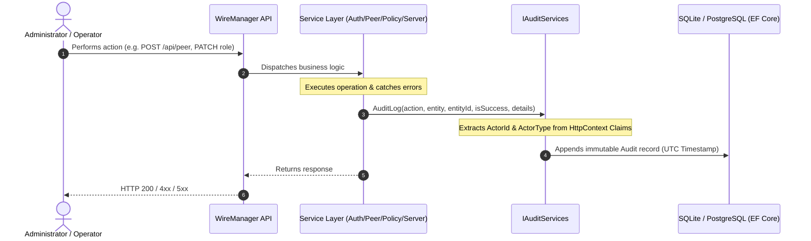

# How to Inspect Audit Logs and Security Events

WireManager incorporates an enterprise-grade, immutable audit logging subsystem designed to give network administrators full visibility into every security-sensitive operation, configuration change, and authentication event across the infrastructure.

This guide explains how the auditing system operates, how events are captured, how to inspect and filter logs via the web console, and how to query the audit REST API for external compliance or SIEM integration.

---

## Auditing & Zero-Trust Accountability

In a Zero-Trust network architecture, knowing *who* changed access permissions, *when* a peer was provisioned or revoked, and *whether* an operation succeeded is just as critical as enforcing the rules themselves.

WireManager records every administrative operation into a dedicated, append-only `Audit` log table.



### Core Audit Record Schema

Each audit record captures comprehensive context about the transaction:

| Field | Type | Description |
| :--- | :--- | :--- |
| `Id` | `Integer` | Auto-incrementing unique identifier for the event. |
| `Timestamp` | `DateTime (UTC)` | Exact UTC date and time when the operation took place. |
| `ActorId` | `String` | Unique identifier (UUID) of the user who initiated the action, or `"System"` for automated operations. |
| `ActorType` | `String` | Role of the initiator: `Admin`, `Operator`, or `System`. |
| `Action` | `String` | Structured dot-notation identifier for the action (e.g., `Peer.Create`, `Auth.Login`). |
| `Entity` | `String` | The target resource category: `User`, `Peer`, `Server`, `Tag`, `Service`, `Policy`, or `Setup`. |
| `EntityId` | `String?` | Specific identifier of the modified resource (e.g., peer ID, user UUID, server ID). |
| `IsSuccess` | `Boolean` | `true` if the operation completed successfully; `false` if an error or rejection occurred. |
| `Details` | `String?` | Additional descriptive payload, diagnostic failure reason, or attribute diffs. |

---

## Role-Based Access Control (RBAC)

Viewing and querying the audit log is strictly restricted to accounts with the **Admin** role:

- **Admin Accounts**: Have full access to the Audit Logs page in the web console (`/audit`) and can query `GET /api/Audit`.
- **Operator Accounts**: Do not have visibility of the Audit menu entry. Direct navigation to `/audit` displays an **Access Denied** notice, and querying `/api/Audit` returns an HTTP `403 Forbidden` response.

:::caution Compliance & Immutability
Audit records are intentionally append-only. There is no API endpoint or UI mechanism to edit or delete individual audit log entries, preserving non-repudiation and evidentiary integrity for compliance audits (such as SOC 2, ISO 27001, or GDPR).
:::

---

## Web Console Walkthrough (`/audit`)

### Navigation and Overview

To access the audit log console:
1. Log in to WireManager with an account having the **Admin** role.
2. In the navigation sidebar, click on **Audit Logs** (`/audit`).

```
+-----------------------------------------------------------------------------------------------+
| [icon] Audit Logs                                                               [ Refresh ]   |
| System event audit trail and security operations log                                          |
+-----------------------------------------------------------------------------------------------+
| [ Search audit events... ]       [ Status: All v ]   [ Entity: All v ]                        |
+-----------------------------------------------------------------------------------------------+
| TIMESTAMP           STATUS    ACTION             ENTITY       ACTOR           DETAILS   VIEW  |
+-----------------------------------------------------------------------------------------------+
| 10/09/2026 14:32:01 [Success] Peer.Create        Peer #12     [Admin] admin   -         [Eye] |
| 10/09/2026 14:30:15 [Failed]  Auth.Login         User         [System] System Invalid.. [Eye] |
| 10/09/2026 14:28:40 [Success] Policy.CreateTag   Tag #4       [Admin] admin   -         [Eye] |
| 10/09/2026 14:25:00 [Success] Server.Create      Server #1    [Admin] admin   -         [Eye] |
+-----------------------------------------------------------------------------------------------+
| Rows per page: [ 10 v ]                 Page 1 of 5 (48 records)             < Prev   Next >  |
+-----------------------------------------------------------------------------------------------+
```

---

### Step 1: Filter and Search Events

The audit toolbar provides flexible, real-time filtering:

1. **Free-Text Search**:
   - Type any string into the search input.
   - Searches across `Action`, `Entity`, `EntityId`, `ActorId`, `ActorType`, and `Details`.
2. **Filter by Status**:
   - **All Statuses**: Shows all successful and failed attempts.
   - **Success**: Displays only operations that succeeded (`IsSuccess = true`).
   - **Failed**: Highlights rejected actions, invalid logins, or operational failures (`IsSuccess = false`).
3. **Filter by Entity**:
   - Choose a target entity from the dropdown (`User`, `Peer`, `Server`, `Tag`, `Service`, `Policy`, or `Setup`).
4. **Live Refresh**:
   - Click the **Refresh** button in the top-right corner to fetch newly generated log entries without reloading the browser.

---

### Step 2: Inspect Event Details

Clicking on any row or selecting the eye icon (`View`) opens the **Audit Entry Details** modal dialog:

```
+-------------------------------------------------------+
| Audit Entry Details                             [ X ] |
| Complete information for audit event #42              |
+-------------------------------------------------------+
| Action: Peer.Create        Status: [✓ Operation Successful] |
+-------------------------------------------------------+
| Timestamp:             | Entity:                      |
| 10/09/2026 14:32:01    | Peer #12                     |
+------------------------+------------------------------+
| Actor Type:            | Actor ID:                    |
| [Admin]                | a3f1c890-7812-4fbc-b892-...  |
+-------------------------------------------------------+
| Details                                  [ Copy ]     |
| +---------------------------------------------------+ |
| | Peer "dev-laptop" provisioned on wg0 with IP      | |
| | 10.0.0.15/32 and policy tags [Developers].        | |
| +---------------------------------------------------+ |
+-------------------------------------------------------+
```

- The modal presents all metadata in high contrast with clear actor badges and formatted timestamps.
- If the event contains detailed payloads (such as failure messages, JSON parameters, or diff summaries), click **Copy** to place the text directly onto your clipboard.

---

### Step 3: Pagination and Page Sizing

At the bottom of the audit table:
- **Rows per page**: Configure batch sizes of **10**, **20**, **50**, or **100** items.
- **Navigation**: Move back and forth using **Previous** and **Next** buttons. The total count and current page position are displayed dynamically.

---

## Audited Actions Catalog

WireManager tracks actions across all subsystem domains using standard dot-notation naming:

### 1. Authentication & User Governance (`User`)

| Action | Success Condition | Failure Trigger Example |
| :--- | :--- | :--- |
| `Auth.Login` | Valid credentials submitted; JWT generated. | Empty username/password; invalid password; nonexistent user. |
| `Auth.Create` | New user account provisioned. | Username already registered; validation failure. |
| `Auth.Update` | Account credentials or role modified. | Target user not found; unauthorized role adjustment. |
| `Auth.Delete` | User account safely deleted. | Target user not found; attempt to delete last administrator. |

### 2. Peer Lifecycle & Connectivity (`Peer`)

| Action | Success Condition | Failure Trigger Example |
| :--- | :--- | :--- |
| `Peer.Create` | Client cryptographic keys generated, IP allocated, server synchronized. | Subnet IP exhaustion; invalid public key; server not found. |
| `Peer.Update` | Peer properties (friendly name, expiration date, keepalive) updated. | Peer ID not found; invalid date format. |
| `Peer.Delete` | Peer revoked, cryptographic keys deleted, IP returned to pool. | Peer ID not found; failure removing peer from WireGuard runtime. |
| `Peer.Toggle` | Peer active state toggled (`true`/`false`), runtime updated. | Peer ID not found; interface sync error. |
| `Peer.AddPolicy` | Policy tag attached to peer; firewall rules recalculated. | Peer or tag not found; tag already attached. |
| `Peer.RemovePolicy`| Policy tag detached from peer; firewall rules revoked. | Peer or tag binding not found. |

### 3. Policies, Tags & Services (`Policy`, `Tag`, `Service`)

| Action | Success Condition | Failure Trigger Example |
| :--- | :--- | :--- |
| `Policy.CreateTag` | New policy tag created in catalog. | Duplicate tag name. |
| `Policy.UpdateTag` | Tag description or name modified. | Tag ID not found. |
| `Policy.DeleteTag` | Policy tag removed and dissociated from all peers. | Tag ID not found. |
| `Policy.CreateService` | Internal network service registered (IP, port, proto). | Duplicate IP/port combination; invalid CIDR. |
| `Policy.DeleteService` | Network service deleted; active firewall rules purged. | Service ID not found. |
| `Policy.RemoveServiceFromTag` | Service unlinked from a specific tag. | Association does not exist. |
| `Policy.CreatePolicy` | One or more services linked to a tag. | No new associations created. |

### 4. WireGuard Servers (`Server`)

| Action | Success Condition | Failure Trigger Example |
| :--- | :--- | :--- |
| `Server.Create` | New WireGuard interface configured and brought up. | Port collision; invalid CIDR subnet. |
| `Server.Update` | Interface endpoint, listen port, or routing updated. | Server ID not found. |
| `Server.Delete` | Interface destroyed and associated peers removed. | Server ID not found. |

### 5. System Bootstrapping (`Setup`)

| Action | Success Condition | Failure Trigger Example |
| :--- | :--- | :--- |
| `Setup.Perform` | Initial onboarding wizard completed; first Admin created. | Setup already completed; database initialization error. |

---

## REST API Integration

External monitoring tools, scripts, or Security Information and Event Management (SIEM) systems can ingest audit records directly via the REST API.

### `GET /api/Audit`

Retrieves a paginated list of audit records, ordered chronologically descending (newest first).

#### Request Headers

```http
GET /api/Audit?pageNumber=1&pageSize=20 HTTP/1.1
Host: wiremanager.example.com
Authorization: Bearer <ADMIN_JWT_TOKEN>
Accept: application/json
```

#### Query Parameters

| Parameter | Type | Default | Description |
| :--- | :--- | :--- | :--- |
| `pageNumber` | `integer` | `1` | The page number to retrieve (1-indexed). |
| `pageSize` | `integer` | `10` | The number of log items per page (maximum recommended: 100). |

#### Response (`200 OK`)

```json
[
  {
    "id": 142,
    "timestamp": "2026-09-10T14:32:01.428Z",
    "actorId": "550e8400-e29b-41d4-a716-446655440000",
    "actorType": "Admin",
    "action": "Peer.Create",
    "entity": "Peer",
    "entityId": "12",
    "isSuccess": true,
    "details": "Allocated IP: 10.0.0.15/32 on interface wg0"
  },
  {
    "id": 141,
    "timestamp": "2026-09-10T14:30:15.112Z",
    "actorId": "System",
    "actorType": "System",
    "action": "Auth.Login",
    "entity": "User",
    "entityId": null,
    "isSuccess": false,
    "details": "Invalid username or password"
  }
]
```

#### Response Status Codes

| Code | Meaning | Description |
| :--- | :--- | :--- |
| `200 OK` | Success | Returns the array of audit logs. |
| `401 Unauthorized` | Missing / Expired Token | Missing or invalid JWT Bearer authentication header. |
| `403 Forbidden` | Insufficient Permissions | The authenticated token belongs to an `Operator` account rather than an `Admin`. |

---

## Security Best Practices

:::tip Detecting Brute-Force & Credential Stuffing
Periodically filter audit logs for `Action: Auth.Login` and `Status: Failed`. A burst of failed login attempts from `"System"` with the same username indicates a potential credential attack.
:::

:::note Monitoring Policy Drift
Ensure that changes to tags and network services (`Policy.UpdateTag`, `Policy.DeleteService`, `Policy.CreatePolicy`) are correlated with approved internal change tickets.
:::

---

## Related Documentation

- **[How to Manage Users and Roles](./user-management.md)** — RBAC roles, creating operators and administrators.
- **[API Reference Catalog](../api/reference.md)** — Comprehensive index of all REST endpoints.
- **[Architecture & Core Concepts](../concepts/overview.md)** — WireManager Zero-Trust networking principles.
