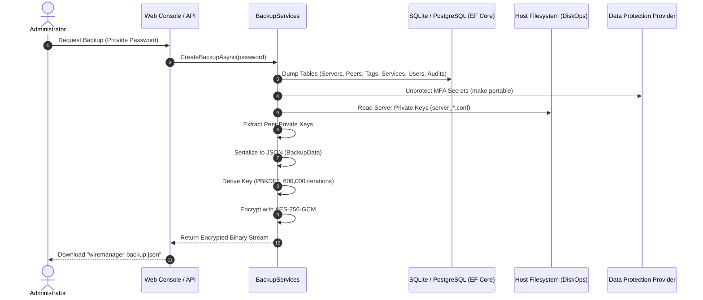
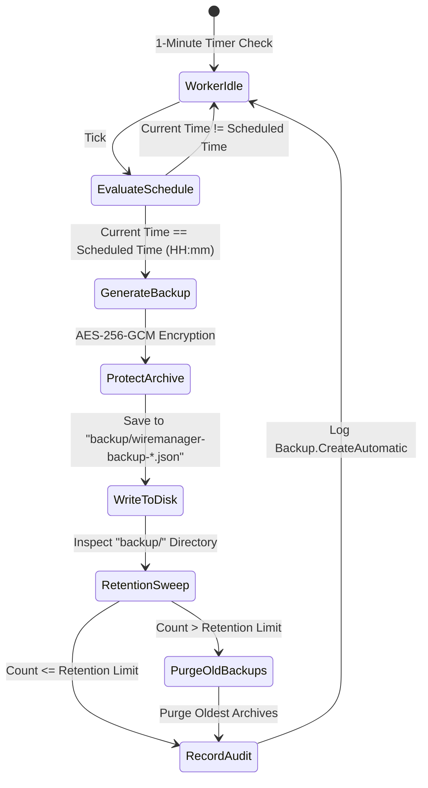
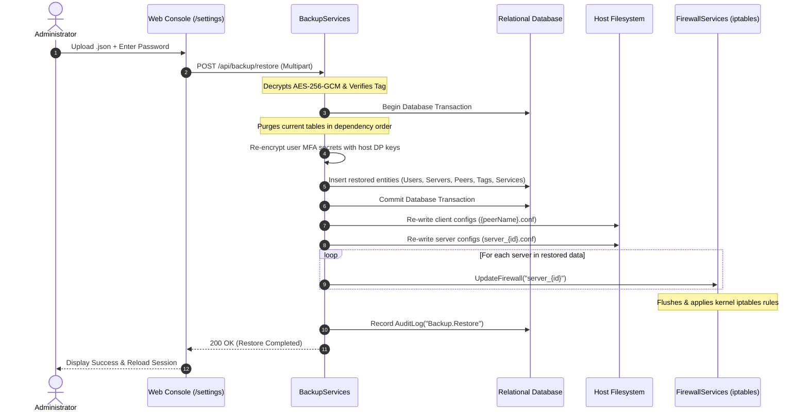

# How to Manage Backups and Automatic Backups

WireManager incorporates an enterprise-grade, cryptographically secured backup and disaster recovery subsystem. It provides network administrators with complete operational resilience, enabling on-demand state exports, automated daily backups with retention enforcement, and zero-downtime disaster recovery across environments.

This guide explains how the backup subsystem functions, the cryptographic standards protecting your sensitive network keys, how to schedule automatic backups, and how to execute full system restorations from the web console or REST API.

---

## Architectural Overview & State Snapshot

In a WireGuard-based VPN infrastructure, state is split between relational metadata (users, policy tags, service definitions, audit history) and cryptographic keypairs stored on the host filesystem (server private keys and client configurations).

When a backup is triggered, WireManager synthesizes these disparate components into an immutable, unified archive encrypted using authenticated symmetric encryption (`AES-256-GCM`).



### Snapshot Scope

A WireManager backup captures the entire operational state of your network controller:

| Component | Target Location | Description |
| :--- | :--- | :--- |
| **WireGuard Servers** | Database & Filesystem | Server configurations (`ConfServers`) and private interface keys extracted from `server_{id}.conf`. |
| **Peers & Keys** | Database & Filesystem | Client peer records (`ConfPeers`), allocated IP addresses, expiration dates, and client private keys. |
| **Zero-Trust Policies** | Database | Policy tags (`Tags`), protected services (`Services`), and tag-service associations (`TagServices`). |
| **Access Bindings** | Database | Peer-to-tag mappings (`PeerTags`) that govern dynamic firewall rule generation. |
| **User Accounts** | Database | Local user accounts (`Users`), roles (`Admin`/`Operator`), password hashes, and user identities (`UserIdentities`). |
| **MFA Secrets** | Database | Time-based One-Time Password (TOTP) secrets, decrypted from host storage and packaged for portability. |
| **System Configurations** | Database | Execution engine preferences, network adapters, and setup completion flags (`SystemConfigs`). |
| **Audit Logs** | Database | Complete historical audit records (`Audits`) providing end-to-end accountability. |

---

## Cryptographic Security & Encryption

WireManager protects backups using defense-in-depth cryptographic primitives designed to resist offline brute-force attacks and tampering.

```
+-----------------------------------------------------------------------------------------+
|                                ENCRYPTED BACKUP PAYLOAD                                  |
+---------------------+--------------------+--------------------+-------------------------+
| Salt (16 Bytes)     | Nonce (12 Bytes)   | Auth Tag (16 Bytes)| Ciphertext (N Bytes)    |
| Random crypt-salt   | AES-GCM IV         | Authentication Tag | AES-256-GCM Payload     |
+---------------------+--------------------+--------------------+-------------------------+
```

### Cryptographic Parameters

1. **Key Derivation Function (KDF)**:
   - **Algorithm**: `PBKDF2` (Password-Based Key Derivation Function 2) using `HMAC-SHA-256`.
   - **Salt**: 16 cryptographically secure random bytes generated via `RandomNumberGenerator`.
   - **Work Factor**: `600,000` iterations (meeting and exceeding modern OWASP security recommendations).
   - **Derived Key Length**: 256 bits (32 bytes).

2. **Authenticated Symmetric Cipher**:
   - **Algorithm**: `AES-256-GCM` (Galois/Counter Mode).
   - **Nonce (Initialization Vector)**: 12 cryptographically secure random bytes.
   - **Authentication Tag**: 16 bytes (128 bits) providing cryptographic integrity and authenticity.
   - Any modification or byte corruption in the ciphertext immediately triggers an authentication error during decryption, preventing chosen-ciphertext attacks.

3. **Portable MFA Secrets**:
   - In standard operation, user MFA secrets are encrypted using the local host's ASP.NET Core Data Protection provider keys.
   - During backup generation, MFA secrets are temporarily decrypted and packed into the AES-256-GCM encrypted payload.
   - Upon restoration, secrets are immediately re-encrypted with the target machine's Data Protection keys. This allows seamless migrations between distinct server hosts or container instances without breaking two-factor authentication.

:::caution Non-Recoverable Passwords
The encryption key is strictly derived from the password entered during backup creation. WireManager **does not store** plaintext passwords. If you lose or forget the encryption password for a manual backup file, the archive cannot be decrypted or recovered.
:::

---

## Role-Based Access Control (RBAC)

Backup and restoration are critical administrative actions:

- **Admin Role**: Full access to generate manual backups, upload and restore archives, configure automatic backup schedules, and view backup configurations.
- **Operator Role**: No access. The Backup cards in the web console are hidden, and API endpoints under `/api/backup` return HTTP `403 Forbidden`.

---

## Manual Backups: Creation & Download

Manual backups can be exported at any time before major network adjustments, server upgrades, or infrastructure migrations.

### Generation Workflow

1. Navigate to **Settings** (`/settings`) using an account with the **Admin** role.
2. In the **Backup & Restore** card, locate the **Create New Backup** section.
3. Enter an **Encryption Password** and re-type it in the **Confirm Encryption Password** field.
4. Click **Download Backup**. WireManager compiles the system state, applies AES-256-GCM encryption, and downloads the archive as `wiremanager-backup.json`.

```
+-----------------------------------------------------------------------------------------------+
| Backup & Restore                                                                              |
| Create an encrypted backup of the entire system or restore from a previous state              |
+---------------------------------------------------------------+-------------------------------+
| Create New Backup                                             | Restore Backup                |
| Export an encrypted archive (AES-256-GCM) containing servers, | Select a previously exported  |
| peers, tags, policies, users, and WireGuard keys.             | backup file and enter password|
|                                                               |                               |
| [!] Warning: Strong password required                         | [!] Overwrites all current    |
|                                                               |     database and keys         |
| Encryption Password:                                          |                               |
| [ ************************** ] [Eye]                         | Select backup file:           |
| Confirm Encryption Password:                                  | [  Drop backup file (.json)   |
| [ ************************** ] [Eye]                         |    here or click to browse   ] |
|                                                               |                               |
| [  Download Backup  ]                                         | Decryption Password:          |
|                                                               | [ ************************** ]|
|                                                               |                               |
|                                                               | [  Restore Backup  ]          |
+---------------------------------------------------------------+-------------------------------+
```

---

## Automatic Backups: Scheduling & Retention

To safeguard against hardware failure, operator mistakes, or system loss, WireManager features an automated background worker that generates periodic encrypted snapshots and automatically enforces data retention rules.



### Background Worker Mechanics (`BackgroundBackupWorker`)

- **Worker Type**: An ASP.NET Core `BackgroundService` hosted directly inside the API runtime.
- **Polling Frequency**: Uses a `PeriodicTimer` with an interval of **1 minute**.
- **Time Evaluation**: Compares the local system hour and minute (`DateTime.Now.TimeOfDay`) against the configured schedule (`TimeOnly`).
- **Encrypted Password Storage**: The encryption password entered for automatic backups is protected at rest in the database using ASP.NET Core Data Protection (`IDataProtector` with purpose `"WireManager.Backup.Password"`).
- **Directory Path**: Archives are written to the `backup/` subfolder located in the application root (`DiskOps._baseFolderPathBackup`).
- **File Naming Format**: `wiremanager-backup-yyyy-MM-dd-HHmmss.json`.

### Automated Retention Management

After each successful automatic backup run, the worker applies a FIFO (First-In, First-Out) retention policy:
1. Queries all `.json` files in the `backup/` folder.
2. Sorts them chronologically by creation timestamp (`CreationTimeUtc`).
3. Calculates `filesToDelete = totalFiles - retentionDays`.
4. If `filesToDelete > 0`, the worker permanently deletes the oldest files until the directory contains exactly the configured retention count.

:::tip Off-Site Backup Strategy
While WireManager stores automatic backups on local disk in the `backup/` folder, administrators should mount this folder to a persistent external volume, NAS, or configure an external sync utility (e.g., `rclone`, `rsync`, or S3 sync) to transport these encrypted JSON files off-site.
:::

---

## Disaster Recovery: System Restoration

Restoring a backup returns WireManager to the exact state captured when the archive was exported.



### Restoration Execution Phases

1. **Decryption and Integrity Check**:
   - The PBKDF2 key is re-derived from the supplied password and the salt stored in the header of the backup file.
   - `AesGcm.Decrypt` validates the 16-byte authentication tag. If the password is wrong or the file is corrupted, decryption immediately aborts.

2. **Atomic Database Replacement**:
   - The restoration executes within an explicit database transaction (`BeginTransactionAsync`).
   - Existing records are deleted in reverse foreign-key order: `Audits`, `PeerTags`, `TagServices`, `UserIdentities`, `ConfPeers`, `ConfServers`, `Tags`, `Services`, `Users`, and `SystemConfigs`.
   - MFA secrets for all restored user accounts are re-encrypted using the current server's cryptographic keys.
   - Restored audit entries receive an appended note: `"Restored from backup."` to preserve non-repudiation and traceability.
   - If any insert fails, the transaction is rolled back completely.

3. **Filesystem Reconstruction**:
   - **Peers**: Regenerates every peer configuration file under `peers/{sanitizedClientName}.conf` with the restored private keys and server endpoint settings.
   - **Servers**: Compiles full WireGuard server configuration files under `servers/server_{id}.conf`, including the `[Interface]` block and every associated `[Peer]` entry.

4. **Kernel Firewall & Route Re-synchronization**:
   - Calls `IFirewallServices.UpdateFirewall` for every restored server interface.
   - Re-applies all Zero-Trust forwarding chains, tag restrictions, and port rules in Linux `iptables` without requiring a daemon restart.

:::danger Overwrite Warning
Restoring a backup is a destructive action that completely overwrites all current servers, peers, policies, credentials, and network configurations. Always take a fresh manual backup before restoring an older archive.
:::

---

## Web Console Walkthrough (`/settings`)

### Step 1: Configure Automatic Backups

1. Log in to WireManager as an **Admin** and select **Settings** from the main navigation bar.
2. Scroll to the **Automatic Backup** card.
3. Review the **Currently Active Configuration** banner at the top, which displays the current active status, daily execution time, and retention threshold.

```
+-----------------------------------------------------------------------------------------------+
| [icon] Automatic Backup                                                                       |
| Schedule daily automatic encrypted backups with retention policies                            |
+-----------------------------------------------------------------------------------------------+
| CURRENTLY ACTIVE CONFIGURATION                                               [ Active ]       |
| Scheduled time: Every day at 03:00             Retention: 7 days                              |
+-----------------------------------------------------------------------------------------------+
| [✓] Enable automatic backup                                                  [  Toggle Switch ]
| Periodically generates an encrypted system backup and removes obsolete backups                |
+-----------------------------------------------------------------------------------------------+
| Daily Execution Time:                           Retention (days):                             |
| [ 03:00 ] [Clock]                               [ 7 ] [Database]                              |
|                                                                                               |
| Encryption Password:                                                                          |
| [ ************************** ] [Eye]                                                          |
| Confirm Encryption Password:                                                                  |
| [ ************************** ] [Eye]                                                          |
|                                                                                               |
| [  Save configuration  ]                                                                      |
+-----------------------------------------------------------------------------------------------+
```

4. Toggle the **Enable automatic backup** switch on.
5. In **Daily Execution Time**, choose the time of day (e.g., `03:00` for 3:00 AM) using 24-hour notation.
6. In **Retention (days)**, specify how many days of backups to retain (e.g., `7` or `30`).
7. Enter a secure **Encryption Password** and confirm it.
8. Click **Save configuration**. A success toast confirms the schedule is stored in the database.

---

### Step 2: Perform a System Restore

1. In **Settings** (`/settings`), locate the **Restore Backup** section in the **Backup & Restore** card.
2. Drag and drop your `.json` backup file onto the upload target, or click to open the file explorer.
3. Once selected, the card displays the filename and file size (e.g., `wiremanager-backup.json (48.2 KB)`).
4. Enter the **Decryption Password** matching the password used when the backup was created.
5. Click **Restore Backup**.
6. A confirmation modal will ask you to confirm the destructive action:

```
+-------------------------------------------------------+
| Confirm Backup Restoration                      [ X ] |
| Are you sure you want to proceed? All current system  |
| data will be replaced with the data from the backup   |
| file.                                                 |
+-------------------------------------------------------+
|                 [ Cancel ]    [ Yes, restore now ]    |
+-------------------------------------------------------+
```

7. Click **Yes, restore now**. WireManager validates, decrypts, reconstructs the database, rewrites configuration files, synchronizes firewall rules, and automatically reloads the application.

---

## Audited Actions Catalog

Every operation within the backup subsystem is recorded in the immutable audit log:

| Action | Success Condition | Failure Trigger Example |
| :--- | :--- | :--- |
| `Backup.Create` | On-demand backup exported and encrypted successfully. | Database query failure; filesystem key read error. |
| `Backup.Restore` | Backup file decrypted, database replaced, configs rewritten, firewall synced. | Invalid decryption password; corrupted ciphertext; missing server/peer key. |
| `Backup.InitializeAutomatic` | Automatic backup schedule, retention, and encrypted password persisted. | Database write error; Data Protection provider failure. |
| `Backup.CreateAutomatic` | Scheduled automatic backup generated, saved to `backup/`, and retention applied. | Disk full; permissions error writing to `backup/` directory. |

To review these events, navigate to **Audit Logs** (`/audit`) or query `GET /api/Audit`.

---

## Security & Operational Best Practices

:::tip Master Password Management
Store backup encryption passwords in an enterprise password manager (such as Bitwarden, 1Password, or HashiCorp Vault). Label the entry with the backup purpose and server hostname.
:::

:::note Storage Volume Persistence
When deploying WireManager in Docker containers, ensure the `./backup` directory on the host is bound to a dedicated storage volume (e.g., `-v /var/data/wiremanager/backup:/app/backup`). Otherwise, local automatic backups will not persist across container recreations.
:::

:::tip Regular Recovery Drills
Periodically test restoring a backup into an isolated staging environment or lab container to confirm your recovery runbooks and verify backup integrity.
:::

---

## Related Documentation

- **[Backup & Disaster Recovery REST API](../api/backup.md)** — Complete specifications for `/api/backup` endpoints.
- **[How to Inspect Audit Logs and Security Events](./audit-logs.md)** — Monitoring security events and tracking administrative actions.
- **[How to Manage Users and Roles](./user-management.md)** — Role-Based Access Control and administrator credentials.
- **[WireGuard Server Management](../api/servers.md)** — Managing server interfaces and firewall synchronization.
