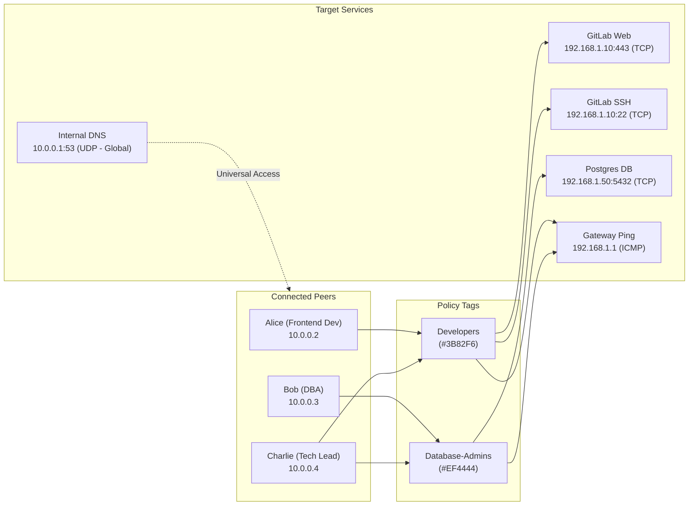

# How to Configure Access Policies

This guide provides a hands-on, step-by-step walkthrough for configuring **Zero-Trust Network Access Control** in WireManager. You will learn how to define internal network resources (**Services**), bundle them into role-based policy groups (**Tags**), assign them to client devices (**Peers**), and verify traffic isolation.

---

## What We'll Build

In this tutorial, we will configure an enterprise access topology for a team with different operational roles:



### Access Matrix Summary:
- **Alice** (`Developers` tag): Reaches GitLab Web, GitLab SSH, and Gateway Ping. Connection attempts to PostgreSQL are **blocked**.
- **Bob** (`Database-Admins` tag): Reaches PostgreSQL and Gateway Ping. Connection attempts to GitLab are **blocked**.
- **Charlie** (Both tags): Reaches all services via additive union.
- **Everyone**: Reaches the Internal DNS server automatically because it is marked as a **Global Service**.

---

## Step 1: Define Target Network Services

In WireManager, services represent the specific destinations and ports you wish to expose.

1. Navigate to **Services** in the left sidebar (`/services`).
2. Click the **New Service** button (`+`) in the top right.

### 1.1 Create the Global DNS Service
1. **Name**: `Internal DNS`
2. **Protocol**: Select `UDP`
3. **Port**: `53`
4. **Target IP**: `10.0.0.1`
5. **Global Service Switch**: Toggle **ON**

:::tip Smart Global Detection
When you type `DNS` into the name field, WireManager's smart detection banner automatically suggests enabling **Servizio Globale**. Click the suggestion banner to toggle it on with a single click.
:::

6. Click **Create**. Because this service is marked Global, WireManager immediately injects universal allow rules into all active WireGuard server firewall chains.

---

### 1.2 Create the GitLab Services
Next, create the web and SSH endpoints for your code repository:

#### GitLab Web
- **Name**: `GitLab Web`
- **Protocol**: `TCP`
- **Port**: `443`
- **Target IP**: `192.168.1.10`
- **Domain**: `git.corp.internal` *(used later for reverse proxy verification)*
- **Global Service**: Toggle **OFF**
- Click **Create**.

#### GitLab SSH
- **Name**: `GitLab SSH`
- **Protocol**: `TCP`
- **Port**: `22`
- **Target IP**: `192.168.1.10`
- **Global Service**: Toggle **OFF**
- Click **Create**.

---

### 1.3 Create the Database Service
- **Name**: `PostgreSQL Production`
- **Protocol**: `TCP`
- **Port**: `5432`
- **Target IP**: `192.168.1.50`
- **Global Service**: Toggle **OFF**
- Click **Create**.

---

### 1.4 Create a Portless Diagnostic Service (Ping Gateway)
WireManager supports Layer-3 protocols that do not require transport ports:

- **Name**: `Gateway Ping`
- **Protocol**: Select `ICMP` *(Notice the Port field automatically disappears)*
- **Target IP**: `192.168.1.1`
- **Global Service**: Toggle **OFF**
- Click **Create**.

---

## Step 2: Create Policy Tags

Tags bundle multiple services into logical roles or access tiers.

1. Navigate to **Tags** in the left sidebar (`/tags`).
2. Click the **New Tag** button (`+`).

```
+-------------------------------------------------------------+
|                          New Tag                            |
+-------------------------------------------------------------+
| Tag Name:   [ Developers                                  ] |
| Color:      (*) #3B82F6 (Blue)  [Palette Picker]            |
|                                                             |
| Associated Services:                                        |
|   [x] GitLab Web (192.168.1.10:443/TCP)                     |
|   [x] GitLab SSH (192.168.1.10:22/TCP)                      |
|   [ ] PostgreSQL Production (192.168.1.50:5432/TCP)         |
|   [x] Gateway Ping (192.168.1.1/ICMP)                       |
+-------------------------------------------------------------+
|                          [Cancel]  [Create Tag]             |
+-------------------------------------------------------------+
```

### 2.1 Create the `Developers` Tag
- **Name**: `Developers`
- **Color**: Select `#3B82F6` (Blue) from the preset color palette.
- **Select Services**: Check `GitLab Web`, `GitLab SSH`, and `Gateway Ping`.
- Click **Create**.

### 2.2 Create the `Database-Admins` Tag
- **Name**: `Database-Admins`
- **Color**: Select `#EF4444` (Red) to indicate high-privilege access.
- **Select Services**: Check `PostgreSQL Production` and `Gateway Ping`.
- Click **Create**.

---

## Step 3: Assign Tags to Peers

Now assign the policy tags to your client devices:

1. Navigate to **Peers** in the left sidebar (`/peers`).

### Assign to Alice
1. Locate `alice-macbook` in the peers list.
2. Click the **More Actions** menu (`...`) and choose **Edit** (or assign tags during initial peer creation).
3. In the **Access Tags** section of the modal, click the **`Developers`** tag badge to select it.
4. Click **Save Changes**.

### Assign to Bob
1. Locate `bob-dba` in the peers list.
2. Click **Edit**.
3. In the **Access Tags** section, select the **`Database-Admins`** tag badge.
4. Click **Save Changes**.

### Assign to Charlie (Multi-Tag Union)
1. Locate `charlie-lead` in the peers list.
2. Click **Edit**.
3. In the **Access Tags** section, select **both** **`Developers`** and **`Database-Admins`**.
4. Click **Save Changes**.

---

## Step 4: Behind the Scenes: Automated Firewall Compilation

The moment tags are assigned, WireManager's firewall engine automatically recompiles the active iptables chain for the hosting server (`WIREMANAGER-FW-server_1`):

```bash
# 1. State tracking (Allow return packets)
iptables -A WIREMANAGER-FW-server_1 -m state --state RELATED,ESTABLISHED -j ACCEPT

# 2. Universal Global Service (Applied to all peers)
iptables -A WIREMANAGER-FW-server_1 -d 10.0.0.1 -p udp --dport 53 -j ACCEPT

# 3. Alice (10.0.0.2) - Developers Tag Rules
iptables -A WIREMANAGER-FW-server_1 -s 10.0.0.2 -d 192.168.1.10 -p tcp --dport 443 -j ACCEPT
iptables -A WIREMANAGER-FW-server_1 -s 10.0.0.2 -d 192.168.1.10 -p tcp --dport 22 -j ACCEPT
iptables -A WIREMANAGER-FW-server_1 -s 10.0.0.2 -d 192.168.1.1 -p icmp -j ACCEPT

# 4. Bob (10.0.0.3) - Database-Admins Tag Rules
iptables -A WIREMANAGER-FW-server_1 -s 10.0.0.3 -d 192.168.1.50 -p tcp --dport 5432 -j ACCEPT
iptables -A WIREMANAGER-FW-server_1 -s 10.0.0.3 -d 192.168.1.1 -p icmp -j ACCEPT

# 5. Charlie (10.0.0.4) - Union of Both Tags
iptables -A WIREMANAGER-FW-server_1 -s 10.0.0.4 -d 192.168.1.10 -p tcp --dport 443 -j ACCEPT
iptables -A WIREMANAGER-FW-server_1 -s 10.0.0.4 -d 192.168.1.10 -p tcp --dport 22 -j ACCEPT
iptables -A WIREMANAGER-FW-server_1 -s 10.0.0.4 -d 192.168.1.50 -p tcp --dport 5432 -j ACCEPT
iptables -A WIREMANAGER-FW-server_1 -s 10.0.0.4 -d 192.168.1.1 -p icmp -j ACCEPT

# 6. Default Deny (Drop all other internal traffic)
iptables -A WIREMANAGER-FW-server_1 -j DROP
```

:::note Zero Interruption
This update executes via the Docker socket without restarting the WireGuard container or interrupting existing client connections.
:::

---

## Step 5: Verify and Test Access Isolation

Connect each client device to the VPN and verify that access policies are strictly enforced:

### Test Alice's Device (`10.0.0.2`)
```bash
# Test 1: GitLab Web (Allowed)
curl -I --connect-timeout 3 https://192.168.1.10:443
# Result: HTTP/2 200 OK

# Test 2: ICMP Ping (Allowed)
ping -c 2 192.168.1.1
# Result: 2 packets transmitted, 2 received, 0% packet loss

# Test 3: PostgreSQL Database (BLOCKED by Default Deny)
nc -zv -w 3 192.168.1.50 5432
# Result: Connection timed out! (Packets dropped by firewall)
```

### Test Bob's Device (`10.0.0.3`)
```bash
# Test 1: PostgreSQL Database (Allowed)
nc -zv -w 3 192.168.1.50 5432
# Result: Connection to 192.168.1.50 5432 port [tcp/postgresql] succeeded!

# Test 2: GitLab Web (BLOCKED by Default Deny)
curl -I --connect-timeout 3 https://192.168.1.10:443
# Result: Connection timed out! (Packets dropped by firewall)
```

### Test Charlie's Device (`10.0.0.4`)
```bash
# Test 1: Both GitLab and PostgreSQL are reachable
curl -I --connect-timeout 3 https://192.168.1.10:443 # Succeeded
nc -zv -w 3 192.168.1.50 5432                     # Succeeded
```

---

## Step 6: Managing Policy Changes in Real-Time

One of the greatest benefits of WireManager's tag abstraction is zero-touch policy propagation.

### Adding a New Service to an Entire Team
Suppose your company deploys a new staging API on `192.168.1.25:8080`:
1. Go to **Services** → Create `Staging API` (`192.168.1.25:8080/TCP`).
2. Go to **Tags** → Edit the **`Developers`** tag → Check `Staging API` → Click **Save**.
3. **Instant Reachability**: Both Alice and Charlie immediately gain access to the staging API. You do not need to edit Alice or Charlie's peer profiles or resend them `.conf` files.

### Immediate Privilege Revocation
If Bob leaves the database administration team:
1. Go to **Peers** → Edit `bob-dba`.
2. Uncheck the **`Database-Admins`** tag badge.
3. Click **Save Changes**.
4. Within milliseconds, Bob's active packets to `192.168.1.50:5432` are dropped by the firewall.

---

## Best Practices for Policy Architecture

:::tip Recommended Design Patterns
1. **Name Tags by Function, Not Names**: Use functional role names (e.g., `Frontend-Team`, `SRE-Oncall`, `Finance-Workstations`) instead of personal names (`Alice-Tag`).
2. **Environment Separation**: Always maintain distinct tags for different stages of the development lifecycle (e.g., `App-Dev`, `App-Staging`, `App-Production`).
3. **Use Color Coding as a Security Tier Indicator**:
   - **Red (`#EF4444`)**: Production databases, payment gateways, sensitive infrastructure.
   - **Amber (`#F59E0B`)**: Staging clusters, contractor access.
   - **Blue (`#3B82F6`)**: Internal development tools, documentation, Git.
   - **Green (`#10B981`)**: Observability dashboards (Grafana, Prometheus).
4. **Audit Empty Tags Periodically**: If a tag no longer contains any active services or peers, delete it to keep the dashboard clean.
:::

---

## Related Documentation

- **[Access Policies Concept Reference](../concepts/access-policies.md)** — In-depth architectural details on policy resolution.
- **[Tags Concept Reference](../concepts/tags.md)** — Tag data models, UI features, and API endpoints.
- **[Services Concept Reference](../concepts/services.md)** — Protocol definitions and global service scoping.
- **[Create a Peer Guide](./create-peer.md)** — Provisioning and distributing peer VPN profiles.
- **[Nginx Proxy Manager Guide](./nginx-proxy-manager.md)** — Integrating tags with reverse proxy external authentication.
