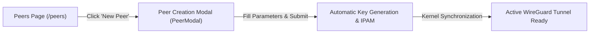
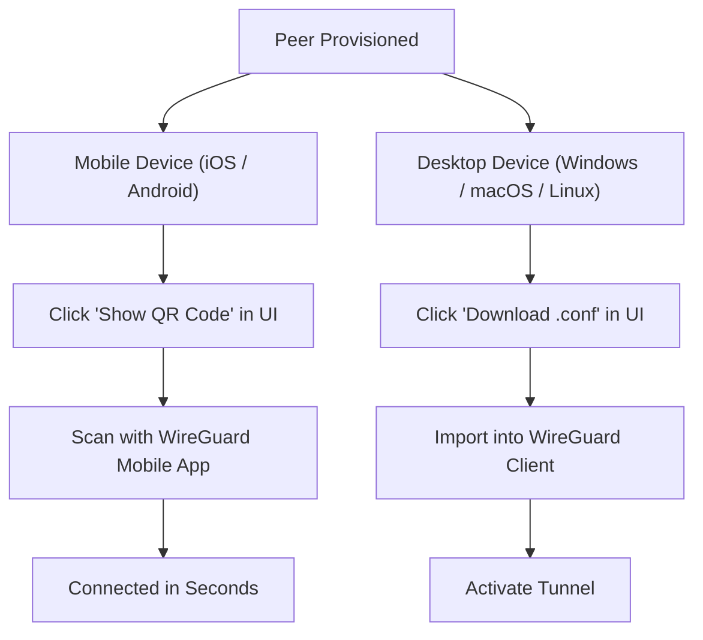

# How to Create and Onboard a Peer

This guide walks you through the step-by-step process of creating, configuring, and distributing a new VPN client profile (**Peer**) in WireManager, and connecting to the network from desktop and mobile devices.

---

## Prerequisites

Before creating a peer, ensure you have:
1. **At least one active WireGuard Server** configured in WireManager (e.g., `Server 1` on `10.0.0.0/24`).
2. An administrator or operator account logged into the WireManager web console (`http://<your-server>:3002`).
3. *(Optional)* Pre-configured **Services** and **Tags** if you wish to assign access permissions immediately during creation.

---

## Step 1: Open the Peer Creation Modal

1. Log in to the WireManager web console.
2. In the left navigation sidebar, click on **Peers**.
3. In the top-right corner of the Peers page, click the **New Peer** button (`+`).



---

## Step 2: Configure Peer Parameters

The creation modal provides several fields. Most fields include intelligent defaults:

```
+-------------------------------------------------------------+
|                      Create New Peer                        |
+-------------------------------------------------------------+
| Client Name:          [ alice-macbook                     ] |
| WireGuard Server:     [ Server 1 (10.0.0.0/24)          v ] |
| IP Address:           [ Leave blank for automatic (IPAM)  ] |
| DNS Server:           [ 1.1.1.1                           ] |
| Allowed IPs:          [ 0.0.0.0/0                         ] |
| Persistent KeepAlive: [ 25                                ] |
|                                                             |
| Expiration:           ( ) None  (*) Presets  ( ) Custom     |
|                       [1d] [3d] [7d] [14d] [30d]            |
|                                                             |
| Access Tags:          [x] Developers  [ ] Staging-DB        |
+-------------------------------------------------------------+
|                          [Cancel]  [Create Peer]            |
+-------------------------------------------------------------+
```

### Parameter Reference

| Field | Description | Recommended Setting |
| :--- | :--- | :--- |
| **Client Name** | A unique, human-readable name identifying the user or device. Special characters are automatically sanitized for file storage. | `john-laptop` or `alice-mobile` |
| **WireGuard Server** | The VPN server instance hosting this peer tunnel. | Select your primary server (e.g. `Server 1`) |
| **IP Address** | Private IPv4 address within the server subnet. **Leave blank** to let WireManager's IPAM engine assign the lowest available IP. | Leave blank for automated allocation |
| **DNS Server** | DNS resolver IP configured on the client interface. | `1.1.1.1`, `8.8.8.8`, or internal DNS IP (e.g. `10.0.0.1`) |
| **Allowed IPs** | Controls which traffic is routed through the VPN tunnel (Full Tunnel vs. Split Tunnel). | See [Tunnel Routing Options](#tunnel-routing-options) below |
| **Persistent KeepAlive** | Frequency in seconds to send empty keepalive packets to maintain stateful NAT translation tables. | `25` seconds for mobile/laptops behind NAT |
| **Expiration** | Scheduled lifetime for ephemeral access (temporary contractors, short-term audits). | Choose `None` for employees, or a preset (e.g. `7d`) for guests |
| **Access Tags** | Policy tags governing which internal services the peer can reach. | Select relevant tags (e.g. `Developers`, `DevOps`) |

---

### Tunnel Routing Options

Choose how the client directs traffic by configuring the **Allowed IPs** field:

#### Option A: Full Tunnel (`0.0.0.0/0`)
- **Behavior**: Directs **all** internet and intranet traffic through the WireGuard VPN tunnel.
- **Best For**: Secure browsing on public Wi-Fi networks, total corporate egress filtering, inspection gateways.

#### Option B: Split Tunnel (Specific Subnets)
- **Behavior**: Directs only traffic destined for internal company networks through the tunnel, while everyday internet browsing (YouTube, general web) exits directly via the user's local ISP.
- **Example**: `10.0.0.0/24, 192.168.1.0/24`
- **Best For**: Remote developer access to internal databases and staging servers without consuming VPN server bandwidth.

---

## Step 3: Ephemeral Access Scheduling (Optional)

If creating an account for a contractor, consultant, or temporary worker, configure an **Expiration**:

- **No Expiration**: The peer remains active indefinitely until manually revoked or deleted.
- **Presets**: Select `1d`, `3d`, `5d`, `7d`, `14d`, or `30d`. Access automatically expires at midnight on the scheduled date.
- **Custom**: Use the datetime picker to select an exact date and minute.

:::info Automated Cleanup
When an expired peer reaches its deadline, WireManager's background audit worker deactivates the peer, revokes its firewall permissions, and releases its allocated IP address back to the pool.
:::

---

## Step 4: Save and Provision

Click the **Create Peer** button.

### What Happens Behind the Scenes:
1. **Keypair Generation**: WireManager securely generates a Curve25519 private key and derives the matching public key.
2. **IPAM Assignment**: WireManager reserves the next free IP address in the server's subnet (e.g. `10.0.0.5/32`).
3. **Database Registration**: The peer record, public key, assigned IP, and tag associations are stored in the database.
4. **WireGuard Hot-Sync**: WireManager generates the peer configuration block in the server configuration file (`server_1.conf`) and syncs the live interface (`wg syncconf`) without disrupting other active tunnels.
5. **Firewall Compilation**: If tags were assigned, WireManager recalculates iptables rules in `WIREMANAGER-FW-server_1` to immediately permit traffic to authorized services.

---

## Step 5: Distribute and Onboard Client Devices

Once created, locate the new peer in the **Peers** list to distribute the configuration.



### Method A: Mobile Onboarding via QR Code (iOS & Android)

1. In the Peers table or card view, click the **More Actions** menu (`...`) next to the peer and select **Show QR Code** (or click the QR code icon).
2. On your mobile device, open the official **WireGuard** app.
3. Tap the **+** (Add Tunnel) button and select **Create from QR code**.
4. Point your device's camera at the screen to scan the QR code.
5. Enter a friendly name for the tunnel (e.g., `Company VPN`) and save.
6. Toggle the tunnel switch to **Active**.

:::note Complete Configuration Transfer
The QR code contains the full client configuration block, including the generated private key, assigned IP address, server public key, endpoint address, and keepalive settings. No manual typing is required.
:::

---

### Method B: Desktop Onboarding via `.conf` File (Windows, macOS, Linux)

1. In the Peers table, click the **More Actions** menu (`...`) next to the peer and select **Download Config** (or click the download icon).
2. A configuration file named `<client-name>.conf` will download to your machine.
   ```ini
   [Interface]
   PrivateKey = aAAA...example...key=
   Address = 10.0.0.5/32
   DNS = 1.1.1.1

   [Peer]
   PublicKey = sSSS...server...public...key=
   Endpoint = vpn.example.com:51820
   AllowedIPs = 0.0.0.0/0
   PersistentKeepalive = 25
   ```
3. Open the official **WireGuard** application on your desktop.
4. Click **Add Tunnel** (or **Import tunnel(s) from file**) and select the downloaded `.conf` file.
5. Click **Activate** to establish the connection.

---

## Step 6: Verify Connectivity

After connecting, verify that the tunnel is healthy and traffic is flowing:

### 1. Check Connection Status in WireManager
Return to the WireManager **Peers** page:
- **Connection Indicator**: Look for a **green pulsing dot** next to the client's name. This indicates that a successful cryptographic handshake occurred within the last 3 minutes.
- **Inspect Telemetry**: Click the **More Actions** menu (`...`) and select **Details**:
  - Verify that **Latest Handshake** displays a recent timestamp (e.g. *A few seconds ago*).
  - Verify that **Download (RX)** and **Upload (TX)** counters are actively incrementing.
  - Inspect the **Historical Transfer Chart** to monitor ongoing throughput.

### 2. Test Network Reachability from Client Device
Open a terminal on the client device and test communication with an authorized service:

```bash
# Test internal DNS resolution (if global DNS is configured)
nslookup my-service.internal.net

# Test HTTP/HTTPS reachability to an authorized service
curl -I https://192.168.1.50:443
```

---

## Managing Existing Peers

From the **Peers** page, administrators can perform lifecycle operations at any time:

- **Quick Enable / Disable**: Toggle the switch in the peer row or card to immediately disable a lost or compromised device. Traffic is blocked in kernel iptables instantly without deleting the configuration.
- **Edit Configuration**: Click **Edit** to modify DNS addresses, change Allowed IPs, adjust expiration dates, or add/remove access tags.
- **Delete Peer**: Click **Delete** to permanently revoke access and delete configuration files from disk.

---

## Troubleshooting Common Issues

### No Handshake / Connection Timeout
- **Firewall UDP Port**: Ensure that port `51820/UDP` (or your configured server listening port) is open on your external firewall and router.
- **Server Endpoint Address**: In WireManager **Server** settings, verify that the server's public endpoint (domain or WAN IP) is publicly reachable from the client's network.
- **NAT Keepalive**: Ensure `PersistentKeepalive = 25` is configured if the client is behind home Wi-Fi or mobile carrier NAT.

### Handshake Succeeds but Cannot Access Services
- **Missing Tags**: Verify that the peer has been assigned at least one **Tag** containing the target service, or that the service is marked as a **Global Service**.
- **Server Routing**: Ensure the target service host has a route back to the WireGuard subnet (e.g., routing `10.0.0.0/24` through the WireGuard gateway).
- **Client Allowed IPs**: If using Split Tunneling, confirm that the target service's IP subnet is explicitly included in the peer's `AllowedIPs`.

---

## Related Documentation

- **[Peers Concept Reference](../concepts/peers.md)** — Architectural concepts, key management, and IPAM.
- **[Tags Concept Reference](../concepts/tags.md)** — How to create and manage policy tags.
- **[Configure Access Policies Guide](./configure-access.md)** — Step-by-step guide for linking peers to services via tags.
- **[Nginx Proxy Manager Integration](./nginx-proxy-manager.md)** — Set up reverse proxy authentication for web apps.
