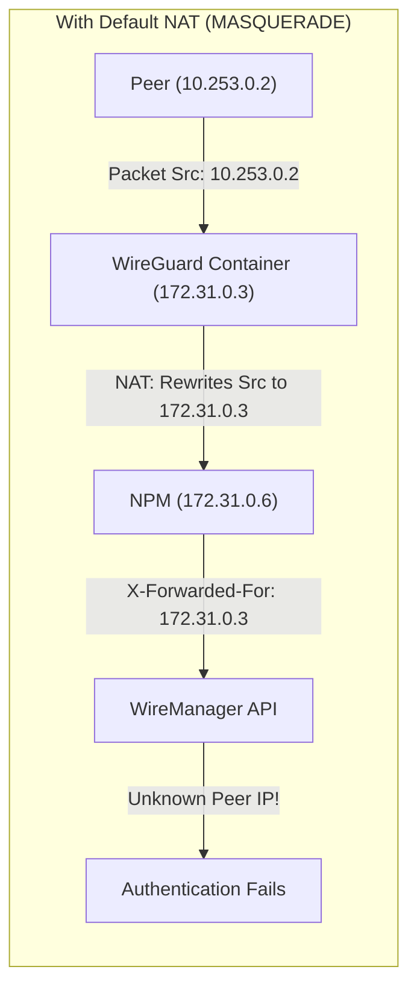
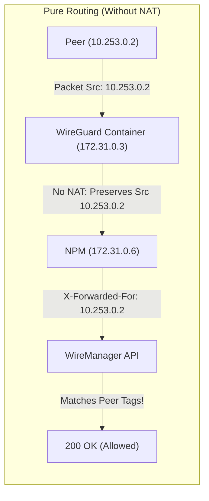
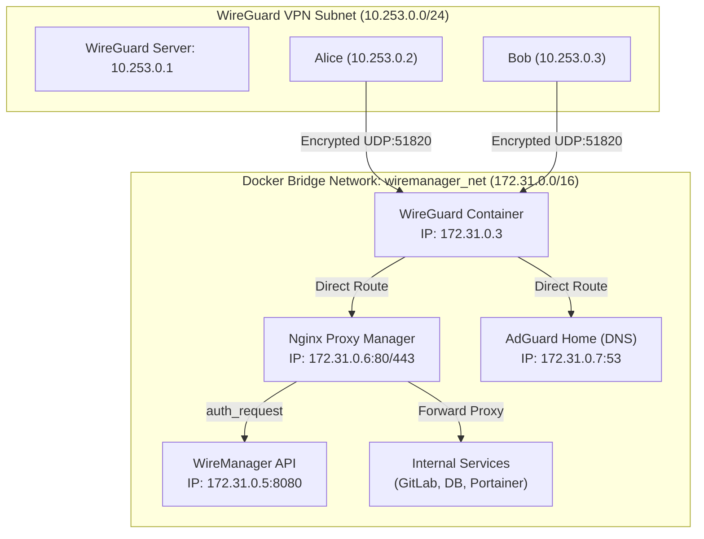

# Nginx Proxy Manager & Real Client IP Integration

This guide explains how to integrate **WireManager** with **Nginx Proxy Manager (NPM)** to enforce Layer-7 Zero-Trust External Authentication. It covers how to eliminate NAT (Network Address Translation) inside the WireGuard container so that NPM sees the **real client IP address** of your VPN peers, how to route internal DNS with **AdGuard Home**, and how to ensure routes persist across system reboots.

---

## The Challenge: NAT vs. Zero-Trust Identity

By default, standard Docker WireGuard configurations apply a global `MASQUERADE` (NAT) rule to all outbound traffic leaving the VPN tunnel. 

When a peer (`10.253.0.2`) connects to an internal web service behind NPM (`172.31.0.6`), the WireGuard container rewrites the packet's source IP to its own Docker bridge IP (`172.31.0.3`):



Because WireManager's External Authentication endpoint (`/api/peer/authorized`) matches access rights based on the peer's actual assigned VPN IP, **NAT breaks per-peer and per-tag authorization**.

### The Solution: Pure Routing Without NAT
By disabling `MASQUERADE` inside WireGuard and adding a return route inside the NPM and AdGuard containers, traffic flows transparently with the peer's original IP preserved:



---

## Topology & Network Architecture

In this reference architecture, all infrastructure containers reside on a dedicated Docker bridge network (`wiremanager_net`), while VPN peers operate within a separate subnet:



| Component | Network Interface | IP Address | Role |
| :--- | :--- | :--- | :--- |
| **Docker Bridge** | `wiremanager_net` | `172.31.0.0/16` | Isolated container bridge connecting VPN, API, Proxy, and DNS |
| **WireGuard** | `eth0` / `server_1` | `172.31.0.3` / `10.253.0.1` | VPN tunnel gateway |
| **WireManager API** | `eth0` | `172.31.0.5` | Management API & External Auth endpoint |
| **Nginx Proxy Manager** | `eth0` (or `eth1`) | `172.31.0.6` | Ingress reverse proxy enforcing `auth_request` |
| **AdGuard Home** | `eth0` (or `eth1`) | `172.31.0.7` | Internal DNS resolver with domain rewrites |
| **VPN Clients (Peers)** | `wg0` | `10.253.0.0/24` | Client devices carrying assigned access policy tags |

---

## Step 1: Host System Configuration

On your Linux host server (e.g., Debian, Ubuntu):

### 1. Enable IPv4 Kernel Forwarding
Verify that kernel packet forwarding is active:
```bash
cat /proc/sys/net/ipv4/ip_forward
```
If the output is `0`, enable forwarding immediately:
```bash
sudo sysctl -w net.ipv4.ip_forward=1
```
To persist this setting across reboots, add it to `/etc/sysctl.d/99-wiremanager.conf`:
```ini
net.ipv4.ip_forward=1
```
Then apply with:
```bash
sudo sysctl --system
```

---

## Step 2: Disable NAT in WireGuard Container

By default, many WireGuard Docker images execute iptables commands that masquerade all forwarded packets. We must remove generic masquerading on the Docker bridge.

### 1. Inspect Existing NAT Rules
Check if `MASQUERADE` is enabled inside the WireGuard container:
```bash
docker exec wireguard iptables -t nat -S POSTROUTING
```
If you see a rule matching `-A POSTROUTING -j MASQUERADE` or `-A POSTROUTING -o eth0 -j MASQUERADE`, delete it:
```bash
docker exec wireguard iptables -t nat -D POSTROUTING -o eth0 -j MASQUERADE
```

### 2. Remove NAT Rules from the WireGuard Configuration

The WireGuard server configuration may also contain `iptables` commands that enable masquerading.

Open the generated `server_<id>.conf` file and remove the two lines responsible for NAT:

```ini
PostUp = iptables -A FORWARD -i %i -j ACCEPT; iptables -A FORWARD -o %i -j ACCEPT; iptables -t nat -A POSTROUTING -j MASQUERADE
PostDown = iptables -D FORWARD -i %i -j ACCEPT; iptables -D FORWARD -o %i -j ACCEPT; iptables -t nat -D POSTROUTING -j MASQUERADE
```
Removing these rules prevents WireGuard from re-enabling NAT when the interface is restarted.
:::warning
**Important:** Do not remove unrelated `iptables` rules used for forwarding or firewall enforcement. Only remove the rules responsible for `MASQUERADE`.
:::

### 3. Ensure Pure Forwarding Between Interface and Bridge
Verify that the container kernel forwards traffic between the VPN interface (`server_1`) and the Docker ethernet interface (`eth0`):
```bash
docker exec wireguard sh -c '
  iptables -A FORWARD -i server_1 -o eth0 -j ACCEPT
  iptables -A FORWARD -i eth0 -o server_1 -m state --state RELATED,ESTABLISHED -j ACCEPT
'
```

:::tip Verify WireGuard Container IP
Confirm that the WireGuard container is connected to `wiremanager_net`:
```bash
docker inspect wireguard \
  --format '{{range $net, $cfg := .NetworkSettings.Networks}}{{$net}} {{$cfg.IPAddress}}{{"\n"}}{{end}}'
```
The output must show `wiremanager_net 172.31.0.3`.
:::

---

## Step 3: Configure Container Routing (NPM & AdGuard)

Because NPM (`172.31.0.6`) and AdGuard (`172.31.0.7`) have default routes pointing to the Docker gateway (`172.31.0.1`), they do not know how to return packets to the `10.253.0.0/24` subnet. 

We must add a direct static route inside the network namespaces of NPM and AdGuard pointing to the WireGuard container (`172.31.0.3`).

### 1. Add Route in Nginx Proxy Manager Container
Using `nsenter` on the host:
```bash
# Retrieve NPM container PID
PID_NPM=$(docker inspect -f '{{.State.Pid}}' npm)

# Inject return route to VPN subnet via WireGuard container IP
sudo nsenter -t "$PID_NPM" -n ip route replace 10.253.0.0/24 via 172.31.0.3
```

Verify that the route is installed:
```bash
sudo nsenter -t "$PID_NPM" -n ip route show
```
*Expected output: `10.253.0.0/24 via 172.31.0.3 dev eth1` (or `dev eth0`)*.

---

### 2. Add Route in AdGuard Home Container
Repeat the same step for the AdGuard Home container:
```bash
# Retrieve AdGuard container PID
PID_ADG=$(docker inspect -f '{{.State.Pid}}' adguardhome)

# Inject return route
sudo nsenter -t "$PID_ADG" -n ip route replace 10.253.0.0/24 via 172.31.0.3
```

Verify:
```bash
sudo nsenter -t "$PID_ADG" -n ip route show
```

---

## Step 4: Configure AdGuard Home (Internal DNS)

To allow peers to resolve private hostnames (e.g. `portainer.netrod.xyz` or `git.corp.internal`) directly to NPM:

### 1. Bind DNS to All Interfaces
In your `AdGuardHome.yaml` configuration file (typically `/opt/adguardhome/conf/AdGuardHome.yaml` or container mount):
```yaml
dns:
  bind_hosts:
    - 0.0.0.0
  port: 53
```
Restart AdGuard if you changed this configuration:
```bash
docker restart adguardhome
```

### 2. Configure DNS Rewrites in AdGuard
In the AdGuard web administration panel:
1. Navigate to **Filters** → **DNS rewrites**.
2. Add rewrites pointing your internal domains to the NPM container IP (`172.31.0.6`):
   - `*.example.xyz` → `172.31.0.6`
   - `portainer.example.xyz` → `172.31.0.6`
   - `npm.example.xyz` → `172.31.0.6`
   - `grafana.example.xyz` → `172.31.0.6`

---

## Step 5: Peer Client Configuration

In your client's WireGuard configuration profile (or generated via WireManager UI):

```ini
[Interface]
PrivateKey = <ClientPrivateKey>
Address = 10.253.0.2/32
# Set DNS to the AdGuard container IP on the shared Docker bridge:
DNS = 172.31.0.7

[Peer]
PublicKey = <ServerPublicKey>
Endpoint = vpn.example.com:51820
# Include both the VPN subnet and the Docker bridge subnet:
AllowedIPs = 10.253.0.0/24, 172.31.0.0/16
PersistentKeepalive = 25
```

:::note Split Tunnel Subnets
Including `172.31.0.0/16` in `AllowedIPs` ensures that queries to AdGuard (`172.31.0.7`) and HTTPS traffic to NPM (`172.31.0.6`) are routed over the WireGuard tunnel. If using Full Tunnel (`0.0.0.0/0`), this is included automatically.
:::

---

## Step 6: Configure External Authentication in NPM

Now configure Nginx Proxy Manager to validate requests against WireManager:

1. In the NPM administrative console, navigate to **Hosts** → **Proxy Hosts**.
2. Click **Add Proxy Host** (or edit an existing one).
3. **Details Tab**:
   - **Domain Names**: e.g., `portainer.netrod.xyz`
   - **Scheme**: `http` (or `https`)
   - **Forward Hostname / IP**: Target upstream container IP or hostname
   - **Forward Port**: Target upstream port (e.g. `9000`)
   - Enable **Block Common Exploits** and **Websockets Support** if needed.
4. **Advanced Tab**: Paste the following custom Nginx configuration block:

```nginx
# Forward authentication sub-request definition
location = /wiremanager-auth {
    internal;
    proxy_pass http://wiremanager-api:8080/api/peer/authorized;
    proxy_pass_request_body off;
    proxy_set_header Content-Length "";
    proxy_set_header X-Forwarded-For $remote_addr;
    proxy_set_header X-Forwarded-Host $host;
}

# Enforce external authentication on primary location
location / {
    auth_request /wiremanager-auth;
    auth_request_set $auth_status $upstream_status;

    # Standard proxy headers
    proxy_set_header Host $host;
    proxy_set_header X-Real-IP $remote_addr;
    proxy_set_header X-Forwarded-For $proxy_add_x_forwarded_for;
    proxy_set_header X-Forwarded-Proto $scheme;

    # Upstream pass (configured automatically by NPM or set manually)
    proxy_pass $forward_scheme://$server:$port;
}
```

5. Click **Save**.

---

## Step 7: Configure Services and Tags in WireManager

For WireManager to grant access to the domain:

1. In WireManager, go to **Services** → **New Service**:
   - **Name**: `Portainer Management`
   - **Target IP**: `172.31.0.6` *(NPM IP)*
   - **Protocol**: `TCP`
   - **Port**: `443`
   - **Domain**: `portainer.netrod.xyz`
   - Click **Create**.
2. Go to **Tags** → Create or edit a tag (e.g. `DevOps-Lead`):
   - Check `Portainer Management`.
3. Go to **Peers** → Edit your peer (`10.253.0.2`):
   - Assign the `DevOps-Lead` tag.

---

## Step 8: Persistent Routes Across Reboots

Because routes injected into container network namespaces via `nsenter` are stored in memory, **they are lost when Docker containers restart or when the host server reboots**.

To ensure these routes persist automatically, deploy a lightweight dynamic script and systemd service.

### 1. Create the Route Restoration Script
Create `/usr/local/bin/wiremanager-routes.sh`:

```bash
sudo tee /usr/local/bin/wiremanager-routes.sh > /dev/null << 'EOF'
#!/usr/bin/env bash
set -euo pipefail

# Configuration parameters (customizable via environment)
DOCKER_NETWORK="${DOCKER_NETWORK:-wiremanager_net}"
WG_CONTAINER="${WG_CONTAINER:-wireguard}"
VPN_SUBNET="${VPN_SUBNET:-10.253.0.0/24}"
TARGET_CONTAINERS=("${@:-npm adguardhome}")

echo "[WireManager Routes] Discovering WireGuard IP on '$DOCKER_NETWORK'..."
WG_IP=$(docker inspect -f "{{with index .NetworkSettings.Networks \"$DOCKER_NETWORK\"}}{{.IPAddress}}{{end}}" "$WG_CONTAINER" 2>/dev/null || true)

if [ -z "$WG_IP" ]; then
    echo "[WireManager Routes] Error: Container '$WG_CONTAINER' not found or not attached to '$DOCKER_NETWORK'."
    exit 1
fi

echo "[WireManager Routes] WireGuard IP identified as: $WG_IP"

for container in "${TARGET_CONTAINERS[@]}"; do
    PID=$(docker inspect -f '{{.State.Pid}}' "$container" 2>/dev/null || true)
    if [ -n "$PID" ] && [ "$PID" -gt 0 ]; then
        echo "[WireManager Routes] Injecting route into '$container' (PID $PID): $VPN_SUBNET via $WG_IP..."
        nsenter -t "$PID" -n ip route replace "$VPN_SUBNET" via "$WG_IP" || true
    else
        echo "[WireManager Routes] Container '$container' is not running, skipping."
    fi
done

echo "[WireManager Routes] Route synchronization completed successfully."
EOF

sudo chmod +x /usr/local/bin/wiremanager-routes.sh
```

### 2. Create the Systemd Service Unit
Create `/etc/systemd/system/wiremanager-routes.service`:

```ini
[Unit]
Description=Restore WireManager VPN routes inside Docker containers
After=docker.service
Requires=docker.service

[Service]
Type=oneshot
ExecStart=/usr/local/bin/wiremanager-routes.sh
RemainAfterExit=yes

[Install]
WantedBy=multi-user.target
```

### 3. Enable and Test the Service
```bash
sudo systemctl daemon-reload
sudo systemctl enable wiremanager-routes.service
sudo systemctl start wiremanager-routes.service
```

Check the service status:
```bash
sudo systemctl status wiremanager-routes.service
```

---

## Step 9: Verification & Testing

From a connected client device (e.g. `10.253.0.2`):

### 1. Test DNS Resolution
```bash
nslookup portainer.netrod.xyz
```
Expected output:
```text
Server:     172.31.0.7
Address:    172.31.0.7#53

Name:       portainer.netrod.xyz
Address:    172.31.0.6
```

### 2. Test HTTP Access and Real IP in NPM Logs
Send an HTTPS request:
```bash
curl -I -k https://portainer.netrod.xyz
```
- If the peer **has the required tag**: `HTTP/2 200`
- If the peer **lacks the tag**: `HTTP/2 403 Forbidden` (or `401 Unauthorized`)

Check the NPM access log on the host:
```bash
docker exec npm tail -n 5 /data/logs/default-host_access.log
```
Verify that the logged client IP is `10.253.0.2` and **not** `172.31.0.3` or `172.22.0.1`.

---

## Troubleshooting

### NPM Logs Show `172.31.0.3` (WireGuard Container IP)
- A `MASQUERADE` rule is still active inside the WireGuard container.
- Run `docker exec wireguard iptables -t nat -S POSTROUTING` and ensure no rules exist rewriting source IPs for `10.253.0.0/24`.

### Client Experiences Connection Timeout to `172.31.0.6`
- The return route inside the NPM container is missing.
- Check with `sudo nsenter -t $(docker inspect -f '{{.State.Pid}}' npm) -n ip route show`. Ensure `10.253.0.0/24 via 172.31.0.3` is present.

### WireManager API Returns `400 Cannot determine client IP`
- Ensure the NPM advanced configuration passes `proxy_set_header X-Forwarded-For $remote_addr;` and `proxy_set_header X-Forwarded-Host $host;` to `/wiremanager-auth`.

---

## Related Documentation

- **[External Authentication Concept Reference](../concepts/external-auth.md)** — Architectural deep-dive into forward authentication.
- **[Access Policies Concept Reference](../concepts/access-policies.md)** — Zero-Trust policy resolution engine.
- **[Services Concept Reference](../concepts/services.md)** — Configuring target IPs, ports, and domains.
- **[Create a Peer Guide](./create-peer.md)** — Generating and distributing client VPN profiles.
