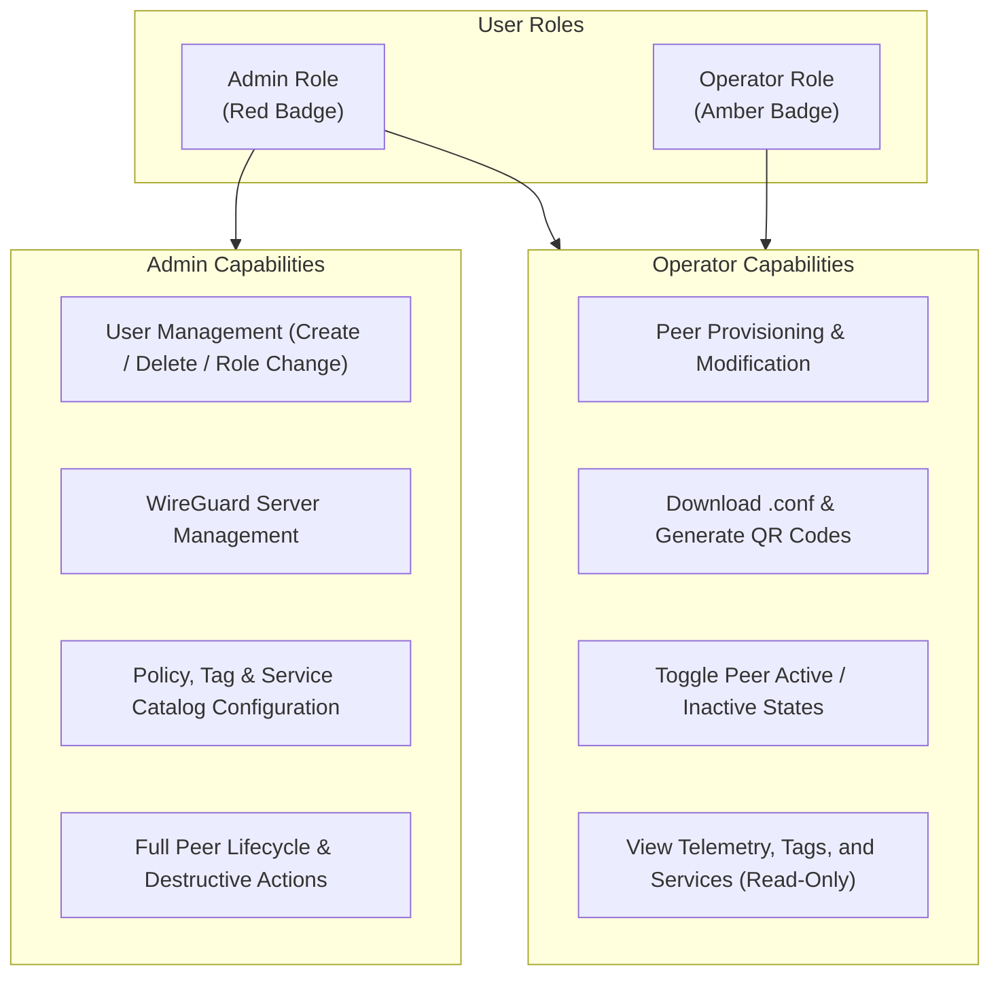

# How to Manage Users and Roles

This guide explains how to manage administrative user accounts and configure Role-Based Access Control (RBAC) in WireManager. You will learn how to create new operator and administrator accounts, modify privileges, and safely remove access.

---

## Role-Based Access Control (RBAC) Overview

WireManager separates system responsibilities into two distinct administrative roles:



### Role Capabilities Matrix

| Feature / Action | Admin | Operator |
| :--- | :---: | :---: |
| **Manage Users** (Create, Delete, Change Role) | Yes | No |
| **Manage Servers** (Create, Delete, Reconfigure Interfaces) | Yes | No |
| **Define Services & Tags** (Create, Modify, Delete) | Yes | No |
| **Peer Provisioning** (Create, Edit, Delete Peers) | Yes | Yes |
| **Distribute Configurations** (Download `.conf`, QR Code) | Yes | Yes |
| **Toggle Peer Status** (Active / Inactive) | Yes | Yes |
| **Monitor Telemetry** (Real-time throughput, graphs) | Yes | Yes |
| **View Catalog** (Read-only view of Tags and Services) | Yes | Yes |

---

## Prerequisites

To manage system users:
1. You must be logged in to WireManager with an account that has the **Admin** role.
2. The user management console is located at `http://<your-server>:3002/users` (or accessible via the **Users** link in the navigation menu).

:::note Access Restriction for Operators
Accounts with the **Operator** role do not see the User Management menu option and receive HTTP `403 Forbidden` if attempting to query `/api/auth/register` or `/api/auth/users`.
:::

---

## Step 1: Open the User Management Console

1. Log in to the WireManager web console with your administrator credentials.
2. In the navigation sidebar, click on **Users** (`/users`).

The page is divided into two operational panels:
- **Left / Top Panel**: Create New User form.
- **Right / Bottom Panel**: Existing Users table with live search and pagination.

```
+-------------------------------------------------------------------------+
|                              User Management                            |
+------------------------------------+------------------------------------+
|          Create New User           |           Existing Users           |
+------------------------------------+------------------------------------+
| Username: [ john.doe             ] | Search: [ Search users...        ] |
| Password: [ ********           (o) ] |                                    |
| Role:     [ ( ) Admin              | * admin (You)       [ Admin v ]    |
|             (*) Operator         ] | * john.doe          [ Operator v ] [x]
|                                    |                                    |
| [Create User]                      | Showing 1 to 2 of 2 users  < 1 >   |
+------------------------------------+------------------------------------+
```

---

## Step 2: Create a New User Account

To create a new operator or administrator:

1. In the **Create New User** form:
   - **Username**: Enter a unique username (minimum 3 characters, maximum 50 characters).
   - **Password**: Enter a secure password (minimum 8 characters, maximum 128 characters). Click the eye icon to toggle visibility.
   - **Role**: Select either **Operator** or **Admin**.
2. Click **Create Account**.
3. A success notification will confirm account creation, and the new user will immediately appear in the user table.

### Security Implementation Behind the Scenes
- The backend verifies that the username is not already taken.
- Passwords are encrypted using **BCrypt** with automatic salt generation before being stored in the database.
- Plaintext passwords are never logged, cached, or returned in API responses.

---

## Step 3: Search and Filter Existing Users

In larger organizations with multiple staff members, use the real-time search bar to filter accounts:

1. Type any portion of the username into the search bar.
2. The table applies a debounced filter (400ms delay) and updates dynamically.
3. Use the pagination controls at the bottom of the table to navigate through large user directories (5 users per page by default).

---

## Step 4: Change a User's Role

You can escalate or demote an account's privileges without having to recreate the account:

1. Locate the user in the **Existing Users** list.
2. Click the role dropdown selector next to the user's name:
   - Choose **Admin** to grant full administrative capabilities.
   - Choose **Operator** to restrict the account to peer operations.
3. The role change takes effect immediately via `PATCH /api/auth/users/{uuid}/role/{role}`.

:::caution Self-Demotion Protection
WireManager prevents administrators from changing their own role from `Admin` to `Operator`. This built-in safety guard eliminates the risk of an administrator accidentally locking themselves out of the system.
:::

---

## Step 5: Delete a User Account

When a staff member leaves the organization or no longer requires access:

1. Locate the target user in the list.
2. Click the **Delete** button (trash can icon) on the right side of the row.
3. Confirm the deletion in the confirmation dialog.
4. The user record is purged from the database, and any active sessions using that user's credentials will be rejected upon their next API call.

:::caution Self-Deletion Protection
Administrators cannot delete their own active account. If an account must be decommissioned, another administrator must perform the deletion.
:::

---

## Programmatic User Management via API

Automate user provisioning in your onboarding scripts using the REST API:

### 1. Register a User via cURL
```bash
# Retrieve Admin JWT Token
TOKEN=$(curl -s -X POST http://localhost:5070/api/auth/login \
  -H "Content-Type: application/json" \
  -d '{"username": "admin", "password": "AdminPassword123!"}' \
  | jq -r '.token')

# Create a new Operator account
curl -X POST http://localhost:5070/api/auth/register \
  -H "Authorization: Bearer $TOKEN" \
  -H "Content-Type: application/json" \
  -d '{
    "username": "developer-ops",
    "password": "SecurePassword2026!",
    "role": "Operator"
  }'
```

### 2. List Users via cURL
```bash
curl -X GET "http://localhost:5070/api/auth/users?start=0&end=10" \
  -H "Authorization: Bearer $TOKEN" \
  -H "Accept: application/json"
```

### 3. Change a User's Role via cURL
```bash
curl -X PATCH "http://localhost:5070/api/auth/users/<user-uuid>/role/Admin" \
  -H "Authorization: Bearer $TOKEN"
```

### 4. Delete a User via cURL
```bash
curl -X DELETE "http://localhost:5070/api/auth/users/<user-uuid>" \
  -H "Authorization: Bearer $TOKEN"
```

---

## Best Practices & Security Recommendations

:::tip Administrative Security Checklist
1. **Default to Operator**: Assign the `Operator` role to team members who only need to add devices, reset VPN tunnels, or view network statistics. Reserve the `Admin` role for infrastructure leads.
2. **Dedicated Service Accounts**: For automated CI/CD pipelines or scripts that provision VPN peers, create a dedicated `Operator` account rather than using a personal administrator login.
3. **Prompt Offboarding**: Delete user accounts immediately upon an employee's departure. WireManager checks user validity during token generation and policy enforcement.
4. **Strong Passwords**: Enforce a strong password policy (at least 12 characters with a mix of letters, numbers, and symbols) for all accounts.
:::

---

## Related Documentation

- **[API Authentication Guide](../api/authentication.md)** — In-depth details on JWT tokens, claims, and lifetimes.
- **[API Overview](../api/overview.md)** — Architectural model and base URL reference.
- **[Create a Peer Guide](./create-peer.md)** — Day-to-day peer provisioning workflow.
- **[Configure Access Policies](./configure-access.md)** — Setting up services and tags.
